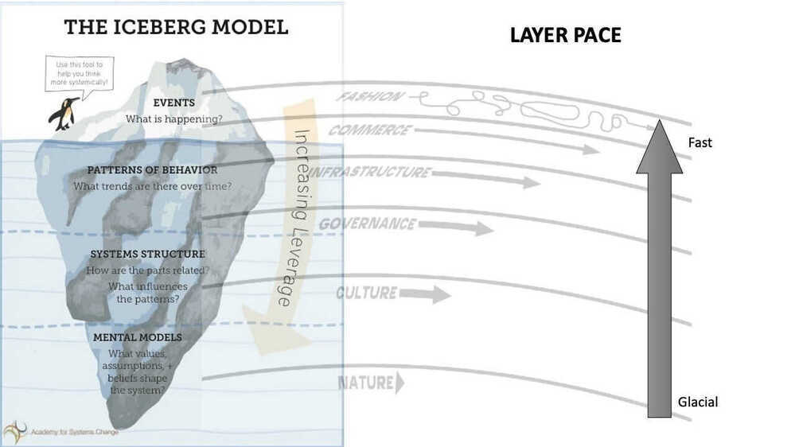

# Thinking Mental Models

- [The Scientific Method](https://en.wikipedia.org/wiki/Scientific_method)
- **[Inversion](https://jamesclear.com/inversion) / Reframing**
- Surfing or "Riding the Wave"
- [Working Backward](https://en.wikipedia.org/wiki/Backward_chaining)
- Structured thinking

you methodically [break down problems](https://forge.medium.com/the-500-year-old-piece-of-advice-that-will-change-your-life-1e580f115731) and solve them piece by piece, rather than worrying, relying on past assumptions, or shrugging in absolute cluelessness.

- The Map is not the Territory
- Circle of competence
- Thought Experiment
- Probablistic Thinking
- **Gradually, and then suddenly**

The quote is from Ernest Hemingway. The graphic is from Gautam John, a subscriber, who combined two important systems thinking models - the Iceberg Model and Pace Layers framework.

## Systems Thinking

[Thinking in systems](../book-summaries/thinking-in-systems)

"Systems thinking is a way of seeing the world as a series of **interconnected** and **interdependent** systems rather than lots of independent parts. As a thinking tool, it seeks to oppose the **reductionist view** --- the idea that a system can be understood by the sum of its isolated parts - and replace it with **expansionism**, the view that everything is part of a larger whole and that the connections between all elements are critical."

- [Systems Thinking](https://en.wikipedia.org/wiki/Systems_thinking)--- "By taking the overall system as well as its parts into account systems thinking is designed to avoid potentially contributing to further development of unintended consequences." (related:[causal loop diagrams](https://en.wikipedia.org/wiki/System_dynamics#Causal_loop_diagrams);[stock and flow](https://en.wikipedia.org/wiki/Stock_and_flow);[Le Chatelier's principle](https://en.wikipedia.org/wiki/Le_Chatelier%27s_principle#Effect_of_a_catalyst), [hysteresis](https://en.wikipedia.org/wiki/Hysteresis#In_biology) - "the time-based dependence of a system's output on present and past inputs."; "Can't see the forest for the trees.")

- Iceberg Model
- Connection circles
- Balancing feedback loop
- Reinforcing feedback loop
  - Ex - **Compound Interest** (The more money you have in the bank, the more you earn on interest. That money is added to your balance and so you earn on interest even more.)

- **Decision Making**
  - Confidence determines speed vs. quality
    - Is your confidence in the problem importance low? Focus on speed.
    - Is your confidence in the problem and the solution high? Focus on quality.
    - Is your confidence in the problem importance high, but low in the solution? Balance both speed and quality.
  - Second order thinking
    - Ex - living an hour away from work → need to buy a car → spending two hours of each day in a car
  - Hard choice model
  - Decision matrix
- **Problem Solving**
  - Issue trees

- First principles

Break down complex problems into basic elements and create innovative solutions from there.

- Abstraction laddering

Frame your problem better with different levels of abstraction.

- Inversion

Approach a problem from a different point of view.

[Arguing from First Principles](https://en.wikipedia.org/wiki/First_principle)--- "A first principle is a basic, foundational, self-evident proposition or assumption that cannot be deduced from any other proposition or assumption." (related:[dimensionality reduction](https://en.wikipedia.org/wiki/Dimensionality_reduction);[orthogonality](https://en.wikipedia.org/wiki/Orthogonality); "Reasonable minds can disagree" if underlying premises differ.)

## First Principles Thinking

1. Clarifying your thinking and explaining the origins of your ideas (Why do I think this? What exactly do I think?)
2. Challenging assumptions (How do I know this is true? What if I thought the opposite?)
3. Looking for evidence (How can I back this up? What are the sources?)
4. Considering alternative perspectives (What might others think? How do I know I am correct?)
5. Examining consequences and implications (What if I am wrong? What are the consequences if I am?)
6. Questioning the original questions (Why did I think that? Was I correct? What conclusions can I draw from the reasoning process?)

## Modeling

- [Thought Experiment](https://en.wikipedia.org/wiki/Thought_experiment)--- "considers some hypothesis, theory, or principle for the purpose of thinking through its consequences." (related:[counterfactual thinking](https://en.wikipedia.org/wiki/Counterfactual_thinking))
- [Scenario Analysis](https://en.wikipedia.org/wiki/Scenario_analysis)--- "A process of analyzing possible future events by considering alternative possible outcomes." (related: "Skate to where the puck is going.";[black swan theory](https://en.wikipedia.org/wiki/Black_swan_theory)--- "a metaphor that describes an event that comes as a surprise, has a major effect, and is often inappropriately rationalized after the fact with the benefit of hindsight.")
- [Power-law](https://en.wikipedia.org/wiki/Power_law)--- "A functional relationship between two quantities, where a relative change in one quantity results in a proportional relative change in the other quantity, independent of the initial size of those quantities: one quantity varies as a power of another." (related:[Pareto distribution](https://en.wikipedia.org/wiki/Pareto_distribution);[Pareto principle](https://en.wikipedia.org/wiki/Pareto_principle)--- "for many events, roughly 80% of the effects come from 20% of the causes.", [diminishing returns](https://en.wikipedia.org/wiki/Diminishing_returns), [premature optimization](https://en.wikipedia.org/wiki/Program_optimization#When_to_optimize), [heavy-tailed distribution](https://en.wikipedia.org/wiki/Heavy-tailed_distribution#Relationship_to_fat-tailed_distributions), [fat-tailed distribution](https://en.wikipedia.org/wiki/Fat-tailed_distribution);[long tail](https://en.wikipedia.org/wiki/Long_tail)--- "the portion of the distribution having a large number of occurrences far from the "head" or central part of the distribution.";[black swan theory](https://en.wikipedia.org/wiki/Black_swan_theory)--- "a metaphor that describes an event that comes as a surprise, has a major effect, and is often inappropriately rationalized after the fact with the benefit of hindsight.")

<https://en.wikipedia.org/wiki/Power_law>

<https://www.scotthyoung.com/blog/2021/02/22/productivity-frontier>

- [Normal Distribution](https://en.wikipedia.org/wiki/Normal_distribution)--- "A very common continuous probability distribution...Physical quantities that are expected to be the sum of many independent processes (such as measurement errors) often have distributions that are nearly normal." (related:[central limit theorem](https://en.wikipedia.org/wiki/Central_limit_theorem))
- [Sensitivity Analysis](https://en.wikipedia.org/wiki/Sensitivity_analysis)--- "The study of how the uncertainty in the output of a mathematical model or system (numerical or otherwise) can be apportioned to different sources of uncertainty in its inputs."
- **[Cost-benefit Analysis](https://en.wikipedia.org/wiki/Cost%E2%80%93benefit_analysis)**

A systematic approach to estimating the strengths and weaknesses of alternatives that satisfy transactions, activities or functional requirements for a business." (related:[net present value](https://en.wikipedia.org/wiki/Net_present_value)--- "a measurement of the profitability of an undertaking that is calculated by subtracting the present values of cash outflows (including initial cost) from the present values of cash inflows over a period of time.", [discount rate](https://en.wikipedia.org/wiki/Discount_rate))

<https://www.wikiwand.com/en/Cost%E2%80%93benefit_analysis>

<https://www.investopedia.com/terms/c/cost-benefitanalysis.asp>

- [Simulation](https://en.wikipedia.org/wiki/Simulation)--- "The imitation of the operation of a real-world process or system over time." (related:[Queuing theory](https://en.wikipedia.org/wiki/Queueing_theory)--- "the mathematical study of waiting lines, or queues.")
- [Pareto Efficiency](https://en.wikipedia.org/wiki/Pareto_efficiency)--- "A state of allocation of resources in which it is impossible to make any one individual better off without making at least one individual worse off...A Pareto improvement is defined to be a change to a different allocation that makes at least one individual better off without making any other individual worse off, given a certain initial allocation of goods among a set of individuals."

## Brainstorming

- [Lateral Thinking](https://en.wikipedia.org/wiki/Lateral_thinking)--- "Solving problems through an indirect and creative approach, using reasoning that is not immediately obvious and involving ideas that may not be obtainable by using only traditional step-by-step logic."
- [Divergent Thinking](https://en.wikipedia.org/wiki/Divergent_thinking) vs [Convergent Thinking](https://en.wikipedia.org/wiki/Convergent_thinking)--- "Divergent thinking is a thought process or method used to generate creative ideas by exploring many possible solutions. It is often used in conjunction with its cognitive opposite, convergent thinking, which follows a particular set of logical steps to arrive at one solution, which in some cases is a 'correct' solution." (related:[groupthink](https://en.wikipedia.org/wiki/Groupthink))
- [Crowdsourcing](https://en.wikipedia.org/wiki/Crowdsourcing)--- "The process of obtaining needed services, ideas, or content by soliciting contributions from a large group of people, especially an online community, rather than from employees or suppliers." (related:[wisdom of the crowd](https://en.wikipedia.org/wiki/Wisdom_of_the_crowd)--- "a large group's aggregated answers to questions involving quantity estimation, general world knowledge, and spatial reasoning has generally been found to be as good as, and often better than, the answer given by any of the individuals within the group.";[collective intelligence](https://en.wikipedia.org/wiki/Collective_intelligence);[bandwagon effect](https://en.wikipedia.org/wiki/Bandwagon_effect)--- "a phenomenon whereby the rate of uptake of beliefs, ideas, fads and trends increases the more that they have already been adopted by others.";[Stone Soup](https://en.wikipedia.org/wiki/Stone_Soup))

A crowd can be smarter than a single person, Consider other's perspective to challenge your own biases.

- [Paradigm shift](https://en.wikipedia.org/wiki/Paradigm_shift)--- "a fundamental change in the basic concepts and experimental practices of a scientific discipline." (related:[The Structure of Scientific Revolutions](https://en.wikipedia.org/wiki/The_Structure_of_Scientific_Revolutions)--- "An episodic model in which periods of such conceptual continuity in normal science were interrupted by periods of revolutionary science;[Planck's principle](https://en.wikipedia.org/wiki/Planck%27s_principle)--- "the view that scientific change does not occur because individual scientists change their mind, but rather that successive generations of scientists have different views.";[punctuated equilibrium](https://en.wikipedia.org/wiki/Punctuated_equilibrium))

## Reasoning

- [Anecdotal](https://yourlogicalfallacyis.com/anecdotal)--- "Using a personal experience or an isolated example instead of a sound argument or compelling evidence."
- [False Cause](https://yourlogicalfallacyis.com/false-cause)--- "Presuming that a real or perceived relationship between things means that one is the cause of the other." (related:[correlation does not imply causation](https://en.wikipedia.org/wiki/Correlation_does_not_imply_causation), or in [xkcd form](https://xkcd.com/552/))
- [Straw Man](https://en.wikipedia.org/wiki/Straw_man)--- "Giving the impression of refuting an opponent's argument, while actually refuting an argument that was not advanced by that opponent."
- (1) Plausible - Thinking that just because something is plausible means that it is true.
- (1) Likely - Thinking that just because something is possible means that it is likely.
- [Appeal to Emotion](https://yourlogicalfallacyis.com/appeal-to-emotion)--- "Manipulating an emotional response in place of a valid or compelling argument."
- [Ad Hominem](https://yourlogicalfallacyis.com/ad-hominem)--- "Attacking your opponent's character or personal traits in an attempt to undermine their argument."
- [Slippery Slope](https://yourlogicalfallacyis.com/slippery-slope)--- "Asserting that if we allow A to happen, then Z will eventually happen too, therefore A should not happen." (related:[broken windows theory](https://en.wikipedia.org/wiki/Broken_windows_theory)--- "maintaining and monitoring urban environments to prevent small crimes such as vandalism, public drinking, and toll-jumping helps to create an atmosphere of order and lawfulness, thereby preventing more serious crimes from happening.")
- [Black or White](https://yourlogicalfallacyis.com/black-or-white)--- "When two alternative states are presented as the only possibilities, when in fact more possibilities exist."
- [Bandwagon](https://yourlogicalfallacyis.com/bandwagon)--- "Appealing to popularity or the fact that many people do something as an attempted form of validation."
- For a longer list, see [Thou shall not commit logical fallacies](https://yourlogicalfallacyis.com/)(I have this poster on my office door.)

**[Tools for better thinking | Untools](https://untools.co)**

## Black and White Thinking by Kevin Dutton

The burden of a binary brain in a complex world

- Today, life's rarely black and white, but often shades of gray
- Too many alternatives can quickly overwhelm the brain. Similarly, having too few choices is a path to stereotyping, hatred, and militancy

## The Fallacy of Affirming the Consequent

Problem: As a logical claim, it doesn't work

Just because a prediction turns out to be true, does not prove that the theory that made the prediction is true.

Reason: False hypotheses can make true predictions

<https://www.youtube.com/watch?v=t7PwqiiQmVM>

## Links

<https://system.com>

[The Art of Logic](../book-summaries/the-art-of-logic)
