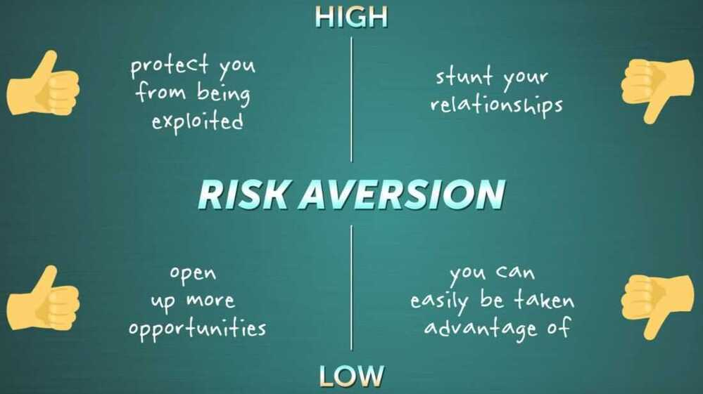

# Trust

Trust does not mean that others have to do things the way you expect them to. Trust means to become vulnerable.

Trust involves vulnerability, which involves risk. So **Dispositional Trust,** is tied to an idea called **Risk Aversion**, or how much you avoid risks.

"Friends are better than money. Almost anything money can do, friends can do better. In so many ways a friend with a boat is better than owning a boat."

Being honest may not get you a lot of friends but it'll always get you the right ones. -- John Lennon

Cognitive trust can be earned by Competence, Intent and Integrity.

https://ideas.ted.com/there-are-three-sides-to-every-argument

## Generational Trust

India is a low trust society. Which, I assume, would be true of any developing nation. Where resources are scarce and the people looking to exploit them far more.

In resource-constrained environments, most games are zero-sum games. For me to win, you have to lose. There isn’t enough to go around and feed everyone’s need. And when needs go unfulfilled, greed takes over.

That’s why it’s so common to hear stories of people working so hard to become police officers or get government jobs or even become a TT - only to become corrupt and start taking bribes the minute they get there. Why won’t they? They worked their asses off and won a massive lottery against millions of other aspirants. Now they want to amass enough resource so that their future generations don’t have to fight that fight.

So I understand why, by default, we operate from distrust. Starting with trust is a privilege only developed nations can afford. Where, from land to food to clean air & water, there is enough for everyone. Abundance makes trust easy.

I understand all this. But that doesn’t make it any easier to deal with the logical repercussion of it. That anyone trying to build a high-trust system in a low trust society will need to prove their intent again and again and again. Because, in low-trust societies, we start with ‘guilty until proven innocent’.

[My Experiment With Truth - by Shashank Mehta](https://midlifeentrepreneur.substack.com/p/my-experiment-with-truth)
