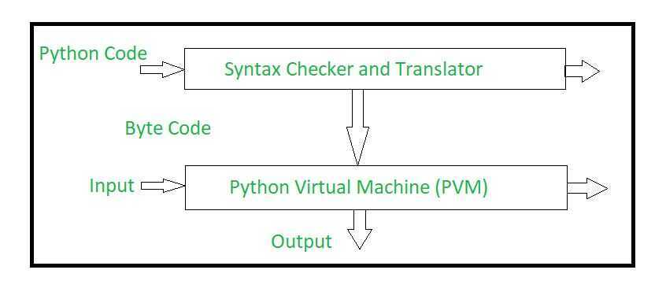

# Architecture

## Working

## The Python interpreter performs following tasks to execute a Python program

- **Step 1 :**The interpreter reads a python code or instruction. Then it verifies that the instruction is well formatted, i.e. it checks the syntax of each line.If it encounters any error, it immediately halts the translation and shows an error message.
- **Step 2 :**If there is no error, i.e. if the python instruction or code is well formatted then the interpreter translates it into its equivalent form in intermediate language called "Byte code".Thus, after successful execution of Python script or code, it is completely translated into Byte code.
- **Step 3 :**Byte code is sent to the Python Virtual Machine(PVM).Here again the byte code is executed on PVM.If an error occurs during this execution then the execution is halted with an error message.

https://www.geeksforgeeks.org/internal-working-of-python

## Why Python is Slow

[Talk: Anthony Shaw - Why is Python slow?](https://www.youtube.com/watch?v=I4nkgJdVZFA&ab_channel=PyCon2020)

## References

https://rushter.com/blog/python-memory-managment

https://github.com/python/cpython/blob/7d6ddb96b34b94c1cbdf95baa94492c48426404e/Objects/obmalloc.c
