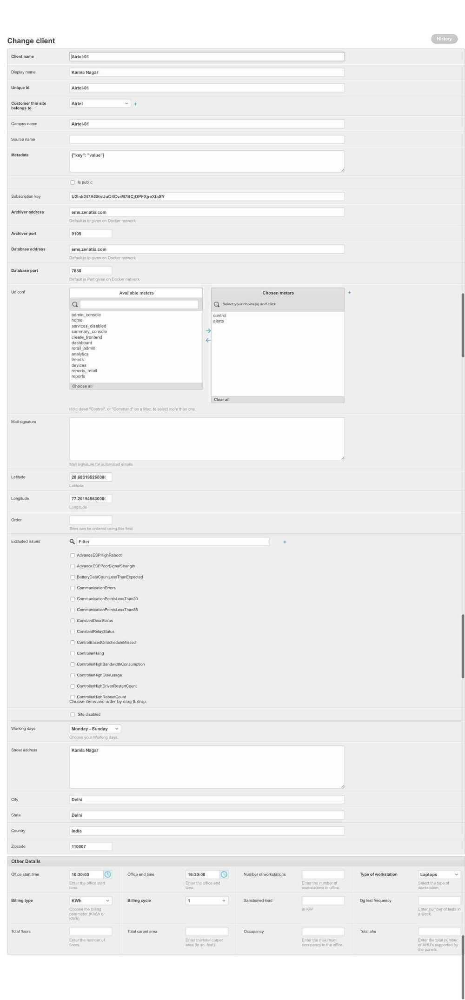

# Admin site

## Overview

- Enabled by default
- Requirements
  - django.contrib.auth
  - django.contrib.contenttypes
  - django.contrib.messages
  - django.contrib.sessions

## ModelAdmin objects

The **ModelAdmin** class is the representation of a model in the admin interface. Usually, these are stored in a file named **admin.py** in your application.

Register decorator

```python
@admin.register(Author)
```

list_display is used to show columns of data in list page

```python
list_display = {'Issue', 'Date', 'clean'}
```

fieldsets is used to show the fields that must be shown in detail page

```python
fieldsets = {}
```

```python
classTicketAdmin(admin.ModelAdmin):
 list_display=('ticket_number','issue','device','status')
 list_editable = ('is_finished',)
 list_filter=('status',)

 readonly_fields=('ticket_number','ticket_id','issue','device','status')

 def has_add_permission(self, request):
  return False

 def has_delete_permission(self, request, obj=None):
    return False
```

## Overriding the fieldsets that are shown in django admin panel

We can override the fields that are shown when a user opens the django admin panel model.

Ex -

```python
 fieldsets=(
  (None,{'fields':(
  'client_name','display_name','unique_id','customer','campus_name','source_name','metadata',
  'is_public',
  'subscription_key','archiver_address','archiver_port','database_address','database_port',
  'url_conf','mail_signature','latitude','longitude','order','excluded_issues',
  'site_disabled','working_days','street_address','city','state','country','zipcode')},),
  ('OtherDetails',
  {'fields':(('office_start_time','office_end_time','number_of_workstations','type_of_workstation'),
  ('billing_type','billing_cycle','sanctioned_load','dg_test_frequency'),
  ('total_floors','total_carpet_area','occupancy','total_ahu'))}),
)
```



Here notice the different sections and also the sub-sections in the "Other Details" section.

Now we can also override the admin fields to show according to the user who is logged in, by overriding `function get_fieldsets(self, request, obj=None)` and returning the fieldsets accordingly.

Ex -

```python
def get_fieldsets(self, request, obj=None):
  client_id=request.session.get('client_id', None)

  #if request is from frontend, dont show some of the fields
  if client_id is not None:
    return self.fieldsets
  else:
    if request.user.is_superuser:
      return self.fieldsets
    else:
      return self.tester_fieldsets
and,
tester_fieldsets=(
  (None,{'fields':('campus_name','display_name','customer')},),
)
```

## ModelAdmin.get_queryset(request)

The **get_queryset** method on a **ModelAdmin** returns a [**QuerySet**](https://docs.djangoproject.com/en/2.1/ref/models/querysets/#django.db.models.query.QuerySet) of all model instances that can be edited by the admin site. One use case for overriding this method is to show objects owned by the logged-in user:

```python
 class MyModelAdmin(admin.ModelAdmin):
    def get_queryset(self, request):
        qs = super().get_queryset(request)
        if request.user.is_superuser:
            return qs
        return qs.filter(author=request.user)

```

## Admin Actions

Custom admin actions can be created for bulk operations in change list page

## Admin alternatives

[**https://djangopackages.org/grids/g/admin-interface/**](https://djangopackages.org/grids/g/admin-interface/)

<https://github.com/mirumee/saleor> (14.1k stars)

Customer-centric e-commerce on a modern stack

A headless, GraphQL commerce platform delivering ultra-fast, dynamic, personalized shopping experiences. Beautiful online stores, anywhere, on any device.

<https://github.com/sehmaschine/django-grappelli>

<https://github.com/darklow/django-suit>

<https://github.com/geex-arts/django-jet>

<https://github.com/jet-admin/jet-bridge>

<https://github.com/jet-admin/jet-bridge>

<https://github.com/sshwsfc/xadmin>

<https://dev.to/sm0ke/django-boilerplate-code-open-source-and-free-2aa5>

<https://appseed.us/admin-dashboards/django-datta-able>

React admin - <https://github.com/marmelab/react-admin>

## Django Open Source projects

<https://www.upgrad.com/blog/django-open-source-projects>

- Wagtail (Open Source CMS)
- Ownphotos (Open Source Google Photos)
- PostHog - <https://github.com/PostHog/posthog> (Open Source Event Tracking)
- Cabot (Open Source Nagios)
- Saleor Commerce (Open Source E-Commerce)

## Others

<https://awesomeopensource.com>

<https://github.com/sindresorhus/awesome>

## Others

<https://realpython.com/manage-users-in-django-admin>
