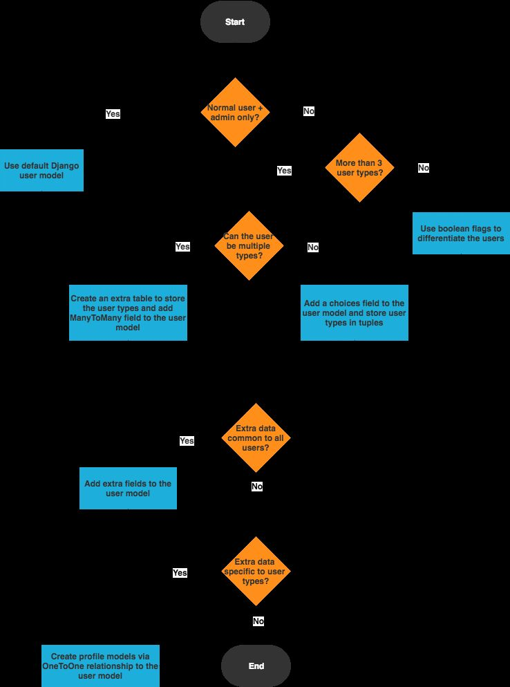

# Advanced

1. Atomic Transactions
2. Using `+` as the related_name when we do not want django to automatically create related_name
3. Using decorators

### Tips

1. No matter what strategy you pick, or what is your business model, always use one, and only one Django model to handle the authentication.
2. Never user the built-in Django User model directly, even if the built-in Django User implementation fulfill all the requirements of your application.

## Signals - <https://anonbadger.wordpress.com/2018/12/15/python-signal-handlers-and-exceptions>

[Introduction to Django Signals | Django (3.0) Crash Course Tutorials (pt 18)](https://www.youtube.com/watch?v=Kc1Q_ayAeQk&list=PL-51WBLyFTg2vW-_6XBoUpE7vpmoR3ztO&index=18)

## Context Processors

A context processor has a very simple interface: It's just a Python function that takes one argument, anHttpRequestobject, and returns a dictionary that gets added to the template context.

<https://djangobook.com/writing-context-processors>

<https://docs.djangoproject.com/en/2.2/ref/templates/api/#using-requestcontext>

## Middlewares

<http://www.gustavwengel.dk/django-middleware-walkthrough>

## Problems

### N+1 Select Query Issue

This problem occurs when the code needs to load the children of a parent-child relationship (the "many" in the "one-to-many"). Most ORMs have lazy-loading enabled by default, so queries are issued for the parent record, and then one query for EACH child record. As you can expect, doing N+1 queries instead of a single query will flood your database with queries, which is something we can and should avoid.

#### Example

Let's say you have a collection ofCarobjects (database rows), and eachCarhas a collection ofWheelobjects (also rows). In other words, Car->Wheelis a 1-to-many relationship.

Now, let's say you need to iterate through all the cars, and for each one, print out a list of the wheels. The naive O/R implementation would do the following:

`SELECT * FROM Cars;`

And then for each Car:

`SELECT * FROM Wheel WHERE CarId = ?`

In other words, you have one select for the Cars, and then N additional selects, where N is the total number of cars.

Alternatively, one could get all wheels and perform the lookups in memory:

`SELECT * FROM Wheel`

This reduces the number of round-trips to the database from N+1 to 2. Most ORM tools give you several ways to prevent N+1 selects.

<https://theorangeone.net/posts/django-orm-performance>

## Django 3.0

ASGI Support

<https://docs.djangoproject.com/en/3.0/releases/3.0>

<https://arunrocks.com/a-guide-to-asgi-in-django-30-and-its-performance>
