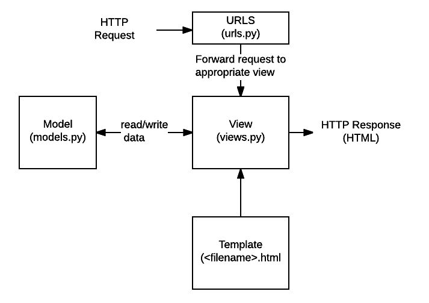

# Architecture

Follows **Model-View-Template (MVT)** architectural pattern.

## Primary Goal

1. Ease of creation of complex, database-driven websites

2. Reusability, and pluggability of components

3. Rapid development

4. Don't repeat yourself

5. Provide create, read, update and delete interface that is generated dynamically through introspection and configured via admin-roles

## Difference between MVC and MVT

Django itself takes care of the controller part only leaving Templates.

Template is a HTML file mixed with Django Template Language (DTL).

Django web applications typicallygroup the code that handles each of these steps into separate files:

- **URLs:** While it is possible to process requests from every single URL via a single function, it is much more maintainable to write a separate view function to handle each resource. A URL mapper is used to redirect HTTP requests to the appropriate viewbased on the request URL. The URL mapper can also match particular patterns of strings or digits that appear in an URL, and pass these to a view function as data.
- **View:** A view is arequest handler function, which receives HTTP requests and returns HTTP responses. Views access the data needed to satisfy requests via *models*, and delegate the formatting of the response to *templates*.
- **Models:** Models are Python objects that define the structure of an application's data, and provide mechanisms to manage (add, modify, delete) and query records in the database.
- **Templates:** A template is a text file defining the structure or layout of a file (such as an HTML page), with placeholders used to represent actual content. A *view* can dynamically create an HTML page using an HTML template, populating it with data from a *model*. A template can be used to define the structure of any type of file; it doesn't have to be HTML!
