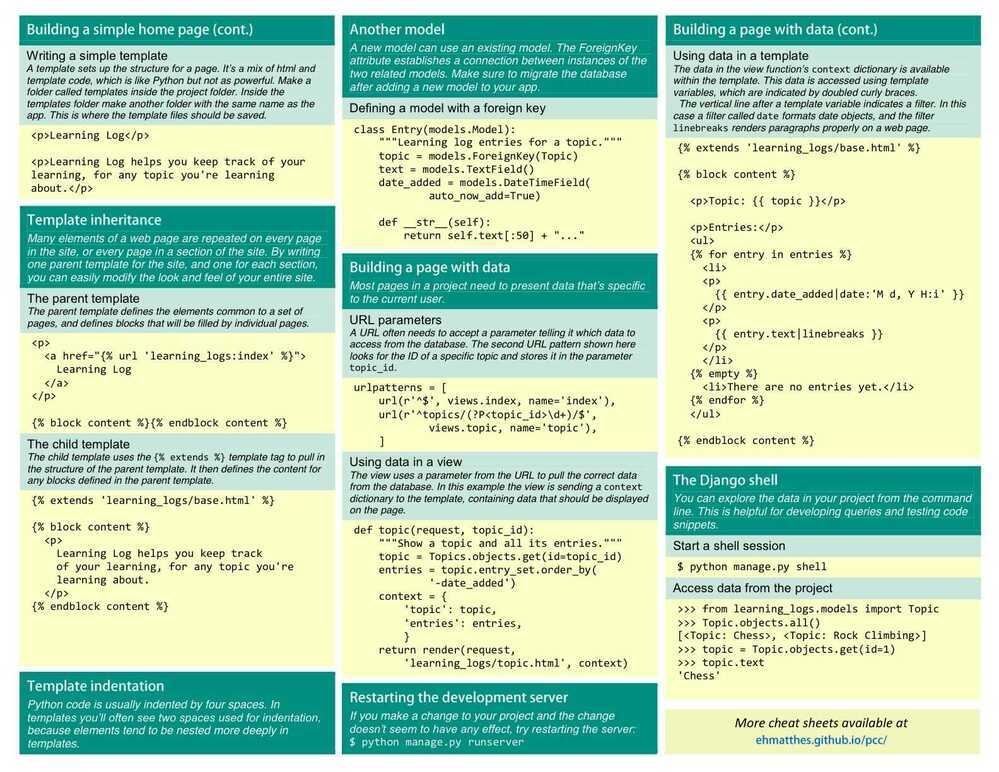

# Cheatsheet

You want to add user authentication in a Django project such that one user is logged in only once. This should avoid two different persons logging into the system with the same login/password. Which of the following is a possible way to do this?

- Checking in the django_session table before logging in the user
