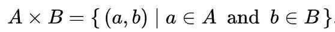

# 10. Functional Programming Modules

10.1. itertools - Functions creating iterators for efficient looping

10.2. functools - Higher order functions and operations on callable objects

10.3. operator - Standard operators as functions

## 10.1 itertools - Functions creating iterators for efficient looping (iterator algebra)

[Python Tutorials - Python Itertools Playlist](https://www.youtube.com/playlist?list=PLGKQkV4guDKEn-pF85NoIL_-VYIFz3ppo)

### 1. Infinite Iterators

| **Iterator** | **Arguments** | **Results** | **Example** |
|---|---|---|---|
| [**count()**](https://docs.python.org/2/library/itertools.html#itertools.count) | start, [step] | start, start+step, start+2*step, ... | count(10)-->1011121314... |
| [**cycle()**](https://docs.python.org/2/library/itertools.html#itertools.cycle) | p | p0, p1, ... plast, p0, p1, ... | cycle('ABCD')-->ABCDABCD... |
| [**repeat()**](https://docs.python.org/2/library/itertools.html#itertools.repeat) | elem [,n] | elem, elem, elem, ... endlessly or up to n times | repeat(10,3)-->101010 |

### 2. Iterators terminating on the shortest input sequence

| **Iterator** | **Arguments** | **Results** | **Example** |
|---|---|---|---|
| [**chain()**](https://docs.python.org/2/library/itertools.html#itertools.chain) | p, q, ... | p0, p1, ... plast, q0, q1, ... | chain('ABC','DEF')-->ABCDEF |
| [**compress()**](https://docs.python.org/2/library/itertools.html#itertools.compress) | data, selectors | (d[0] if s[0]), (d[1] if s[1]), ... | compress('ABCDEF', [1,0,1,0,1,1])-->ACEF |
| [**dropwhile()**](https://docs.python.org/2/library/itertools.html#itertools.dropwhile) | pred, seq | seq[n], seq[n+1], starting when pred fails | dropwhile(lambdax:x<5, [1,4,6,4,1])-->641 |
| [**groupby()**](https://docs.python.org/2/library/itertools.html#itertools.groupby) | iterable[, keyfunc] | sub-iterators grouped by value of keyfunc(v) |  |
| [**ifilter()**](https://docs.python.org/2/library/itertools.html#itertools.ifilter) | pred, seq | elements of seq where pred(elem) is true | ifilter(lambdax:x%2,range(10))-->13579 |
| [**ifilterfalse()**](https://docs.python.org/2/library/itertools.html#itertools.ifilterfalse) | pred, seq | elements of seq where pred(elem) is false | ifilterfalse(lambdax:x%2,range(10))-->02468 |
| [**islice()**](https://docs.python.org/2/library/itertools.html#itertools.islice) | seq, [start,] stop [, step] | elements from seq[start:stop:step] | islice('ABCDEFG',2,None)-->CDEFG |
| [**imap()**](https://docs.python.org/2/library/itertools.html#itertools.imap) | func, p, q, ... | func(p0, q0), func(p1, q1), ... | imap(pow,(2,3,10),(5,2,3))-->3291000 |
| [**starmap()**](https://docs.python.org/2/library/itertools.html#itertools.starmap) | func, seq | func(*seq[0]), func(*seq[1]), ... | starmap(pow, [(2,5),(3,2),(10,3)])-->3291000 |
| [**tee()**](https://docs.python.org/2/library/itertools.html#itertools.tee) | it, n | it1, it2, ... itn splits one iterator into n |  |
| [**takewhile()**](https://docs.python.org/2/library/itertools.html#itertools.takewhile) | pred, seq | seq[0], seq[1], until pred fails | takewhile(lambdax:x<5, [1,4,6,4,1])-->14 |
| [**izip()**](https://docs.python.org/2/library/itertools.html#itertools.izip) | p, q, ... | (p[0], q[0]), (p[1], q[1]), ... | izip('ABCD','xy')-->AxBy |
| [**izip_longest()**](https://docs.python.org/2/library/itertools.html#itertools.izip_longest) | p, q, ... | (p[0], q[0]), (p[1], q[1]), ... | izip_longest('ABCD','xy',fillvalue='-')-->AxByC-D- |

### 3. Combinatoric generators

| Iterator | Arguments | Results | Examples |
| --- | --- | --- | --- |
| [product()](https://docs.python.org/2/library/itertools.html#itertools.product) | p, q, … [repeat=1] | cartesian product, equivalent to a nested for-loop | product('ABCD',repeat=2), AAABACADBABBBCBDCACBCCCDDADBDCDD |
| [permutations()](https://docs.python.org/2/library/itertools.html#itertools.permutations) | p[, r] | r-length tuples, all possible orderings, no repeated elements | permutations('ABCD',2), ABACADBABCBDCACBCDDADBDC |
| [combinations()](https://docs.python.org/2/library/itertools.html#itertools.combinations) | p, r | r-length tuples, in sorted order, no repeated elements | combinations('ABCD',2), ABACADBCBDCD |
| [combinations_with_replacement()](https://docs.python.org/2/library/itertools.html#itertools.combinations_with_replacement) | p, r | r-length tuples, in sorted order, with repeated elements | combinations_with_replacement('ABCD',2), AAABACADBBBCBDCCCDDD |

## Permutations of a string python function

```python
def toString(List):
    return ''.join(List)

# Function to print permutations of string
# This function takes three parameters:
# 1. String
# 2. Starting index of the string
# 3. Ending index of the string.
def permute(a, l, r):
    if l == r:
        print(toString(a))
    else:
        for i in range(l, r + 1):
            a[l], a[i] = a[i], a[l]
            permute(a, l + 1, r)
            a[l], a[i] = a[i], a[l] # backtrack

# Driver program to test the above function
string = "ABC"
n = len(string)
a = list(string)
permute(a, 0, n-1)

Runtime - O(n^2 * n!)
```

## Itertools.chain()

Without the**chain()**function, iterating over two lists would require creating a copy with the contents of both or adding the contents of one to the other.

```python
import itertools
l1 = ['a', 'b', 'c']
l2 = ['d', 'e', 'f']
chained = itertools.chain(l1, l2)
chained
<itertools.chain object at 0x100431250>

[l for l in chained]
['a', 'b', 'c', 'd', 'e', 'f']
```

## Itertools.izip()

izip() is almost identical to the zip() builtin, in that it pairs up the contents of two lists into an iterable of 2-tuples. However, where **zip()** allocates a new list,izip() only returns an iterator

## Itertools.product()

This tool computes the[cartesian product](https://en.wikipedia.org/wiki/Cartesian_product) of input iterables.

```python
from itertools import product

print list(product([1,2,3],repeat = 2))
[(1, 1), (1, 2), (1, 3), (2, 1), (2, 2), (2, 3), (3, 1), (3, 2), (3, 3)]

print list(product([1,2,3],[3,4]))
[(1, 3), (1, 4), (2, 3), (2, 4), (3, 3), (3, 4)]

A = [[1,2,3],[3,4,5]]
print list(product(*A))
[(1, 3), (1, 4), (1, 5), (2, 3), (2, 4), (2, 5), (3, 3), (3, 4), (3, 5)]

B = [[1,2,3],[3,4,5],[7,8]]
print list(product(*B))
[(1, 3, 7), (1, 3, 8), (1, 4, 7), (1, 4, 8), (1, 5, 7), (1, 5, 8), (2, 3, 7), (2, 3, 8), (2, 4, 7), (2, 4, 8), (2, 5, 7), (2, 5, 8), (3, 3, 7), (3, 3, 8), (3, 4, 7), (3, 4, 8), (3, 5, 7), (3, 5, 8)]

def product(*args):
    if not args:
        return iter(((),)) # yield tuple()
    return (items + (item,)
        for items in product(*args[:-1]) for item in args[-1])
```

In[set theory](https://en.wikipedia.org/wiki/Set_theory)(and, usually, in other parts of[mathematics](https://en.wikipedia.org/wiki/Mathematics)), aCartesian productis a[mathematical operation](https://en.wikipedia.org/wiki/Mathematical_operation) that returns a[set](https://en.wikipedia.org/wiki/Set_(mathematics))(orproduct setor simplyproduct) from multiple sets. That is, for setsAandB, the Cartesian productA×Bis the set of all[ordered pairs](https://en.wikipedia.org/wiki/Ordered_pair)(a,b) wherea∈Aandb∈B. Products can be specified using[set-builder notation](https://en.wikipedia.org/wiki/Set-builder_notation), e.g.



A table can be created by taking the Cartesian product of a set of rows and a set of columns. If the Cartesian productrows×columnsis taken, the cells of the table contain ordered pairs of the form(row value, column value).

More generally, a Cartesian product ofnsets, also known as ann-fold Cartesian product, can be represented by an array ofndimensions, where each element is ann-[tuple](https://en.wikipedia.org/wiki/Tuple). An ordered pair is a[2-tuple or couple](https://en.wikipedia.org/wiki/Tuple#Names_for_tuples_of_specific_lengths).

<https://en.wikipedia.org/wiki/Cartesian_product>

## Subset of a given length

```python
from itertools import combinations

# return all subset of size 2
list(combinations([1,2,3], 2)
```

Number of elements in a given set of size n with subset size r = nCr (3C1 = 3, 3C3 = 1)

## Powerset (all subsets of a set)

```python
from itertools import chain, combinations

def powerset(iterable):
"powerset([1,2,3]) --> () (1,) (2,) (3,) (1,2) (1,3) (2,3) (1,2,3)"
    s = list(iterable)
    return chain.from_iterable(combinations(s, r) for r in range(len(s)+1))

from itertools import chain, combinations
def powerset(lst):
    return chain(*map(lambda x: combinations(lst, x), range(len(lst)+1)))

for i in powerset([1,2,3]):
    print(i)
()
(1,)
(2,)
…
```

## 10.2 Functools

Partial functions allow us to fix a certain number of arguments of a function and generate a new function.

```python
from functools import partial

# A normal function
def f(a, b, c, x):
    return 1000*a + 100*b + 10*c + x

# A partial function that calls f with
# a as 3, b as 1 and c as 4.
g = partial(f, 3, 1, 4)

# Calling g()
print(g(5))

>>>3145

from functools import partial

# A normal function
def add(a, b, c):
    return 100 * a + 10 * b + c

# A partial function with b = 1 and c = 2
add_part = partial(add, c = 2, b = 1)

# Calling partial function
print(add_part(3))

>>>312
```

<https://www.geeksforgeeks.org/partial-functions-python>

```python
from functools import cache,  lru_cache

@cache / @lru_cache(maxsize=5)
def fib(n):
    if n <= 1:
        return n
return fib(n-1) + fib(n-2)
```

## References

<https://julien.danjou.info/python-and-functional-programming>

<https://skerritt.blog/learn-functional-python-in-10-minutes>
