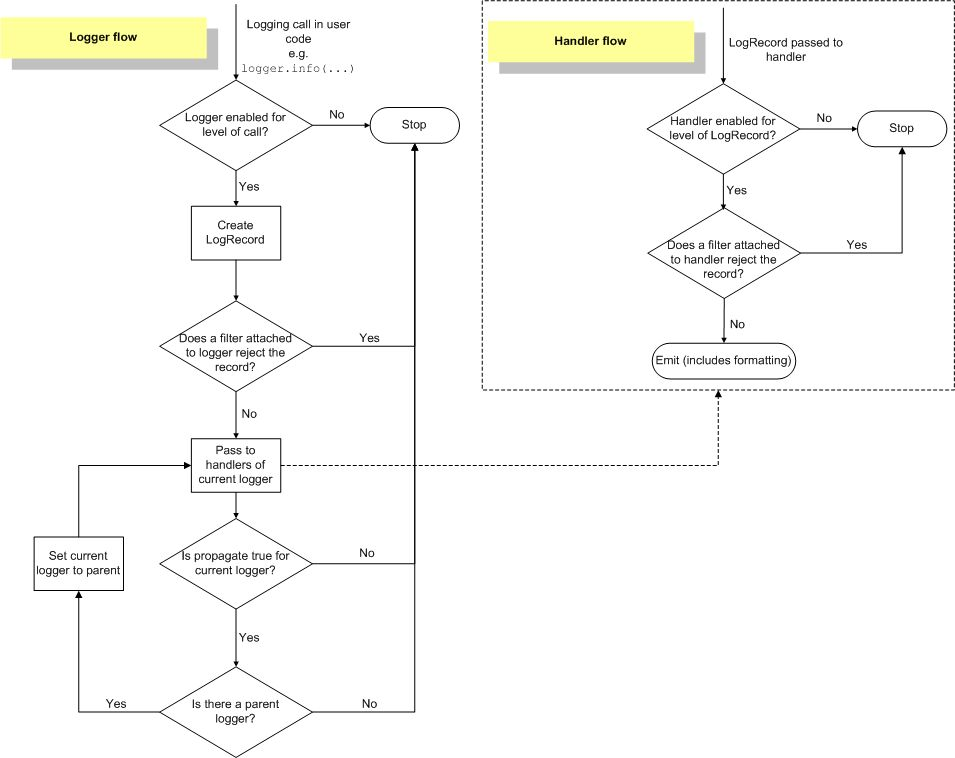

# 16. Generic Operating System Services / Logging

[16.1.os - Miscellaneous operating system interfaces](https://docs.python.org/3/library/os.html)

[16.2.io - Core tools for working with streams](https://docs.python.org/3/library/io.html)

[16.3.time - Time access and conversions](https://docs.python.org/3/library/time.html)

[**16.4.argparse - Parser for command-line options, arguments and sub-commands**](https://docs.python.org/3/library/argparse.html)

[**16.5.getopt - C-style parser for command line options**](https://docs.python.org/3/library/getopt.html)

[16.6.logging - Logging facility for Python](https://docs.python.org/3/library/logging.html)

[16.7.logging.config - Logging configuration](https://docs.python.org/3/library/logging.config.html)

[16.8.logging.handlers - Logging handlers](https://docs.python.org/3/library/logging.handlers.html)

[16.9.getpass - Portable password input](https://docs.python.org/3/library/getpass.html)

[16.10.curses - Terminal handling for character-cell displays](https://docs.python.org/3/library/curses.html)

[16.11.curses.textpad - Text input widget for curses programs](https://docs.python.org/3/library/curses.html#module-curses.textpad)

[16.12.curses.ascii - Utilities for ASCII characters](https://docs.python.org/3/library/curses.ascii.html)

[16.13.curses.panel - A panel stack extension for curses](https://docs.python.org/3/library/curses.panel.html)

[16.14.platform - Access to underlying platform's identifying data](https://docs.python.org/3/library/platform.html)

[16.15.errno - Standard errno system symbols](https://docs.python.org/3/library/errno.html)

[16.16.ctypes - A foreign function library for Python](https://docs.python.org/3/library/ctypes.html)

## OS

```bash
import os

os.listdir() # gives the list of the files and folder is the current directory

os.getloadavg() # Return the number of processes in the system run queue averaged over the last 1, 5, and 15 minutes or raises [OSError](https://docs.python.org/3/library/exceptions.html#OSError) if the load average was unobtainable.
```

- **Single Core system--** if load average is 1.00 it means that system is fully utilized and if there will be more tasks incoming they will be queue-up and wait for execution.
- **Single Core system--** if load average is 2.00 it means that System is already utilized and some tasks are already queued-up and waiting for execution.
- **Multi core system ( 4 cores )--** if load average is 1.00 it means that system uses 1/4 of his CPU capabilities, one task is actively running and there are still 3 cores at 'idle' stage.
- **Multi core system ( 4 cores )--** if load average is 4.00 it means that system uses all 4 cores and it indicate that system is fully utilized.

**run-queue:** Number of active ( running ) and queued processes

<https://www.thegeekdiary.com/understanding-os-load-average-and-run-queue-blocked-queue-in-terms-of-cpu-utilization-in-linux>

## Python logging

| **Level**    | **When it's used**                                                                                                                                                     |
|-------------|-----------------------------------------------------------|
| **DEBUG**    | Detailed information, typically of interest only when diagnosing problems.                                                                                             |
| **INFO**     | Confirmation that things are working as expected.                                                                                                                      |
| **WARNING**  | An indication that something unexpected happened, or indicative of some problem in the near future (e.g. 'disk space low'). The software is still working as expected. |
| **ERROR**    | Due to a more serious problem, the software has not been able to perform some function.                                                                                |
| **CRITICAL** | A serious error, indicating that the program itself may be unable to continue running                                                                                  |

The default level isWARNING, which means that only events of this level and above will be tracked.



The logging library takes a modular approach and offers several categories of components: loggers, handlers, filters, and formatters.

- Loggers expose the interface that application code directly uses.
- Handlers send the log records (created by loggers) to the appropriate destination.
- Filters provide a finer grained facility for determining which log records to output.
- Formatters specify the layout of log records in the final output.

Log event information is passed between loggers, handlers, filters and formatters in a [LogRecord](https://docs.python.org/3/library/logging.html#logging.LogRecord) instance.

<https://docs.python.org/3/howto/logging.html>

<https://docs.python.org/3/howto/logging-cookbook.html>

1. Logger

[Logger](https://docs.python.org/3/library/logging.html#logging.Logger) objects have a threefold job. First, they expose several methods to application code so that applications can log messages at runtime. Second, logger objects determine which log messages to act upon based upon severity (the default filtering facility) or filter objects. Third, logger objects pass along relevant log messages to all interested log handlers.

2. Handler

[Handler](https://docs.python.org/3/library/logging.html#logging.Handler) objects are responsible for dispatching the appropriate log messages (based on the log messages' severity) to the handler's specified destination.[Logger](https://docs.python.org/3/library/logging.html#logging.Logger) objects can add zero or more handler objects to themselves with an [addHandler()](https://docs.python.org/3/library/logging.html#logging.Logger.addHandler) method. As an example scenario, an application may want to send all log messages to a log file, all log messages of error or higher to stdout, and all messages of critical to an email address. This scenario requires three individual handlers where each handler is responsible for sending messages of a specific severity to a specific location.

## logging.Handlers

- **StreamHandler**
- FileHandler
- NullHandler
- WatchedFileHandler
- BaseRotatingHandler
- RotatingFileHandler
- TimedRotatingFileHandler
- SocketHandler
- DatagramHandler
- SysLogHandler
- NTEventLogHandler
- **SMTPHandler**
- MemoryHandler
- **HTTPHandler**
- QueueHandler
- QueueListener

<https://docs.python.org/3/library/logging.handlers.html>

3. Formatter

Formatter objects configure the final order, structure, and contents of the log message. Unlike the base [logging.Handler](https://docs.python.org/3/library/logging.html#logging.Handler) class, application code may instantiate formatter classes, although you could likely subclass the formatter if your application needs special behavior. The constructor takes three optional arguments -- a message format string, a date format string and a style indicator.

`"format": "[%(asctime)s] [%(levelname)s in %(module)s - %(funcName)s():%(lineno)s]: %(message)s",`

```python
# Debugging Logging
import traceback
import logging

# logging settings
DEBUG = eval(os.environ.get('DEBUG', 'False'))
if DEBUG:
    logging.basicConfig(format='%(asctime)s %(levelname)-8s %(message)s',
    level=logging.DEBUG, datefmt='%Y-%m-%d %H:%M:%S')
else:
    logging.basicConfig(format='%(asctime)s %(levelname)-8s %(message)s', level=logging.INFO, datefmt='%Y-%m-%d %H:%M:%S')

logging.error('No topic: {}'.format(topic))
# logging.error(traceback.format_exc())
logging.exception('Exception') #traceback is attached with message

# format_exc()
    This is like print_exc(limit) but returns a string instead of printing to a file.

# SLACK Logging
import requests
import json
import os
from logging.config import dictConfig

# debugging and logging settings
DEBUG = eval(os.environ.get('DEBUG', 'False'))

SLACK_WEBHOOK="https://hooks.slack.com/services/org_id/api_key"

# for sending error logs to slack
class HTTPSlackHandler(logging.Handler):
    def emit(self, record):
        log_entry = self.format(record)
        log_entry = f'daily_truncate_db_script: {log_entry}'
        json_text = json.dumps({"text": log_entry})
        logging.info(f'json_text {json_text}')
        url = SLACK_WEBHOOK
        return requests.post(url, json_text, headers={"Content-type": "application/json"}).content

dictConfig({
    "version": 1,
    "disable_existing_loggers": True,
    "formatters": {
        "default": {
            "format": "[%(asctime)s] [%(levelname)s in %(module)s - %(funcName)s():%(lineno)s]: %(message)s",
        },
        "access": {
            "format": "%(message)s",
        }
    },
    "handlers": {
        "console": {
            "class": "logging.StreamHandler",
            "formatter": "default",
            "stream": "ext://sys.stdout",
        },
        "slack": {
            "class": "__main__.HTTPSlackHandler",
            "formatter": "default",
            "level": "ERROR",
        }
    },
    "root": {
        "level": "DEBUG" if DEBUG else "INFO",
        "handlers": ["console"] if DEBUG else ["console", "slack"],
    }
})
```

### argparse

```python
import argparse

parser = argparse.ArgumentParser()

parser.add_argument("square", type=int, help="display a square of a given number")

parser.add_argument("-v", "--verbosity", type=int, help="increase output verbosity")

args = parser.parse_args()

answer = args.square**2

if args.verbosity == 2:
    print("the square of {} equals {}".format(args.square, answer))
elif args.verbosity == 1:
    print("{}^2 == {}".format(args.square, answer))
else:
    print(answer)

# to skip
parser.add_argument("--skip", action='store_true')
if args.skip:
    print('True')
else:
    print('False')
python test.py --skip
True
>>>python test.py
False
```

<https://docs.python.org/3.3/library/argparse.html>

<https://docs.python.org/3/howto/argparse.html>

### getopt

Parses command line options and parameter list. args is the argument list to be parsed, without the leading reference to the running program.
Example -

```python
try:
    opts, args = getopt.getopt(argv, "dh:i:k:p:P:t:u:v",
    ["debug", "id", "keepalive", "port", "password", "topic", "username", "verbose"])
except getopt.GetoptError as s:
    print_usage()
    sys.exit(2)

for opt, arg in opts:
if opt in ("-d", "--debug"):
debug = True
elif opt in ("-h", "--host"):
host = arg
elif opt in ("-i", "--id"):
client_id = arg
elif opt in ("-k", "--keepalive"):
keepalive = int(arg)
elif opt in ("-p", "--port"):
port = int(arg)
elif opt in ("-P", "--password"):
password = arg
elif opt in ("-t", "--topic"):
topic = arg
print(topic)
elif opt in ("-u", "--username"):
username = arg
elif opt in ("-v", "--verbose"):
verbose = True
```

<https://docs.python.org/3/library/getopt.html>

<https://github.com/eclipse/paho.mqtt.python/blob/master/examples/client_mqtt_clear_retain.py>
