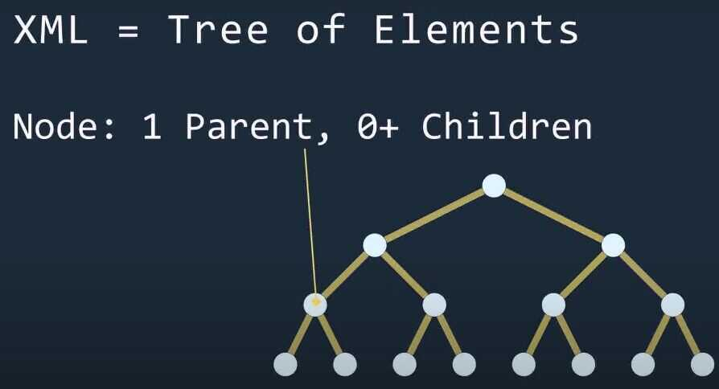
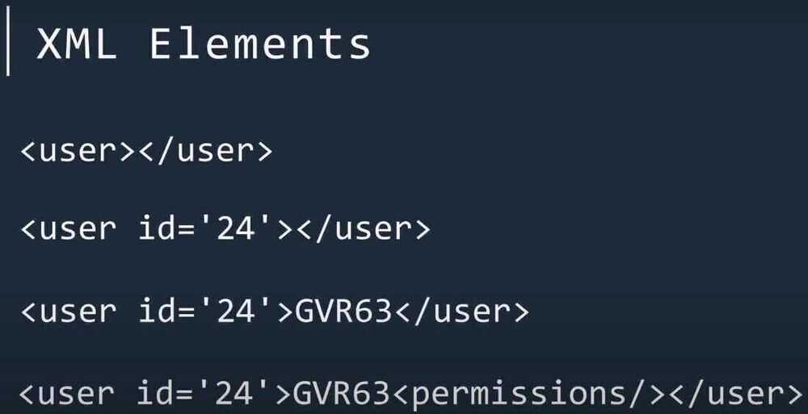

# 21. Structured Markup Processing Tools

- [html - HyperText Markup Language support](https://docs.python.org/3/library/html.html)
- [html.parser - Simple HTML and XHTML parser](https://docs.python.org/3/library/html.parser.html)
    - [Example HTML Parser Application](https://docs.python.org/3/library/html.parser.html#example-html-parser-application)
    - [HTMLParserMethods](https://docs.python.org/3/library/html.parser.html#htmlparser-methods)
    - [Examples](https://docs.python.org/3/library/html.parser.html#examples)
- [html.entities - Definitions of HTML general entities](https://docs.python.org/3/library/html.entities.html)
- [XML Processing Modules](https://docs.python.org/3/library/xml.html)
    - [XML vulnerabilities](https://docs.python.org/3/library/xml.html#xml-vulnerabilities)
    - [ThedefusedxmlPackage](https://docs.python.org/3/library/xml.html#the-defusedxml-package)
- [xml.etree.ElementTree - The ElementTree XML API](https://docs.python.org/3/library/xml.etree.elementtree.html)
    - [Tutorial](https://docs.python.org/3/library/xml.etree.elementtree.html#tutorial)
        - [XML tree and elements](https://docs.python.org/3/library/xml.etree.elementtree.html#xml-tree-and-elements)
        - [Parsing XML](https://docs.python.org/3/library/xml.etree.elementtree.html#parsing-xml)
        - [Pull API for non-blocking parsing](https://docs.python.org/3/library/xml.etree.elementtree.html#pull-api-for-non-blocking-parsing)
        - [Finding interesting elements](https://docs.python.org/3/library/xml.etree.elementtree.html#finding-interesting-elements)
        - [Modifying an XML File](https://docs.python.org/3/library/xml.etree.elementtree.html#modifying-an-xml-file)
        - [Building XML documents](https://docs.python.org/3/library/xml.etree.elementtree.html#building-xml-documents)
        - [Parsing XML with Namespaces](https://docs.python.org/3/library/xml.etree.elementtree.html#parsing-xml-with-namespaces)
        - [Additional resources](https://docs.python.org/3/library/xml.etree.elementtree.html#additional-resources)
    - [XPath support](https://docs.python.org/3/library/xml.etree.elementtree.html#xpath-support)
        - [Example](https://docs.python.org/3/library/xml.etree.elementtree.html#example)
        - [Supported XPath syntax](https://docs.python.org/3/library/xml.etree.elementtree.html#supported-xpath-syntax)
    - [Reference](https://docs.python.org/3/library/xml.etree.elementtree.html#reference)
        - [Functions](https://docs.python.org/3/library/xml.etree.elementtree.html#functions)
    - [XInclude support](https://docs.python.org/3/library/xml.etree.elementtree.html#xinclude-support)
        - [Example](https://docs.python.org/3/library/xml.etree.elementtree.html#id3)
    - [Reference](https://docs.python.org/3/library/xml.etree.elementtree.html#id4)
        - [Functions](https://docs.python.org/3/library/xml.etree.elementtree.html#elementinclude-functions)
        - [Element Objects](https://docs.python.org/3/library/xml.etree.elementtree.html#element-objects)
        - [ElementTree Objects](https://docs.python.org/3/library/xml.etree.elementtree.html#elementtree-objects)
        - [QName Objects](https://docs.python.org/3/library/xml.etree.elementtree.html#qname-objects)
        - [TreeBuilder Objects](https://docs.python.org/3/library/xml.etree.elementtree.html#treebuilder-objects)
        - [XMLParser Objects](https://docs.python.org/3/library/xml.etree.elementtree.html#xmlparser-objects)
        - [XMLPullParser Objects](https://docs.python.org/3/library/xml.etree.elementtree.html#xmlpullparser-objects)
        - [Exceptions](https://docs.python.org/3/library/xml.etree.elementtree.html#exceptions)
- [xml.dom - The Document Object Model API](https://docs.python.org/3/library/xml.dom.html)
    - [Module Contents](https://docs.python.org/3/library/xml.dom.html#module-contents)
    - [Objects in the DOM](https://docs.python.org/3/library/xml.dom.html#objects-in-the-dom)
        - [DOMImplementation Objects](https://docs.python.org/3/library/xml.dom.html#domimplementation-objects)
        - [Node Objects](https://docs.python.org/3/library/xml.dom.html#node-objects)
        - [NodeList Objects](https://docs.python.org/3/library/xml.dom.html#nodelist-objects)
        - [DocumentType Objects](https://docs.python.org/3/library/xml.dom.html#documenttype-objects)
        - [Document Objects](https://docs.python.org/3/library/xml.dom.html#document-objects)
        - [Element Objects](https://docs.python.org/3/library/xml.dom.html#element-objects)
        - [Attr Objects](https://docs.python.org/3/library/xml.dom.html#attr-objects)
        - [NamedNodeMap Objects](https://docs.python.org/3/library/xml.dom.html#namednodemap-objects)
        - [Comment Objects](https://docs.python.org/3/library/xml.dom.html#comment-objects)
        - [Text and CDATASection Objects](https://docs.python.org/3/library/xml.dom.html#text-and-cdatasection-objects)
        - [ProcessingInstruction Objects](https://docs.python.org/3/library/xml.dom.html#processinginstruction-objects)
        - [Exceptions](https://docs.python.org/3/library/xml.dom.html#exceptions)
    - [Conformance](https://docs.python.org/3/library/xml.dom.html#conformance)
        - [Type Mapping](https://docs.python.org/3/library/xml.dom.html#type-mapping)
        - [Accessor Methods](https://docs.python.org/3/library/xml.dom.html#accessor-methods)
- [xml.dom.minidom - Minimal DOM implementation](https://docs.python.org/3/library/xml.dom.minidom.html)
    - [DOM Objects](https://docs.python.org/3/library/xml.dom.minidom.html#dom-objects)
    - [DOM Example](https://docs.python.org/3/library/xml.dom.minidom.html#dom-example)
    - [minidom and the DOM standard](https://docs.python.org/3/library/xml.dom.minidom.html#minidom-and-the-dom-standard)
- [xml.dom.pulldom - Support for building partial DOM trees](https://docs.python.org/3/library/xml.dom.pulldom.html)
    - [DOMEventStream Objects](https://docs.python.org/3/library/xml.dom.pulldom.html#domeventstream-objects)
- [xml.sax - Support for SAX2 parsers](https://docs.python.org/3/library/xml.sax.html)
    - [SAXException Objects](https://docs.python.org/3/library/xml.sax.html#saxexception-objects)
- [xml.sax.handler - Base classes for SAX handlers](https://docs.python.org/3/library/xml.sax.handler.html)
    - [ContentHandler Objects](https://docs.python.org/3/library/xml.sax.handler.html#contenthandler-objects)
    - [DTDHandler Objects](https://docs.python.org/3/library/xml.sax.handler.html#dtdhandler-objects)
    - [EntityResolver Objects](https://docs.python.org/3/library/xml.sax.handler.html#entityresolver-objects)
    - [ErrorHandler Objects](https://docs.python.org/3/library/xml.sax.handler.html#errorhandler-objects)
- [xml.sax.saxutils - SAX Utilities](https://docs.python.org/3/library/xml.sax.utils.html)
- [xml.sax.xmlreader - Interface for XML parsers](https://docs.python.org/3/library/xml.sax.reader.html)
    - [XMLReader Objects](https://docs.python.org/3/library/xml.sax.reader.html#xmlreader-objects)
    - [IncrementalParser Objects](https://docs.python.org/3/library/xml.sax.reader.html#incrementalparser-objects)
    - [Locator Objects](https://docs.python.org/3/library/xml.sax.reader.html#locator-objects)
    - [InputSource Objects](https://docs.python.org/3/library/xml.sax.reader.html#inputsource-objects)
    - [TheAttributesInterface](https://docs.python.org/3/library/xml.sax.reader.html#the-attributes-interface)
    - [TheAttributesNSInterface](https://docs.python.org/3/library/xml.sax.reader.html#the-attributesns-interface)
- [xml.parsers.expat - Fast XML parsing using Expat](https://docs.python.org/3/library/pyexpat.html)
    - [XMLParser Objects](https://docs.python.org/3/library/pyexpat.html#xmlparser-objects)
    - [ExpatError Exceptions](https://docs.python.org/3/library/pyexpat.html#expaterror-exceptions)
    - [Example](https://docs.python.org/3/library/pyexpat.html#example)
    - [Content Model Descriptions](https://docs.python.org/3/library/pyexpat.html#module-xml.parsers.expat.model)
    - [Expat error constants](https://docs.python.org/3/library/pyexpat.html#module-xml.parsers.expat.errors)

## xml.etree.ElementTree

The [xml.etree.ElementTree](https://docs.python.org/3/library/xml.etree.elementtree.html#module-xml.etree.ElementTree) module implements a simple and efficient API for parsing and creating XML data.





## Main Classes

Element

ElementTree

## Main Functions

```java
ET.fromstring(String) --> Element

ET.tostring(Element) --> String

ET.parse(File) --> ElementTree
```

https://www.youtube.com/watch?v=j0xr0-IAqyk
