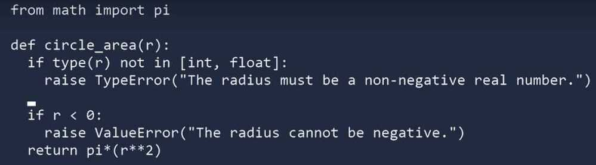

# Testing

1. Create your inputs
2. Execute the code, capturing the output
3. Compare the output with an expected result

## Testing a function

```python
 full_names.py
 def get_full_name(first, last):
     full_name = f'{first} {last}'
     return full_name.title()

 class Accountant:
     def init(self, balance=0):
         self.balance = balance

     def deposit(self, amount):
         self.balance += amount

     def withdraw(self, amount):
         self.balance -= amount

 tests.py
 # To build a test case, make a class that inherits from unittest.TestCase and write methods that begin with test_
 import unittest
 from full_names import get_full_name
 from full_names import Accountant

 class NamesTestCase(unittest.TestCase):
     def test_first_last(self):
         full_name = get_full_name('deepak', 'sood')
         self.assertEqual(full_name, 'Deepak Sood')

 # Testing a class is similar to testing a function, since we mostly test our methods
 class TestAccountant(unittest.TestCase):
     def test_initial_balance(self):
         acc = Accountant()
         self.assertEqual(acc.balance, 0)

         acc = Accountant(100)
         self.assertEqual(acc.balance, 100)

 # The setUp() method
 # When testing a class, we usually have to make an instance of the class. The setUp() method is run before every test. Any instances we make in setUp() are available in every test you write.

 class AccountantTest(unittest.TestCase):
     def setUp(self):
         self.acc = Accountant()

     def test_initial_balance(self):
         self.assertEqual(self.acc.balance, 0)

         acc = Accountant(100)
         self.assertEqual(acc.balance, 100)

 unittest.main()

 # run - python tests.py
 # python -m unittest test_circles
```

## Test Runners

There are many test runners available for Python. The one built into the Python standard library is called `unittest`.

|Tool|Ease of Use|Flexibility|Community Support|Documentation|CI/CD Integration|Test Discovery|Fixture Support|
|---|---|---|---|---|---|---|---|
|`unittest`|Requires more boilerplate code|Follows xUnit conventions|Part of Python standard library|Well-documented|Easily integrated|Supports test discovery|Supports fixtures but may be less convenient|
|`pytest`|Concise syntax|Highly flexible|Large and active community|Extensive documentation|Widely used in CI/CD|Powerful and automatic|Advanced fixture support with fixtures as first-class citizens|
|`nose2`|Strikes a balance between simplicity and features|Flexible with a plugin architecture|Community support has decreased over time|Documentation is available but may not be as comprehensive|Integration is possible but may require additional setup|Supports automatic test discovery|Supports fixtures|
|`doctest`|Simple and readable|Limited flexibility|Part of Python standard library|Limited support for complex scenarios|Integration is possible but may be limited|Extracts tests from docstrings|Limited support for fixtures|
|`Hypothesis`|Requires understanding of property-based testing concepts|Flexible with property-based testing|Active community with regular updates|Good documentation with examples and guides|Integration is possible with custom strategies|Test discovery based on properties specified|Fixtures are supported through strategies|
|`Tox`|Configuration can be complex but provides powerful testing across environments|Flexible for testing across environments|Active community with a focus on compatibility testing|Documentation is available but may require careful reading|Designed for integration with CI/CD pipelines|Relies on configuration for test discovery|Limited support for fixtures, mainly focused on environment isolation|

### unittest

unittest requires that:

- You put your tests into classes as methods
- You use a series of special assertion methods in theunittest.TestCaseclass instead of the built-inassertstatement

[unittest.mock](https://docs.python.org/3/library/unittest.mock.html#module-unittest.mock) is a library for testing in Python. As of Python 3.3, it is available in the [standard library](https://docs.python.org/dev/library/unittest.mock).

#### Disadvantages

unittest feels pretty similar to [JUnit](https://en.wikipedia.org/wiki/JUnit) which I would say is a disadvantage. Python is a different language with different patterns and expectations. One weirdness is that you have to put your tests in a class, even if you don't need to [setUp()](https://docs.python.org/3/library/unittest.html#unittest.TestCase.setUp) or [tearDown()](https://docs.python.org/3/library/unittest.html#unittest.TestCase.tearDown) anything. It uses camelCase for the method names which is against the Python conventions. You cannot simplyassert Expression, but instead, have to useself.assertEqual,self.assertTrue, ... (see the [complete list of assert methods](https://docs.python.org/3/library/unittest.html#assert-methods)). And the error messages are not as expressive as the ones you get from Pytest.

### PyUnit

PyUnit supports fixtures, test cases, test suites and a test runner for the automated testing of the code. In PyUnit, you can organize test cases into suites with the same fixtures

### Nose2

Nose's built in plugins helps you with output capture, code coverage, doctests, etc. Nose syntax is pretty simpler and reduces the barriers to writing tests. It extends Python unittest to make testing easier.

noseis compatible with any tests written using theunittestframework and can be used as a drop-in replacement for theunittesttest runner.

The development ofnoseas an open-source application fell behind, and a fork callednose2was created. If you're starting from scratch, it is recommended that you usenose2instead ofnose.

### Doctest

Doctest testing script goes in docstring with small function at the bottom of file. Doctest allows you to test your code by running examples included in the documentation and verifying that they returned the expected results. The use-case of doctest is less detailed and don't catch special cases. They are useful as an expressive documentation of the main use case of a module and its components.

The doctest looks for `>>>` within the docstrings and executes whatever follows as if it was entered in the interactive console. The next line is then the output which is compared to the output of the program.

### PyTest

[pytest](https://realpython.com/pytest-python-testing/) supports execution ofunittesttest cases. The real advantage ofpytestcomes by writingpytesttest cases.pytesttest cases are a series of functions in a Python file starting with the nametest_.

pytest has some other great features:

- Support for the built-inassertstatement instead of using specialself.assert*()methods
- Support for filtering for test cases
- Ability to rerun from the last failing test
- An ecosystem of hundreds of plugins to extend the functionality

```bash
  pip install pytest
  pytest

  python -m pytest tests
  python -m pytest . #directory
  pytest src/tests/test_sms.py -k 'test_sms_score' #run specific test in specific file

  pytest --doctest-modules
  pytest --durations=3
   It’s important to keep the execution time of the tests low so that it doesn’t feel bad to execute the test suite. I like to print the time of the 3 slowest tests which were performed.
  pytest --junitxml=test-reports/junit.xml --html=test-reports/pytest_report.html --self-contained-html

```

```python
def func(x):
   return x + 1

def test_answer():
   assert func(3) == 4

   assert response.status_code == 200
   assert response.text == "OK"
   assert response.elapsed.total_seconds() < 0.03
```

- pytest-black
- pytest-flake8
    `pytest --flake8 --black`

- pytest-mccabe
- pytest-mypy
        Mypy static type checker plugin for pytest
        automatically run mypy over your code by adding--mypyto your pytest command

- pytest-benchmark

- Coverage

For getting the code coverage in python

Coverage.py is a tool for measuring code coverage of Python programs. It monitors your program, noting which parts of the code have been executed, then analyzes the source to identify code that could have been executed but was not.

Coverage measurement is typically used to gauge the effectiveness of tests. It can show which parts of your code are being exercised by tests, and which are not.

```bash
pip install coverage

## coverage run -m pytest

coverage report

coverage html # open htmlcov/index.html in a browser
```

Many people choose to use the [pytest-cov](https://pytest-cov.readthedocs.io/) plugin, but for most purposes, it is unnecessary.

Some test runners provide coverage integration to make it easy to use coverage.py while running tests. For example, [pytest](http://doc.pytest.org/) has the [pytest-cov](https://pytest-cov.readthedocs.io/) plugin.

https://coverage.readthedocs.io/en/latest

- pytest-cov

pytest plugin to measure branch coverage.

- Install it withpip install pytest-cover
- Use it by adding--cov=path/to/fileor--cov=packagenameto the pytest execution
- Get output to terminal by adding to pytest--cov-report term
- Get HTML output by adding--cov-report html:tests/reports/coverage

This plugin produces coverage reports. Compared to just usingcoveragerunthis plugin does some extras:

- Subprocess support: you can fork or run stuff in a subprocess and will get covered without any fuss.
- Xdist support: you can use all of pytest-xdist's features and still get coverage.
- Consistent pytest behavior. If you runcoveragerun-mpytestyou will have slightly differentsys.path(CWD will be in it, unlike when runningpytest).

https://pytest-cov.readthedocs.io/en/latest/readme.html

#### Hypothesis

Hypothesis is a library which lets you write tests that are parameterized by a source of examples. It then generates simple and comprehensible examples that make your tests fail, letting you find more bugs with less work.

#### tox

tox is a tool for automating test environment management and testing against multiple interpreter configurations.

#### robotframework

[Robot Framework](http://robotframework.org/) is a generic open source automation framework for acceptance testing, acceptance test driven development (ATDD), and robotic process automation (RPA). It has simple plain text syntax and it can be extended easily with libraries implemented using Python or Java.

https://github.com/robotframework/robotframework

https://robotframework.org

https://realpython.com/python-testing

https://medium.com/swlh/unit-testing-in-python-basics-21a9a57418a0

## Assert can be used to test the code

Verify operator statements

```bash
assert(tc>0 and tc<51)
assert(n>=k)
assert(n%k==0)

assert sum([1, 2, 3]) == 6, "Should be 6"

assert sum([6087,5523,4910,3465,5646,8351]) == 33982
```

|                                  |                              |
| -------------------------------- | ---------------------------- |
| `assertEqual(a,b)`               | `a==b`                       |
| `assertNotEqual(a,b)`            | `a!=b`                       |
| `assertTrue(x)`                  | `bool(x) isTrue`             |
| `assertFalse(x)`                 | `bool(x) isFalse`            |
| `assertIs(a,b)`                  | `aisb`                       |
| `assertIsNot(a,b)`               | `aisnotb`                    |
| `assertIsNone(x)`                | `xisNone`                    |
| `assertIsNotNone(x)`             | `xisnotNone`                 |
| `assertIn(a,b)`                  | `ainb`                       |
| `assertNotIn(a,b)`               | `anotinb`                    |
| `assertIsInstance(a,b)`          | `isinstance(a,b`)            |
| `assertNotIsInstance(a,b)`       | `notisinstance(a,b`)         |
| `assertRaises(ValueError, args)` |                              |
| `assertAlmostEqual(1.0, 1.0)`    | `Checks to 7 decimal places` |



## Faker

```python
conda install faker

## # basic

from faker import Faker
fake = Faker()

fake.name()

fake.address()

fake.text()

## # providers

from faker import Faker
from faker.providers import internet

fake = Faker()
fake.add_provider(internet)

print(fake.ipv4_private())

## # localization

from faker import Faker

fake = Faker('hi_IN')

fake.name()

## # fake past datetime

fake.past_datetime(start_date='-10y').strftime('%Y-%m-%d %H:%M:%S')
```

https://github.com/joke2k/faker
