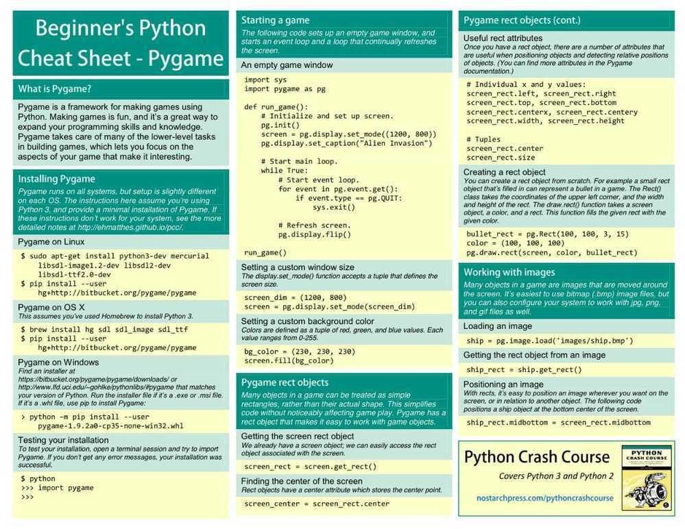
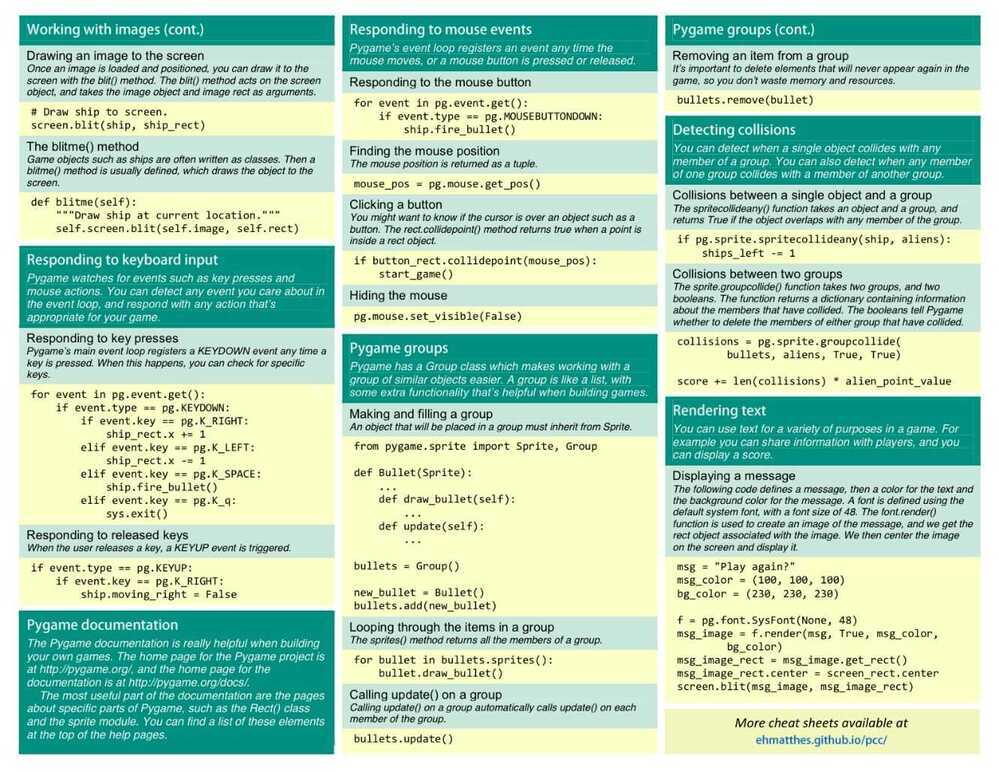

# Libraries

nose packages

## Pypy

PyPy is a [fast](http://speed.pypy.org/), [compliant](https://pypy.org/compat.html) alternative implementation of the [Python](http://python.org/) language (2.7.13 and 3.5.3). It has several advantages and distinct features:

- **Speed:** thanks to its Just-in-Time compiler, Python programs often run [faster](http://speed.pypy.org/) on PyPy.[(What is a JIT compiler?)](http://en.wikipedia.org/wiki/Just-in-time_compilation)
    "If you want your code to run faster, you should probably just use PyPy." - Guido van Rossum (creator of Python)
- **Memory usage:** memory-hungry Python programs (several hundreds of MBs or more) might end up taking [less space](http://morepypy.blogspot.com/2009/10/gc-improvements.html) than they do in CPython.
- **Compatibility:** PyPy is [highly compatible](https://pypy.org/compat.html) with existing python code. It supports [cffi](https://cffi.readthedocs.org/) and can run popular python libraries like [twisted](https://twistedmatrix.com/) and [django](https://www.djangoproject.com/).
- **Stackless:** PyPy comes by default with support for [stackless mode](https://pypy.org/features.html#stackless), providing micro-threads for massive concurrency.

## Django-model-utils

- Django model mixins and utilities.
- Fields
    - StatusField
    - MonitorField
    - SplitField
- Models
    - TimeFramedModel
    - TimeStampedModel
    - StatusModel
    - SoftDeletableModel
- Model Managers
    - InheritanceManager

This manager should be attached to a base model class in a model-inheritance tree. It allows queries on that base model to return heterogenous results of the actual proper subtypes, without any additional queries.

- QueryManager
- SoftDeletableManager
- Mixins

- Miscellaneous Utilities
    - Choices
    - Field Tracker
- https://django-model-utils.readthedocs.io/en/latest/managers.html

## PyFlame

- https://medium.com/build-smarter/blazing-fast-python-40a2b25b0495
- https://github.com/uber-archive/pyflame
- Profiler - [Diagnose slow Python code. (Feat. async/await) - YouTube](https://www.youtube.com/watch?v=m_a0fN48Alw)
- [GitHub - jjnanthakumar/django-flames: This is simple site created in Django framework.. If any issues ping me.](https://github.com/jjnanthakumar/django-flames)
- [GitHub - blopker/djdt-flamegraph: Flamegraphs for Django Debug Toolbar](https://github.com/blopker/djdt-flamegraph)

## py-spy

py-spy is a sampling profiler for Python programs. It lets you visualize what your Python program is spending time on without restarting the program or modifying the code in any way. py-spy is extremely low overhead: it is written in Rust for speed and doesn't run in the same process as the profiled Python program. This means py-spy is safe to use against production Python code.

https://github.com/benfred/py-spy

## FII Memory profiler

https://gitlab.com/pythonspeed/filprofiler

https://pythonspeed.com/articles/memory-profiler-data-scientists

## HorusLP

HorusLP is a Python optimization library designed to help you architect algorithm development workflows. It has a simple, declarative API and very little boilerplate.

https://www.toptal.com/algorithms/horuslp-python-optimization-library

https://www.toptal.com/python/horuslp-gurobi-optimization

## tqdm

A Fast, Extensible Progress Bar for Python and CLI

https://github.com/tqdm/tqdm

## Pendulum

Nativedatetimeinstances are enough for basic cases but when you face more complex use-cases they often show limitations and are not so intuitive to work with.Pendulumprovides a cleaner and more easy to use API while still relying on the standard library. So it's stilldatetimebut better.

https://github.com/sdispater/pendulum

https://pendulum.eustace.io

## pyqt

PyQt is one of the most popular Python bindings for the Qt cross-platform C++ framework

https://wiki.python.org/moin/PyQt

https://www.tutorialspoint.com/pyqt/index.htm

## Pyro

Pyro is a library that enables you to build applications in which objects can talk to each other over the network, with minimal programming effort. You can just use normal Python method calls, with almost every possible parameter and return value type, and Pyro takes care of locating the right object on the right computer to execute the method. It is designed to be very easy to use, and to generally stay out of your way. But it also provides a set of powerful features that enables you to build distributed applications rapidly and effortlessly. Pyro is a pure Python library and runs on many different platforms and Python versions.

https://github.com/irmen/Pyro4

## CookieCutter

A command-line utility that creates projects fromcookiecutters(project templates), e.g. creating a Python package project from a Python package project template.

https://cookiecutter.readthedocs.io/en/1.7.2/first_steps.html

https://github.com/cookiecutter/cookiecutter

## Python-magic

python-magic is a Python interface to the libmagic file type identification library. libmagic identifies file types by checking their headers according to a predefined list of file types. This functionality is exposed to the command line by the Unix commandfile.

https://pypi.org/project/python-magic

## GUI

Tkinter ► GUI

https://docs.python.org/3/library/tki...

wxPython ► GUI toolkit

https://wxpython.org

PyQt ► GUI toolkit

https://pypi.org/project/PyQt5

## Web

Requests ► HTTP library/Web

https://requests.readthedocs.io/en/ma...

Scrapy ► webscraping

https://scrapy.org

BeautifulSoup ► parsing/webscraping https://www.crummy.com/software/Beaut...

Zappa ► server-less application on API Gateway and Amazon Web Services Lambda

https://github.com/Miserlou/Zappa

## Other

Poetry ► manage python packaging and dependencies

https://python-poetry.org

Pywin32 ► Interact with Windows

https://github.com/mhammond/pywin32

Kivy ► Mobile Apps

https://kivy.org/#home

Loguru ► python logging

https://github.com/Delgan/loguru

Babel - the Python Internationalization Library - https://github.com/python-babel/babel

https://tryolabs.com/blog/2019/12/10/top-10-python-libraries-of-2019

https://dev.to/squash/16-amazing-python-libraries-you-should-be-using-now-2020-updated-2aja

## schedule

Python job scheduling for humans.

An in-process scheduler for periodic jobs that uses the builder pattern for configuration. Schedule lets you run Python functions (or any other callable) periodically at pre-determined intervals using a simple, human-friendly syntax.

https://github.com/dbader/schedule

https://schedule.readthedocs.io/en/stable

## pyglet

3d animation and game creation engine

http://pyglet.org

## pygame

https://www.pygame.org





https://humberto.io/blog/exploring-pygame-5-movement-and-collision

[Pong with Python & Pygame - Tutorial - YouTube](https://www.youtube.com/watch?v=tS8F7_X2qB0)

## pygal


## jinja2

Jinja2 is a full-featured template engine for Python. It has full unicode support, an optional integrated sandboxed execution environment, widely used and BSD licensed.

https://palletsprojects.com/p/jinja

## Tenacity

Tenacity is an Apache 2.0 licensed general-purpose retrying library, written in Python, to simplify the task of adding retry behavior to just about anything. It originates from [a fork of retrying](https://github.com/rholder/retrying/issues/65) which is sadly no longer [maintained](https://julien.danjou.info/python-tenacity/). Tenacity isn’t api compatible with retrying but adds significant new functionality and fixes a number of longstanding bugs.

- [Tenacity — Tenacity documentation](https://tenacity.readthedocs.io/en/latest/)
- [GitHub - jd/tenacity: Retrying library for Python](https://github.com/jd/tenacity)
- [Awesome Python Library: Tenacity](https://new.pythonforengineers.com/blog/awesome-python-library-tenacity/)
- [Retry flaky task in Python using Tenacity | by Parag Kamble | Medium](https://paragkamble.medium.com/retry-flaky-task-in-python-using-tenacity-c6fabcf9a3be)

## Serializers

- [ujson](https://github.com/ultrajson/ultrajson) (UltraJSON) is an ultra fast JSON encoder and decoder written in pure C with bindings for Python 3.7+.
- [orjson](https://github.com/ijl/orjson) is a fast, correct JSON library for Python. It is the fastest python library for json encoding & decoding. It serializes dataclass, datetime, numpy, and UUID instances natively.

### Benchmarking

```
# Python 12.502133846282959
# ujson 4.428200960159302
# orjson 2.3136467933654785
```

- [ujson](https://github.com/ultrajson/ultrajson) is 3 times faster than the standard json library
- [orjson](https://github.com/ijl/orjson) is over 6 times faster than the standard json library

#### Conclusion

For most cases, you would want to go with python’s standard json library which removes dependencies on other libraries. On other hand you could try out [ujson](https://github.com/ultrajson/ultrajson) which is simple replacement for python’s json library. If you want more speed and also want dataclass, datetime, numpy, and UUID instances and you are ready to deal with more complex code, then you can try your hands on [orjson](https://github.com/ijl/orjson)

[Benchmarking Python JSON serializers - json vs ujson vs orjson - Dollar Dhingra’s Blog](https://dollardhingra.com/blog/python-json-benchmarking/)

[GitHub - ultrajson/ultrajson: Ultra fast JSON decoder and encoder written in C with Python bindings](https://github.com/ultrajson/ultrajson?tab=readme-ov-file#benchmarks)

## Visualization

- Streamlit
   	- [Building a dashboard in Python using Streamlit](https://blog.streamlit.io/crafting-a-dashboard-app-in-python-using-streamlit/)
- [Dashboarding tools — PyViz 0.0.1 documentation](https://pyviz.org/dashboarding/)
- [Python Interactive Dashboard Development using Streamlit and Plotly - YouTube](https://www.youtube.com/watch?v=7yAw1nPareM)
- [How to Create a Beautiful Python Visualization Dashboard With Panel/Hvplot - YouTube](https://www.youtube.com/watch?v=uhxiXOTKzfs)
- [Build a Python Dashboard with ChatGPT Lightning Fast - YouTube](https://www.youtube.com/watch?v=gs4d0_AKQi8)
- [Develop Data Visualization Interfaces in Python With Dash – Real Python](https://realpython.com/python-dash/)
- [Django dashboard using Highcharts® Dashboards – Highcharts Blog | Highcharts](https://www.highcharts.com/blog/tutorials/django-dashboard-using-highcharts-dashboards/)
- [How to create an analytics dashboard in a Django app](https://www.freecodecamp.org/news/how-to-create-an-analytics-dashboard-in-django-app/)
- [Clinton Dreisbach - Building dashboards with Django and D3](https://dreisbach.us/articles/building-dashboards-with-django-and-d3/)

## Others

- [stripe · PyPI](https://pypi.org/project/stripe/)
