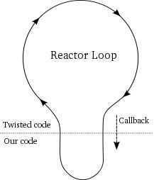

# Twisted

Twisted is an event-driven networking engine written in Python

Twisted is a robust, cross-platform implementation of the Reactor Pattern with lots of extras.

*fig - what happens during a callback*

## Modules

- Transport
- Protocol
- ProtocolFactories
- Deferred
- Actuators

To update the running code functions on fly

## Twisted Web

<https://jcalderone.livejournal.com/tag/sixty%20seconds>

## Plugins

Adding subcommands to thetwistdcommand, as a way to facilitate the deployment of your applications.

Thetapnameattribute of your IServiceMaker provider will be used as the subcommand name in a command like `twistd [subcommand][args...]`, and the options attribute (which should be a [usage.Options](https://twistedmatrix.com/documents/19.7.0/api/twisted.python.usage.Options.html) subclass) will be used to parse the given args.

Taking advantage of [twisted.plugin](https://twistedmatrix.com/documents/19.7.0/api/twisted.plugin.html) is a two step process:

1. Define an interface which plugins will be required to implement. This is done using the zope.interface package in the same way one would define an interface for any other purpose.
    A convention for defining interfaces is do so in a file named like*ProjectName/projectname/iprojectname.py*. The rest of this document will follow that convention: consider the following interface definition be inMatsim/matsim/imatsim.py, an interface definition module for a hypothetical material simulation package.

2. At one or more places in your program, invoke [twisted.plugin.getPlugins](https://twistedmatrix.com/documents/19.7.0/api/twisted.plugin.getPlugins.html) and iterate over its result.

<https://twistedmatrix.com/documents/current/core/howto/plugin.html>

<https://twistedmatrix.com/documents/current/core/howto/tap.html>

## References

<https://twistedmatrix.com/documents/current/core/howto/index.html>

<https://twistedmatrix.com/documents/current/core/howto/pb-intro.html>

Twisted Network Programming Essentials by Abe Fettig

<https://twistedmatrix.com/trac>

[**http://krondo.com/an-introduction-to-asynchronous-programming-and-twisted/**](http://krondo.com/an-introduction-to-asynchronous-programming-and-twisted/)

<https://dbader.org/blog/understanding-asynchronous-programming-in-python>

Access logs - <https://twistedmatrix.com/documents/15.3.0/web/howto/web-in-60/access-logging.html>
