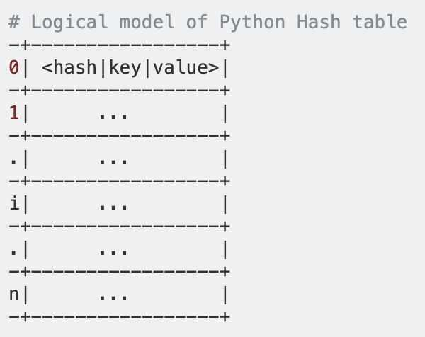

# Dictionary

Each piece of information in a dictionary is stored as a key-value pair. When we provide a key, Python returns the value associated with that key.

## Representation

Use curly braces to define a dictionary. Use colons to connect keys and values, and use commas to separate individual key-value pairs.

Empty Dictionary - `{}`

Dictionary - `{'Name': 'Deepak', 'Age':25}`

## Accessing Values in Dictionary

### Using square bracket notation to fetch data

If we attempt to access a data item with a key, which is not part of the dictionary, we get KeyError

```python
dict = {'Name': 'Zara', 'Age': 7, 'Class': 'First'}
print dict['Name']
print dict['Age']
Zara
7
```

### Using built-in function dict.get() to fetch data from dictionary

dict.get(key, default=None)

The methodget()returns a value for the given key. If key is not available then returns default value None. (or the provided default value)

```python
dict = {'Name': 'Zabra', 'Age': 7}
print "Value : %s" %  dict.get('Age')
print "Value : %s" %  dict.get('Education')
print "Value : %s" %  dict.get('Education', "Never")
Value : 7
Value : None
Value : Never
```

### For multi level dict hierarchies

Returning a default empty dictionary will not raise AttributeError for second get()

`sub_typology=project.json.get(**'area'**,{}).get(**'0'**,{}).get(**'areaSubTypology'**, **''**)`

## Updating in Dictionary

```python
dict = {'Name': 'Zara', 'Age': 7, 'Class': 'First'}
dict['Age'] = 8; # update existing entry
```

If key is not present, then an item is added in the dictionary

## Adding in Dictionary

```python
dict = {'Name': 'Zara', 'Age': 7, 'Class': 'First'}
dict['School'] = "DPS School"; # Add new entry
```

## Deleting in Dictionary

```python
dict = {'Name': 'Zara', 'Age': 7, 'Class': 'First'}
del dict['Name']; # remove entry with key 'Name'
dict.clear(); # remove all entries in dict
del dict ; # delete entire dictionary
```

If we attempt to delete a data item with a key, which is not part of the dictionary, we get KeyError

## Length of a dictionary

`num_responses = len(fav_languages)`

## Properties of Dictionary Keys

- Dictionary values can be any arbitrary Python object, either standard objects or user-defined objects.
- Duplicate key not allowed. When duplicate keys encountered during assignment, the last assignment wins.

```python
dict = {'Name': 'Zara', 'Age': 7, 'Name': 'Manni'}
print "dict['Name']: ", dict['Name']

dict['Name']: Manni
```

- Keys must be immutable. Otherwise "Type Error: objects are unhashable" error thrown. Strings, numbers, tuples can be used as dictionary keys

## Built-in Dictionary functions & Methods

- **Functions**
  - cmp(dict1, dict2)

Compares elements of both dict

Not supported in python3, use dict1==dict2 instead

Library deepdiff can be used for advanced comparisons

- len(dict)

Gives the total number of items in the dictionary

- str(dict)

Produces a printable string representation of a dictionary

- type(variable)

- **Methods**
  - dict.clear()

Removes all elements of dictionary dict

- dict.copy()

Returns a shallow copy of dictionary dict

- **dict.fromkeys(seq[, value])**

Create a new dictionary with keys from seq and values set to value

seq− This is the list of values which would be used for dictionary keys preparation.

value− This is optional, if provided then value would be set to this value

```python
seq = ('name', 'age', 'sex')
dict = dict.fromkeys(seq)
print "New Dictionary : %s" % str(dict)
New Dictionary : {'age': None, 'name': None, 'sex': None}

dict = dict.fromkeys(seq, 10)
print "New Dictionary : %s" % str(dict)
New Dictionary : {'age': 10, 'name': 10, 'sex': 10}
```

- dict.get(key, default=None)

- dict.has_key(key) (removed in python 3, use in operator instead)

dict = {'Name': 'Zabra', 'Age': 7}
'Name' in dict

True

'NoKey' in dict

False

- **dict.items()**

The method items() returns a list of dict's (key, value) tuple pairs

```python
dict = {'Name': 'Zara', 'Age': 7}
for key, value in dict.items():
 print (key, value)

Name Zara
Age 7
````

- dict.keys()

looping through all keys

- dict.setdefault(key, default=None)
- dict.update(dict2)
- dict.values()

Looping through all the values

## Sorting a dictionary

#### sorting by value

`print sorted(prices.items(), key = lambda x : x[1])`

#### sorting by key

`print(sorted(prices.items())`

## Looping through all the keys in order

```python
for name in sorted(fav_language.keys()):
  print(name)
```

## Merging two dictionaries

```python
# Python code to merge dict using update() method
def Merge(dict1, dict2):
    return(dict2.update(dict1))

# Driver code
dict1 = {'a': 10, 'b': 8}
dict2 = {'d': 6, 'c': 4}

# This return None
print(Merge(dict1, dict2))

# changes made in dict2
print(dict2)
```

## Architecture

- Python dictionaries are implemented ashash tables.
- Hash tables must allow forhash collisionsi.e. even if two distinct keys have the same hash value, the table's implementation must have a strategy to insert and retrieve the key and value pairs unambiguously.
- Pythondictusesopen addressingto resolve hash collisions
- Python hash table is just a contiguous block of memory (sort of like an array, so you can do anO(1)lookup by index).
- Each slot in the table can store one and only one entry.
- Eachentryin the table actually a combination of the three values:< hash, key, value >. This is implemented as a C struct
- The figure below is a logical representation of a Python hash table. In the figure below,0, 1, ..., i, ...on the left are indices of theslotsin the hash table (they are just for illustrative purposes and are not stored along with the table obviously!).



- When a new dict is initialized it starts with 8slots.
- When adding entries to the table, we start with some slot,i, that is based on the hash of the key. CPython initially usesi = hash(key) & mask(wheremask = PyDictMINSIZE - 1, but that's not really important). Just note that the initial slot,i, that is checked depends on thehashof the key.
- If that slot is empty, the entry is added to the slot (by entry, I mean,<hash|key|value>). But what if that slot is occupied!? Most likely because another entry has the same hash (hash collision!)
- If the slot is occupied, CPython (and even PyPy) comparesthe hash AND the key(by compare I mean==comparison not theiscomparison) of the entry in the slot against the hash and key of the current entry to be inserted respectively. Ifbothmatch, then it thinks the entry already exists, gives up and moves on to the next entry to be inserted. If either hash or the key don't match, it startsprobing.
- Probing just means it searches the slots by slot to find an empty slot. Technically we could just go one by one,i+1, i+2, ...and use the first available one (that's linear probing). But for reasons explained beautifully in the comments, CPython usesrandom probing. In random probing, the next slot is picked in a pseudo random order. The entry is added to the first empty slot. For this discussion, the actual algorithm used to pick the next slot is not really important. What is important is that the slots are probed until first empty slot is found.
- The same thing happens for lookups, just starts with the initial slot i (where i depends on the hash of the key). If the hash and the key both don't match the entry in the slot, it starts probing, until it finds a slot with a match. If all slots are exhausted, it reports a fail.
- BTW, thedictwill be resized if it is two-thirds full. This avoids slowing down lookups.

https://stackoverflow.com/questions/327311/how-are-pythons-built-in-dictionaries-implemented

Commonly, dictionaries are implemented with either search trees, or hash tables.

Hash tables are (slightly) simpler to implement than search trees and have better average-case performance.

CPython in particular uses hash tables because, compared to B-trees, hash tables give "better performance for lookup (the most common operation by far) under most circumstances, and the implementation is simpler".

Although hash tables have better average-case performance than search trees, they have much more extreme worst-case behavior.

The time complexity for hash table operations:

| Operation | Average-case | Amortized Worst-case |
|-----------|--------------|----------------------|
| Search    | O(1)         | O(n)                 |
| Insertion | O(1)         | O(n)                 |
| Deletion  | O(1)         | O(n)                 |

The time complexity of red-black trees (a kind of search tree):

| Operation | Average-case | Amortized Worst-case |
|-----------|--------------|----------------------|
| Search    | O(log n)     | O(log n)             |
| Insertion | O(log n)     | O(log n)             |
| Deletion  | O(log n)     | O(log n)             |

Because the worst-case time complexity for search tree operations is generally a consistent O(log n), search trees are often preferred in systems where large pauses for rebalancing/ reallocating introduces unacceptable latency (like the high-resolution timer code in Linux).

## Hash Tables in CPython

The CPython dictionary hash tables store items in an array and use open addressing for conflict resolution.

Python optimizes hash tables into combined tables and split tables (which are optimized for dictionaries used to fill the `__dict__` slot of an object). For simplicity, this post will only look at combined tables.

In a combined table, the hash table has two important arrays. One is the entries array. Theentries arraystores entry objects that contain the key and value stored in the hash table. The order of entries doesn't change as the table is resized.

The other array is the indices array that acts as the hash table. Theindices arrayelements contain the index of their corresponding entry in the entries array.


CPython uses a few different structs to represent a dictionary and these arrays.

## Representing dictionaries

There are three important structures used to represent dictionaries:

- The dictionary struct (PyDictObject), representing the entire dictionary object.
- A keys object (PyDictKeysObject), which contains the hash table indices array (dk_indices).
- An entries array, which appears directly after the corresponding PyDictKeysObject in memory and holds the entries referenced bydk_indices.

## Generating an index

An index for the hash array is generated by calling a hash function with a given key.

A hash function is a one-way function that produces the same output for a given input. It's one-way in the sense that, given the hash function, it should be difficult to convert the output back to the input without trial and error.

Python supports different data types as keys for a dictionary. Each supported data type has its own associated hashing algorithm. For strings, Python uses the SipHash algorithm.

SipHashis a relatively fast hash function. On a 64-bit machine, SipHash returns a 64-bit hash. The hash is then converted into an index to be used in an array.

Traditionally, a hash is converted into an index using the modulo operator. For example, if the hash array has 40 slots, the index can be calculated withhash % 40, giving a value between 0-39. Unfortunately, the modulo operator performs division, and division is a slow operation on most CPUs.

The alternative is to use a bitmask. Abitmaskis a pattern of bits that can be logically ANDed with another value to remove (ormask) unwanted bits. Any bit that is a 0 in the mask will become 0 in the result, and any bit that is 1 in the mask will remain the same after being ANDed. For example:

```python
10110110
00000111 3-bit bitmask
&
00000110 Result
```

In order for the bitmask to produce a value in the full range of the array, the size of the array must be a power of 2, so the bitmask can be a full sequence of 1s.

```python
Note that any number that is a power of 2 has a single 1 bit:

2 000010
4 000100
8 001000
16 010000

This can be converted into a bit mask of all 1s by subtracting 1 from the value:

(2 - 1) 1 00001
(4 - 1) 3 00011
(8 - 1) 7 00111
(16 - 1) 15 01111

A 2^n - 1 bit mask has the same effect as modulo 2^n. As an example, consider a 16-bit int. You have an array that contains 32 (2^5) items, with index 0-31. You can use a 5-bit mask to convert your 16-bit value into an index within the range:

1011 0011 1011 1001
0000 0000 0001 1111 mask

0000 0000 0001 1001
```

The following is how CPython converts a hash into an array index (whereDK_SIZEmacro gets the size of a dictionary):

```python
size_t mask = (size_t)DK_SIZE(keys) - 1;

// ..
size_t i = hash & mask;
```

So that's how CPython generates the initial indexi. If the slot at indexiis empty, then the index of the entry can be added to the hash table. If it's not, CPython must resolve the conflict.

## Conflict resolution

Conflict resolution occurs when an element already exists at an index generated from a new key. CPython uses open addressing to resolve conflicts.

The simplest implementation of open addressing is to linearly search through the array in case of a conflict. This is known as linear probing:

```python
while(1) {
  if(table[++i] == EMPTY) {
    return i;
  }
}
```

Linear probing can be inefficient in CPython, because some of the CPython hash functions result in many keys mapping to the same index. If there are many collisions at the same index, linear probing results in clusters of active slots causing the linear probe to go through many iterations before finding a match.


One solution would be to use improved hash functions at the price of slower hashing. Instead, CPython makes the probing more random. It uses the rest of the hash to generate a new index. This is done by storing the hash in a variable namedperturband shiftingperturbdown 5 bits (PERTURB_SHIFT) each iteration. This is combined with the following calculation:

```python
perturb >>= PERTURB_SHIFT;
i = mask & (i*5 + perturb + 1);
```

After a few shifts, perturb becomes 0, meaning justi*5 + 1is used. This is fine becausemask & (i*5 + 1)produces every integer in range 0-maskexactly once.

https://www.data-structures-in-practice.com/hash-tables

https://www.youtube.com/watch?v=npw4s1QTmPg
