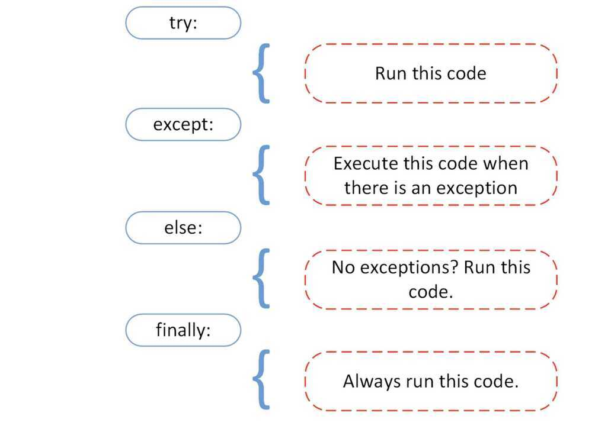

# Exceptions

## Should I Use Exceptions of Conditional Handling?

Python best practice is to use exceptions as a better way to handle "exceptional" cases. Unnecessary use ofif's may slow down your code. Although, keep in mind frequent "except" calls [are even slower](http://stackoverflow.com/questions/2522005/cost-of-exception-handlers-in-python) than plainifconditional handling, so you must use it wisely.

A try/except block is extremely efficient if no exceptions are raised. Actually catching an exception is expensive.

To summarize, exceptions are good for rare cases, and conditions are better for frequent use cases. In the end, of course "[it's better to ask for forgiveness than permission](https://en.wikiquote.org/wiki/Grace_Hopper)".

## What is an Exception

An exception is an error that happens during execution of a program. When that
error occurs, Python generate an exception that can be handled, which avoids your program to crash.

## Why use exceptions

Exceptions are convenient in many ways for handling errors and special conditions
in a program. When you think that you have a code which can produce an error then
you can use exception handling.

## Raising an Excpetion

You can raise an exception in your own program by using the raise exception
statement.

Raising an exception breaks current code execution and returns the exception
back until it is handled.

## Exceptions

1. **IOError -** If the file cannot be opened

2. **ImportError -** If python cannot find the module

3. **ValueError -** Raised when a built-in operation or function receives an argument that has the right type but an inappropriate value

4. **KeyboardInterrupt -** Raised when the user hits the interrupt key (normally Control-C or Delete)

5. **EOFError -** Raised when one of the built-in functions (input() or raw_input()) hits an
    end-of-file condition (EOF) without reading any data

## Catch Exceptions

```python
try:
    Something here
except Exception as e:
    print(e)
```

## Catch requests exception

```python
response=requests.request("POST", ZOHO_CREATE_TICKET_URL,data=str(data), headers=headers)
response.raise_for_status()

except requests.exceptions.HTTPError as errh:
    self.message_user(request, "Httperroroccurred,contactadmin %s" %errh, level=messages.ERROR)
    logger.error('HTTPError', errh)
except requests.exceptions.ConnectionError as errc:
    self.message_user(request, "Connectionerroroccurred,contactadmin", level=messages.ERROR)
    logger.error('ConnectionError', errc)
except requests.exceptions.Timeout as errt:
    self.message_user(request, "Timeout", level=messages.ERROR)
    logger.error('Timeout', errt)
except requests.exceptions.RequestException as errr:
    self.message_user(request, "RequestException", level=messages.ERROR)
    logger.error('RequestException', errr)
except Exception as e:
    self.message_user(request, "Exceptionoccurred,contactadmin", level=messages.ERROR)
logger.error('Exception', e)
```

## Try Catch Finally block

```python
try:
    raise KeyboardInterrupt
except KeyboardInterrupt:
    print('Found keyboard interrupt')
finally:
print('Goodbye, world!')
```

## Try Catch Else Finally block

The `try-except-finally-else` statement in Python is used to handle and manage errors that can occur during program execution. The `else` block is an optional block that is executed when no exceptions are raised in the `try` block. Here are some scenarios where the `else` block can be used:

1. **Validation and processing:** The `else` block can be used to process data and perform validation after a successful execution of the `try` block. For example, you can validate user input in the `try` block, and if there are no errors, process the input in the `else` block.

2. **File operations:** The `else` block can be used to execute code that is dependent on a file operation succeeding. For example, you can open a file in the `try` block, and if the file is successfully opened, read its contents in the `else` block.

3. **Database operations:** The `else` block can be used to execute code that depends on a successful database operation. For example, you can execute a database query in the `try` block, and if the query is successful, fetch and process the data in the `else` block.

It's important to note that the `else` block is executed only if no exceptions are raised in the `try` block. If an exception is raised, the `else` block is skipped, and the `except` block is executed. The `finally` block, if present, is always executed, regardless of whether an exception is raised or not.



## Raise Exception

`raise KeyError(f'body and key not found: {body} {key}')`

## Error vs Exception

There is a subtle difference between anerrorand anexception.

Errors cannot be handled, while Python exceptions can be handled at the run time. An error can be asyntax(parsing) error, while there can be many types of exceptions that could occur during the execution and are not unconditionally inoperable. AnErrormight indicate critical problems that a reasonable application should not try to catch, while anExceptionmight indicate conditions that an application should try to catch. Errors are a form of an unchecked exception and are irrecoverable like anOutOfMemoryError, which a programmer should not try to handle.

Exception handling makes your code more robust and helps prevent potential failures that would cause your program to stop in an uncontrolled manner. Imagine if you have written a code which is deployed in production and still, it terminates due to an exception, your client would not appreciate that, so it's better to handle the particular exception beforehand and avoid the chaos.

Errors can be of various types:

- Syntax Error
- Out of Memory Error
- Recursion Error
- Exceptions

<https://www.datacamp.com/community/tutorials/exception-handling-python>

## Built-in Exceptions

BaseException
+-- SystemExit
+-- KeyboardInterrupt
+-- GeneratorExit
+-- Exception
+-- StopIteration
+-- StopAsyncIteration
+-- ArithmeticError
| +-- FloatingPointError
| +-- OverflowError
| +-- ZeroDivisionError
+-- AssertionError
+-- AttributeError
+-- BufferError
+-- EOFError
+-- ImportError
+-- ModuleNotFoundError
+-- LookupError
| +-- IndexError (if the index is out of bounds)
| +-- KeyError (if the item is not present in the list)
+-- MemoryError
+-- NameError
| +-- UnboundLocalError
+-- OSError
| +-- BlockingIOError
| +-- ChildProcessError
| +-- ConnectionError
| | +-- BrokenPipeError
| | +-- ConnectionAbortedError
| | +-- ConnectionRefusedError
| | +-- ConnectionResetError
| +-- FileExistsError
| +-- FileNotFoundError
| +-- InterruptedError
| +-- IsADirectoryError
| +-- NotADirectoryError
| +-- PermissionError
| +-- ProcessLookupError
| +-- TimeoutError
+-- ReferenceError
+-- RuntimeError
| +-- NotImplementedError
| +-- RecursionError
+-- SyntaxError
| +-- IndentationError
| +-- TabError
+-- SystemError
+-- TypeError
+-- ValueError
| +-- UnicodeError
| +-- UnicodeDecodeError
| +-- UnicodeEncodeError
| +-- UnicodeTranslateError
+-- Warning
+-- DeprecationWarning
+-- PendingDeprecationWarning
+-- RuntimeWarning
+-- SyntaxWarning
+-- UserWarning
+-- FutureWarning
+-- ImportWarning
+-- UnicodeWarning
+-- BytesWarning
+-- ResourceWarning

## References

<http://www.pythonforbeginners.com/error-handling/exception-handling-in-python>
