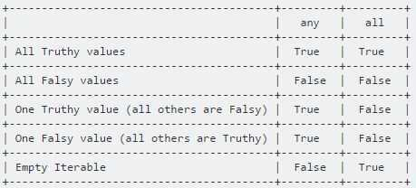

# Loops

<http://www.geeksforgeeks.org/any-all-in-python>

<http://treyhunner.com/2016/04/how-to-loop-with-indexes-in-python>

<https://www.youtube.com/watch?v=Qgevy75co8c>

The fastest way to loop in python is don't loop

1. While loop
2. For loop
3. in-built functions like sum(range(100))
4. numpy functions
5. Mathematics with single operation i.e. no loop

Any and All are two built ins provided in python used for successive And/Or.

## ANY

Returns true if any of the items is True. It returns False if empty or all are false. Any can be thought of as a sequence of OR operations on the provided iterables.

It short circuit the execution i.e. stop the execution as soon as the result is known.

Syntax : any(list of iterables)

```python
# Since all are false, false is returned
print (any([False, False, False, False]))

# Here the method will short-circuit at the
# second item (True) and will return True.
print (any([False, True, False, False]))

# Here the method will short-circuit at the
# first (True) and will return True.
print (any([True, False, False, False]))

Output -
False
True
True
```

## ALL

Returns true if all of the items are True (or if the iterable is empty). All can be thought of as a sequence of AND operations on the provided iterables. It also short circuit the execution i.e. stop the execution as soon as the result is known.

Syntax : all(list of iterables)

```python
# Here all the iterables are True so all
# will return True and the same will be printed
print (all([True, True, True, True]))

# Here the method will short-circuit at the
# first item (False) and will return False.
print (all([False, True, True, False]))

# This statement will return False, as no
# True is found in the iterables
print (all([False, False, False]))

Output -
True
False
False
```



## Range

range() function starts at 0 aby default, and stops one number below the number passed to it. We can use list() function to efficiently generate a large list of numbers

```python
for number in range(1, 1002):
    print(number)

numbers = list(range(1,1000))
```

## Range + Step Loop

```python
N,M = map(int,raw_input().split())
for i in xrange(1, N, 2):
print ( str('.|.')*i ).center(M, '-')
print str('WELCOME').center(M, '-')
for i in xrange(N-2, -1, -2):
print ( str('.|.')*i ).center(M, '-')
```

## Enumerate

<http://book.pythontips.com/en/latest/enumerate.html>

Enumerate is a built-in function of Python.

It allows us to loop over something and have an automatic counter.

```python
for counter, value in enumerate(some_list):
    print(counter, value)

 enumerate also accepts an optional argument which makes it even more useful.
The optional argument allows us to tell enumerate from where to start the index.
my_list = ['apple', 'banana', 'grapes', 'pear']
for c, value in enumerate(my_list, 1):
    print(c, value)

You can also create tuples containing the index and list item using a list.
my_list = ['apple', 'banana', 'grapes', 'pear']
counter_list = list(enumerate(my_list, 1))
print(counter_list)
```

## Basic for in loop

```python
colors = ["red", "green", "blue", "purple"]
for color in colors:
    print(color)
```

Unlike traditional C-styleforloops, Python'sforloops don't have index variables. There's no index initializing, bounds checking, or index incrementing. Python's for loops do *all the work* of looping over our numbers list for us.

<https://treyhunner.com/2019/06/loop-better-a-deeper-look-at-iteration-in-python>

## for and while loop can have else branch

```python
# Python's `for` and `while` loops
# support an `else` clause that executes
# only if the loops terminates without
# hitting a `break` statement.
def contains(haystack, needle):
"""
Throw a ValueError if `needle` not
in `haystack`.
"""
for item in haystack:
    if item == needle:
        break
else:
    # The `else` here is a
    # "completion clause" that runs
    # only if the loop ran to completion
    # without hitting a `break` statement.
    raise ValueError('Needle not found')
contains([23, 'needle', 0xbadc0ffee], 'needle')
None
contains([23, 42, 0xbadc0ffee], 'needle')
ValueError: "Needle not found"

# Personally, I'm not a fan of the `else`
# "completion clause" in loops because
# I find it confusing. I'd rather do
# something like this:
def better_contains(haystack, needle):
    for item in haystack:
        if item == needle:
            return
    raise ValueError('Needle not found')
 # Note: Typically you'd write something
# like this to do a membership test,
# which is much more Pythonic:
if needle not in haystack:
    raise ValueError('Needle not found')
```

## While loops

### A simple while loop

```python
current_value = 1
while current_value <= 5:
    print(current_value)
current_value += 1
```

### Letting the user choose when to quit

```python
msg = ''
while msg != 'quit':
    msg = input('What's your message? ')
print(msg)
```

### do while loop in python

```python
i = 1

while True:
    print(i)
    i = i + 1
    if(i > 5):
break
```

## Using Zip to loop over multiple lists at the same time

```python
colors = ["red", "green", "blue", "purple"]
ratios = [0.2, 0.3, 0.1, 0.4]
for color, ratio in zip(colors, ratios):
print("{}% {}".format(ratio * 100, color))
```
