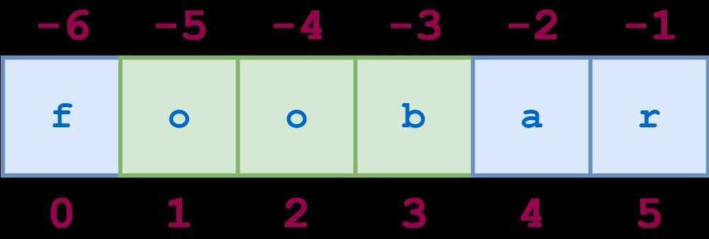
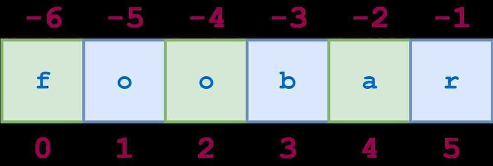
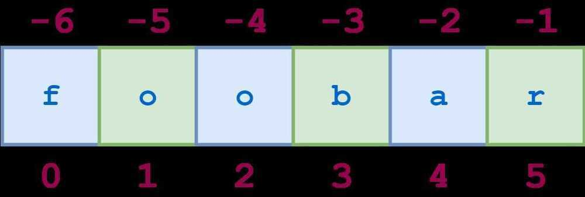

# Strings

## fstrings

```python
# equal operator inside fstrings, from python3.8
num_value = 2
print(f"{num_value = }")
print(f"{num_value % 2 = }")
num_value = 2
num_value = 0

now = datetime.datetime.utcnow()
print(f'{now=:Y-%m-%d}')
```

## String Constants

- string.ascii_letters
- string.ascii_lowercase
- string.ascii_uppercase
- string.digits
- string.hexdigits
- string.octdigits
- string.punctuation
- string.printable
- string.whitespace

## Built-in String Methods

| **Sr.No.** | **Methods with Description** |
|---|---|
| 1 | `capitalize()` - Capitalizes first letter of string |
| 2 | `center(width, fillchar)` - Returns a space-padded string with the original string centered to a total of width columns. |
| 3 | `count(str, beg= 0,end=len(string))` - Counts how many times str occurs in string or in a substring of string if starting index beg and ending index end are given. |
| 4 | `decode(encoding='UTF-8',errors='strict')` - Decodes the string using the codec registered for encoding. encoding defaults to the default string encoding. |
| 5 | `encode(encoding='UTF-8',errors='strict')` - Returns encoded string version of string; on error, default is to raise a ValueError unless errors is given with 'ignore' or 'replace'. |
| 6 | `endswith(suffix, beg=0, end=len(string))` - Determines if string or a substring of string (if starting index beg and ending index end are given) ends with suffix; returns true if so and false otherwise. |
| 7 | `expandtabs(tabsize=8)` - Expands tabs in string to multiple spaces; defaults to 8 spaces per tab if tabsize not provided. |
| 8 | `find(str, beg=0 end=len(string))` - Determine if str occurs in string or in a substring of string if starting index beg and ending index end are given returns index if found and -1 otherwise. |
| 9 | `index(str, beg=0, end=len(string))` - Same as find(), but raises an exception if str not found. |
| 10 | `isalnum()` - Returns true if string has at least 1 character and all characters are alphanumeric and false otherwise. |
| 11 | `isalpha()` - Returns true if string has at least 1 character and all characters are alphabetic and false otherwise. |
| 12 | `isdigit()` - Returns true if string contains only digits and false otherwise. |
| 13 | `islower()` - Returns true if string has at least 1 cased character and all cased characters are in lowercase and false otherwise. |
| 14 | `isnumeric()` - Returns true if a unicode string contains only numeric characters and false otherwise. |
| 15 | `isspace()` - Returns true if string contains only whitespace characters and false otherwise. |
| 16 | `istitle()` - Returns true if string is properly "titlecased" and false otherwise. |
| 17 | `isupper()` - Returns true if string has at least one cased character and all cased characters are in uppercase and false otherwise. |
| 18 | `join(seq)` - Merges (concatenates) the string representations of elements in sequence seq into a string, with separator string. |
| 19 | `len(string)` - Returns the length of the string |
| 20 | `ljust(width[, fillchar])` - Returns a space-padded string with the original string left-justified to a total of width columns. |
| 21 | `lower()` - Converts all uppercase letters in string to lowercase. |
| 22 | `lstrip()` - Removes all leading whitespace in string. |
| 23 | `maketrans()` - Returns a translation table to be used in translate function. |
| 24 | `max(str)` - Returns the max alphabetical character from the string str. |
| 25 | `min(str)` - Returns the min alphabetical character from the string str. |
| 26 | `replace(old, new [, max])` - Replaces all occurrences of old in string with new or at most max occurrences if max given. |
| 27 | `rfind(str, beg=0,end=len(string))` - Same as find(), but search backwards in string. |
| 28 | `rindex( str, beg=0, end=len(string))` - Same as index(), but search backwards in string. |
| 29 | `rjust(width,[, fillchar])` - Returns a space-padded string with the original string right-justified to a total of width columns. |
| 30 | `rstrip()` - Removes all trailing whitespace of string. |
| 31 | `split(str="", num=string.count(str))` - Splits string according to delimiter str (space if not provided) and returns list of substrings; split into at most num substrings if given. |
| 32 | `splitlines( num=string.count('\n'))` - Splits string at all (or num) NEWLINEs and returns a list of each line with NEWLINEs removed. |
| 33 | `startswith(str, beg=0,end=len(string))` - Determines if string or a substring of string (if starting index beg and ending index end are given) starts with substring str; returns true if so and false otherwise. |
| 34 | `strip([chars])` - Performs both lstrip() and rstrip() on string. |
| 35 | `swapcase()` - Inverts case for all letters in string. |
| 36 | `title()` - Returns "titlecased" version of string, that is, all words begin with uppercase and the rest are lowercase. |
| 37 | `translate(table, deletechars="")` - Translates string according to translation table str(256 chars), removing those in the del string. |
| 38 | `upper()` - Converts lowercase letters in string to uppercase. |
| 39 | `zfill (width)` - Returns original string leftpadded with zeros to a total of width characters; intended for numbers, zfill() retains any sign given (less one zero). |
| 40 | `isdecimal()` - Returns true if a unicode string contains only decimal characters and false otherwise. |

## String Formating

```python
'{} {}'.format('one', 'two')

'{} {}'.format(1, 2)

'Hello {}'.format('Deepak')
```

<https://pyformat.info>

### Positional Formating (Positional Arguments)

Also optional positional indexing (positional arguments) can be passed to strings' format

`'{1} {0}'.format('one', 'two')`

### Keyword Formating (Keyword Arguments)

`print("Sammy the {0} {1} a {pr}.".format("shark", "made", pr = "pull request"))`

here pr is a named keyword argument

#### Padding and aligning strings (default is left alignment)

```python
Align Left - '{:>10}'.format('test')
            test
Align Right - '{:10}'.format('test')
    test
Alight left with custom padding character - '{:_<10}'.format('test')
    test______
Center align - '{:^10}'.format('test')
        test
'{:^6}'.format('zip')  #When using center alignment where the length of the string leads to an uneven split of the padding characters the extra character will be placed on the right side
        zip
```

#### Truncating long strings

```python
'{:.5}'.format('xylophone')
xylop
```

#### Combining truncating and padding

```python
'{:10.5}'.format('xylophone')
xylop
```

#### Numbers

```python
'{:d}'.format(42)
42
'{:f}'.format(3.141592653589793)
3.141593
```

#### Padding numbers

```python
'{:4d}'.format(42)
42
'{:06.2f}'.format(3.141592653589793)
003.14
print('{:.0f}'.format(x))
```

For integer values providing a precision doesn't make much sense and is actually forbidden in the new style (it will result in a ValueError)

```python
'{:04d}'.format(42)
0042
```

#### Signed numbers

```python
'{:+d}'.format(42)
+42
```

Use a space character to indicate that negative numbers should be prefixed with a minus symbol and a leading space should be used for positive ones.

```python
'{: d}'.format((- 23))
-23

'{: d}'.format(42)
42

'{:=5d}'.format((- 23))
- 23

'{:=+5d}'.format(23)
- 23
```

#### Named placeholders

```python
data = {'first': 'Hodor', 'last': 'Hodor!'}

'{first} {last}'.format(**data)
Hodor Hodor!

'{first} {last}'.format(first='Hodor', last='Hodor!')
Hodor Hodor!
```

#### Getitem & getattr

```python
person = {'first': 'Jean-Luc', 'last': 'Picard'}

'{p[first]} {p[last]}'.format(p=person)
Jean-Luc Picard

data = [4, 8, 15, 16, 23, 42]

'{d[4]} {d[5]}'.format(d=data)
23 42
```

#### Datetime

```python
from datetime import datetime
'{:%Y-%m-**%d** %H:%M}'.format(datetime(2001, 2, 3, 4, 5))
2001-02-03 04:05
```

#### Parametrized formats

Parametrized alignment and width

```python
'{:{align}{width}}'.format('test', align='^', width='10')
test
```

Parametrized precision

```python
'{:.{prec}} = {:.{prec}f}'.format('Gibberish', 2.7182, prec=3)
Gib = 2.718
```

Width and precision

```python
'{:{width}.{prec}f}'.format(2.7182, width=5, prec=2)
2.72
'{:{prec}} = {:{prec}}'.format('Gibberish', 2.7182, prec='.3')
Gib = 2.72
```

datetime

```python
from datetime import datetime
dt = datetime(2001, 2, 3, 4, 5)
'{:{dfmt} {tfmt}}'.format(dt, dfmt='%Y-%m-**%d**', tfmt='%H:%M')
2001-02-03 04:05
```

Positional arguments

```python
'{:{}{}{}.{}}'.format(2.7182818284, '>', '+', 10, 3)
+2.72
```

Positional + keyword arguments

```python
'{:{}{sign}{}.{}}'.format(2.7182818284, '>', 10, 3, sign='+')
+2.72
```

#### Print formats for other numbers

```python
print('{0:d}'.format(5)) #decimal
print('{0:f}'.format(5)) #float
print('{0:b}'.format(5)) #binary
print('{0:x}'.format(15)) #hexadecimal
```

#### Passing parameters

```python
A = deepak
B = sood
"Hello %s %s!" %(A, B) [Should be passed as tuple for more than one arguments)
```

#### Strings are immutable, but can be altered using following approaches

- One solution is to convert the string to a list and then change the value.

```python
string = "abracadabra"
l = list(string)
l[5] = 'k'
string = ''.join(l)
print string
Abrackdabra
```

- Another approach is to slice the string and join it back.

```python
string = string[:5] + "k" + string[6:]
print string
Abrackdabra
```

#### Regex for finding sub_string inside string with overlapping

```python
Matches = re.findall('(?='+sub_string+')', string)
len(Matches)
```

#### TextWrap

[textwrap.wrap()](https://docs.python.org/2/library/textwrap.html#textwrap.wrap)

The *wrap()* function wraps a single paragraph in text (a string) so that every line is *width*characters long at most.

It returns a list of output lines.

```python
import textwrap
string = "This is a very very very very very long string."
print textwrap.wrap(string,8)
['This is', 'a very', 'very', 'very', 'very', 'very', 'long', 'string.']
```

[textwrap.fill()](https://docs.python.org/2/library/textwrap.html#textwrap.fill)

The *fill()* function wraps a single paragraph in text and returns a single string containing the wrapped paragraph.

```python
import textwrap
string = "This is a very very very very very long string."
print textwrap.fill(string,8)
This is
a very
very
very
very
very
long
string.
```

#### `dec=int(input("Enter a decimal number:"))`

```python
print(bin(dec),"inbinary.")
print(oct(dec),"inoctal.")
print(hex(dec),"inhexadecimal."
```

#### Ascii to number and vice versa

```python
ord('a')
97
chr(97)
'a'
chr(ord('a') + 3)
'd'
```

#### Formatting string

```python
def __repr__(self):
    return f'Pizza({self.ingredients!r})'

Pizza(['cheese', 'tomatoes'])
Pizza(['cheese', 'tomatoes'])
```

This is used to override **repr** that prints the object instance when printed

#### String slicing

Python also allows a form of indexing syntax that extracts substrings from a string, known as string slicing. Ifsis a string, an expression of the forms[m:n]returns the portion ofsstarting with positionm, and up to but not including positionn

Omitting both indices returns the original string, in its entirety. Literally. It's not a copy, it's a reference to the original string

```python
s[:] is s
True
```

Negative indices can be used with slicing as well.-1refers to the last character -2 the second-to-last, and so on, just as with simple indexing. The diagram below shows how to slice the substring'oob'from the string'foobar'using both positive and negative indices:



```python
s = 'foobar'

s[-5:-2]
'oob'
s[1:4]
'oob'
s[-5:-2] == s[1:4]
True

string = string[:-3] (removes last 3 digits from string)
```

## Stride

Adding an additional:and a third index designates a stride (also called a step), which indicates how many characters to jump after retrieving each character in the slice.

For example, for the string'foobar', the slice0:6:2starts with the first character and ends with the last character (the whole string), and every second character is skipped. This is shown in the following diagram:



Similarly,1:6:2specifies a slice starting with the second character (index1) and ending with the last character, and again the stride value2causes every other character to be skipped:



You can specify a negative stride value as well, in which case Python steps backward through the string. In that case, the starting/first index should be greater than the ending/second index:

```python
s = 'foobar'
s[5:0:-2]
'rbo'
```

In the above example,5:0:-2means "start at the last character and step backward by2, up to but not including the first character."

When you are stepping backward, if the first and second indices are omitted, the defaults are reversed in an intuitive way: the first index defaults to the end of the string, and the second index defaults to the beginning. Here is an example:

```python
s = '12345' * 5
s
'1234512345123451234512345'
s[::-5]
'55555'
```

This is a common paradigm for reversing a string:

```python
s = 'If Comrade Napoleon says it, it must be right.'
s[::-1]
'.thgir eb tsum ti ,ti syas noelopaN edarmoC fI'
```

Example

What is the slice expression that gives every third character of strings, starting with the last character and proceeding backward to the first?

`s[::-3]`

#### DocString

`r""" """`

r is used to create a raw string if there are special characters inside the docstring

#### Remove all punctuations from a given string

`Ex - document = document.translate(str.maketrans('','',string.punctuation))`

## Sluggify a string

```python
translate_table = {ord(char): u'' **for** char **in** non_url_safe}
non_url_safe_regex = re.compile(
r'[{}]'.format(''.join(re.escape(x) **for** x **in** non_url_safe)))
```

## def _slugify2(self, text)

```python
text = text.translate(self.translate_table)
text = u'_'.join(text.split())
```

## return text

<https://www.peterbe.com/plog/fastest-python-function-to-slugify-a-string>

## References

Python format specification mini language are used to format strings

<https://docs.python.org/3.6/library/string.html#format-specification-mini-language>

Python string formatters

<https://www.digitalocean.com/community/tutorials/how-to-use-string-formatters-in-python-3>

<https://pyformat.info>

<https://realpython.com/python-encodings-guide>
