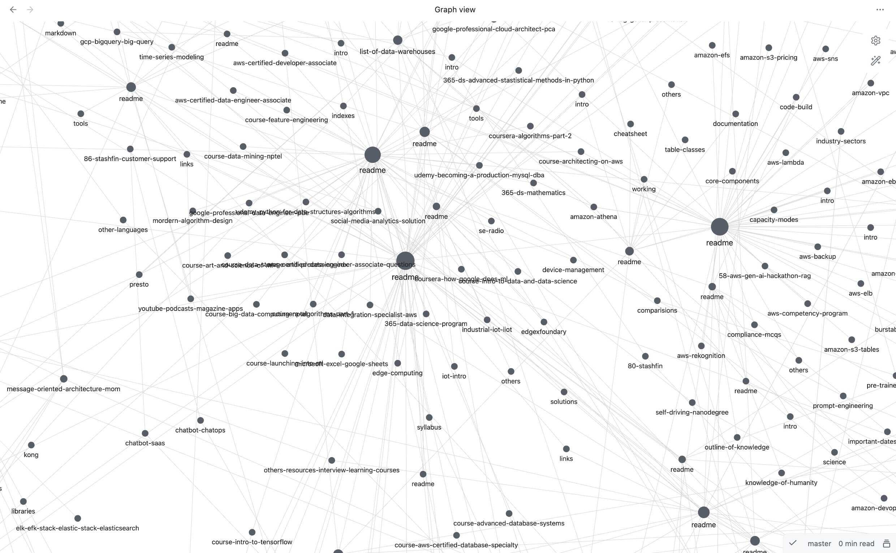

# Deepak's Wiki

This is my personal wiki where I share everything I know about this world in form of an online wiki.

The purpose of this site is to force me to improve the quality of these notes, the prospect of being read by someone being motivating. It also allows me to access it everywhere.

If this is your first time visiting this wiki, start from the outline below and explore the area of your interest or you can checkout out a curated list of [must read pages](readme.md#must-read-pages) below.

**Why I write (summed up in one quote) -** Your brain is for having ideas not holding them.

## Outline

- [About me](about-deepak-sood/readme.md)
    - [Experience](about-deepak-sood/experience.md)
    - [Projects](about-deepak-sood/projects/readme.md)
    - [Meetups / Talks / Sessions](about-deepak-sood/meetups-talks-sessions.md)
- [Computer Science](computer-science/readme.md)
    - [AI](ai/readme.md)
	    - [ML Algorithms](ai/ml-algorithms/readme.md)
	    - [LLM](ai/llm/readme.md)
	    - [Computer Vision](ai/computer-vision-cv/readme.md)
	    - [NLP](ai/nlp/readme.md)
	    - [Deep Learning](ai/deep-learning/readme.md)
    - [Algorithms](algorithms/readme.md)
    - [Data Structures](data-structures/readme.md)
    - [Languages](languages/readme.md)
        - [Python](python/readme.md)
    - [Networking](networking/readme.md)
    - [Databases](databases/readme.md)
	    - [SQL Databases](databases/sql-databases/readme.md)
		- [NoSQL Databases](databases/nosql-databases/readme.md)
		- [Data Warehouses](databases/data-warehouses/readme.md)
    - [Frontend](frontend/readme.md)
    - [DevOps](devops/readme.md)
	    - [Kubernetes](devops/kubernetes/readme.md)
    - [Cloud - AWS](cloud/aws/readme.md)
    - [Cloud - Others](cloud/others/readme.md)
    - [Technologies](technologies/readme.md)
	    - [Apache Airflow](technologies/apache-airflow/readme.md)
	    - [Kafka](technologies/kafka/readme.md)
    - [Decentralized Applications / Cryptocurrencies](decentralized-applications/readme.md)
    - [Courses](courses/readme.md)
- [Book Summaries](book-summaries/readme.md)
- [Mathematics](mathematics/readme.md)
- [Knowledge](knowledge/readme.md)
    - [Economics](economics/readme.md)
    - [Management](management/readme.md)
    - [Psychology](psychology/readme.md)

## Size of Wiki

Below are my 2400+ notes & their relations visualized using Obsidian.




This wiki is large. 280,000+ lines of markdown (calculated with [loc](https://github.com/cgag/loc))

```bash
loc

--------------------------------------------------------------------------------
 Language             Files        Lines        Blank      Comment         Code
--------------------------------------------------------------------------------
 Markdown              2433       281547        84012            0       197535
 JSON                     3        20089            0            0        20089
 JavaScript               3          247           26           87          134
 YAML                     1           50            5           22           23
 CSS                      1           30            2            7           21
 Plain Text               2            3            0            0            3
 Bourne Shell             1            3            0            1            2
--------------------------------------------------------------------------------
 Total                 2444       301969        84045          117       217807
--------------------------------------------------------------------------------
```

## Getting started

This garden is quite literally my digital brain. It includes my thoughts, notes and links on topics I care about.

I update the notes daily in my [github repo](https://github.com/deepaksood619/deepaksood619.github.io/), and build it few times in a month using Github Actions and Docusaurus.

The content being [markdown](languages/others/markdown) files, which after every commit to the builds the website using Docusaurus and publishes it to [deepaksood619.github.io](https://deepaksood619.github.io/) from which you are likely reading this page.

The way I structure each page often looks the same and follows a structure. The sidebar you see on the left is sorted alphabetically. It's nested too. Many top level folders are nested quite deep.

I use [Zettlekasten Method](psychology/learning/note-taking-second-brain-pkm-zettelkasten) for note taking and [obsidian](devops/ides/obsidian) tool to manage and structure my notes. I have previously used [Onenote](devops/ides/onenote) but grown out of it in about 4 years, since it doesn't scale in terms of number of notes and doesn't have [linking of notes](psychology/learning/note-taking-second-brain-pkm-zettelkasten#links).

**My Obsidian View**


## Must Read Pages

There's 2000+ pages in here and lots of them I think are interesting. But these few can be nice starts for a read:

- [Quotes](knowledge/quotes-proverbs/readme.md) small phrases that makes my day and help me to remember and revise simple rules in a fun way
- [Mental Models](knowledge/general/mental-models) that I have compiled over the years and helps me learn concepts quickly of any domain and connect concepts across domains
- [Learning how to learn](psychology/learning/learning-intro) course that changed my learning approach and in turn my whole life, and the reason why I write and maintain these notes.
- [Book - Principles by Ray Dalio](book-summaries/principles)
- [Fallacies of Distributed Computing](computer-science/distributed-system/fallacies-and-problems) and [Biases / Fallacies](psychology/biases-fallacies) of Human Computing, which everyone should know and try to overcome in their lifetimes
- [Types of Databases](databases/concepts/types-of-databases) to organize your data in the right database, since data has gravity, it becomes harder with quantity of data to migrate data over time to other databases
- List of [YouTube / Podcasts](knowledge/youtube-podcasts-magazine-apps.md) that I follow and [YouTube Videos](knowledge/links.md) that I have watched. Also [Computer Science YouTube Videos](computer-science/links.md) that I have watched since keeping yourself updated with the field is a must.
- [My Experiences](about-deepak-sood/experience.md) over the years, [Meetups / Talks](about-deepak-sood/meetups-talks-sessions.md) I presented, and [Social links](about-deepak-sood/social-links.md) to connect with me

## Donate

If you found this helpful, please consider making a donation to support my work.

Eth: Ethereum MainNet - 0xC629700c063c9848c2D09e79248d39b997fAD48E

BTC: bc1qfpm3x5qcr6su8ndq8afmw6u5hzdwpyauwkdcdf

Paypal - [Deepak Sood | deepaksood619](https://paypal.me/deepaksood619?country.x=IN&locale.x=en_GB)

Buy me a coffee - [Deepak Sood | deepaksood619](https://www.buymeacoffee.com/deepaksood619)

Github Sponsers - [Deepak Sood | deepaksood619](https://github.com/sponsors/deepaksood619)

## Contact

[Deepak Sood | LinkedIn](https://www.linkedin.com/in/deepaksood619/)
