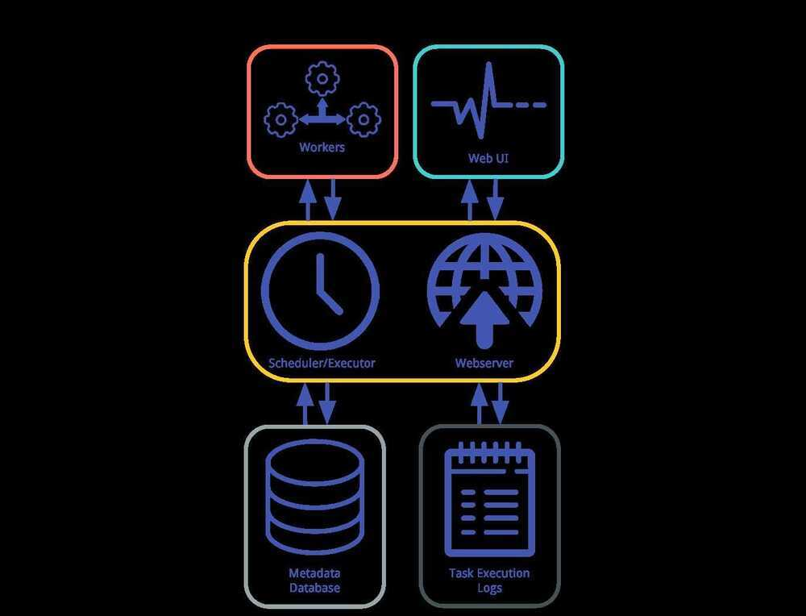
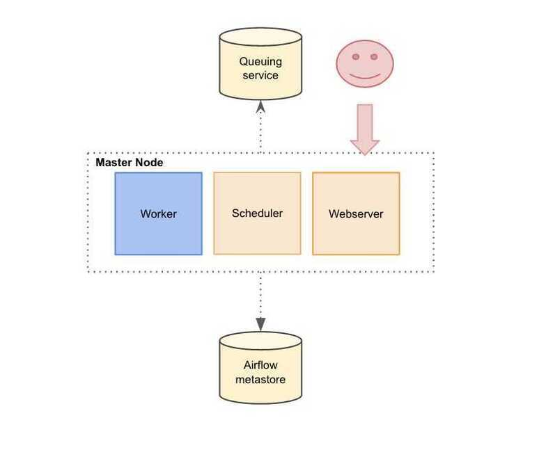

# Airflow Architecture

At its core, Airflow is simply a queuing system built on top of a metadata database. The database stores the state of queued tasks and a scheduler uses these states to prioritize how other tasks are added to the queue. This functionality is orchestrated by four primary components

### Metadata Database

This database stores information regarding the state of tasks. Database updates are performed using an abstraction layer implemented in SQLAlchemy. This abstraction layer cleanly separates the function of the remaining components of Airflow from the database.

Airflow uses a SQL database to store metadata about the data pipelines being run. In the diagram above, this is represented as Postgres which is extremely popular with Airflow. Alternate databases supported with Airflow include MySQL.

### Scheduler

The Scheduler is a process that uses DAG definitions in conjunction with the state of tasks in the metadata database to decide which tasks need to be executed, as well as their execution priority. The Scheduler is generally run as a service.

The Airflow web server and Scheduler are separate processes run (in this case) on the local machine and interact with the database mentioned above.

#### Scheduler Operation

Step 0. Load available DAG definitions from disk (fill DagBag)

While the scheduler is running:

Step 1. The scheduler uses the DAG definitions to identify and/or initialize any DagRuns in the metadata db.

Step 2. The scheduler checks the states of the TaskInstances associated with active DagRuns, resolves any dependencies amongst TaskInstances, identifies TaskInstances that need to be executed, and adds them to a worker queue, updating the status of newly-queued TaskInstances to "queued" in the database.

Step 3. Each available worker pulls a TaskInstance from the queue and starts executing it, updating the database record for the TaskInstance from "queued" to "running".

Step 4. Once a TaskInstance is finished running, the associated worker reports back to the queue and updates the status for the TaskInstance in the database (e.g. "finished", "failed", etc.)

Step 5. The scheduler updates the states of all active DagRuns ("running", "failed", "finished") according to the states of all completed associated TaskInstances.

Step 6. Repeat Steps 1-5

#### Configurations

- [max_dagruns_to_create_per_loop](https://airflow.apache.org/docs/apache-airflow/stable/configurations-ref.html#config-scheduler-max-dagruns-to-create-per-loop)

    This changes the number of DAGs that are locked by each scheduler when creating DAG runs. One possible reason for setting this lower is if you have huge DAGs (in the order of 10k+ tasks per DAG) and are running multiple schedulers, you won’t want one scheduler to do all the work.

- [max_dagruns_per_loop_to_schedule](https://airflow.apache.org/docs/apache-airflow/stable/configurations-ref.html#config-scheduler-max-dagruns-per-loop-to-schedule)

    How many DagRuns should a scheduler examine (and lock) when scheduling and queuing tasks. Increasing this limit will allow more throughput for smaller DAGs but will likely slow down throughput for larger (>500 tasks for example) DAGs. Setting this too high when using multiple schedulers could also lead to one scheduler taking all the DAG runs leaving no work for the others.

- [use_row_level_locking](https://airflow.apache.org/docs/apache-airflow/stable/configurations-ref.html#config-scheduler-use-row-level-locking)

    Should the scheduler issue `SELECT ... FOR UPDATE` in relevant queries. If this is set to False then you should not run more than a single scheduler at once.

- [pool_metrics_interval](https://airflow.apache.org/docs/apache-airflow/stable/configurations-ref.html#config-scheduler-pool-metrics-interval)

    How often (in seconds) should pool usage stats be sent to StatsD (if statsd_on is enabled). This is a _relatively_ expensive query to compute this, so this should be set to match the same period as your StatsD roll-up period.

- [orphaned_tasks_check_interval](https://airflow.apache.org/docs/apache-airflow/stable/configurations-ref.html#config-scheduler-orphaned-tasks-check-interval)

    How often (in seconds) should the scheduler check for orphaned tasks or dead SchedulerJobs.

    This setting controls how a dead scheduler will be noticed and the tasks it was "supervising" get picked up by another scheduler. The tasks will stay running, so there is no harm in not detecting this for a while.

    When a SchedulerJob is detected as "dead" (as determined by [scheduler_health_check_threshold](https://airflow.apache.org/docs/apache-airflow/stable/configurations-ref.html#config-scheduler-scheduler-health-check-threshold)) any running or queued tasks that were launched by the dead process will be "adopted" and monitored by this scheduler instead.

- [dag_dir_list_interval](https://airflow.apache.org/docs/apache-airflow/stable/configurations-ref.html#config-scheduler-dag-dir-list-interval) How often (in seconds) to scan the DAGs directory for new files.

- [file_parsing_sort_mode](https://airflow.apache.org/docs/apache-airflow/stable/configurations-ref.html#config-scheduler-file-parsing-sort-mode) The scheduler will list and sort the DAG files to decide the parsing order.

- [**max_tis_per_query**](https://airflow.apache.org/docs/apache-airflow/stable/configurations-ref.html#config-scheduler-max-tis-per-query) The batch size of queries in the scheduling main loop. This should not be greater than `core.parallelism`. If this is too high then SQL query performance may be impacted by complexity of query predicate, and/or excessive locking.

    Additionally, you may hit the maximum allowable query length for your db. Set this to 0 to use the value of `core.parallelism`.

- [min_file_process_interval](https://airflow.apache.org/docs/apache-airflow/stable/configurations-ref.html#config-scheduler-min-file-process-interval) Number of seconds after which a DAG file is re-parsed. The DAG file is parsed every min_file_process_interval number of seconds. Updates to DAGs are reflected after this interval. Keeping this number low will increase CPU usage.

- [parsing_processes](https://airflow.apache.org/docs/apache-airflow/stable/configurations-ref.html#config-scheduler-parsing-processes) The scheduler can run multiple processes in parallel to parse DAG files. This defines how many processes will run.

- [scheduler_idle_sleep_time](https://airflow.apache.org/docs/apache-airflow/stable/configurations-ref.html#config-scheduler-scheduler-idle-sleep-time) Controls how long the scheduler will sleep between loops, but if there was nothing to do in the loop. i.e. if it scheduled something then it will start the next loop iteration straight away. This parameter is badly named (historical reasons) and it will be renamed in the future with deprecation of the current name.

- [schedule_after_task_execution](https://airflow.apache.org/docs/apache-airflow/stable/configurations-ref.html#config-scheduler-schedule-after-task-execution) Should the Task supervisor process perform a "mini scheduler" to attempt to schedule more tasks of the same DAG. Leaving this on will mean tasks in the same DAG execute quicker, but might starve out other DAGs in some circumstances.

https://medium.com/@dustinstansbury/how-quizlet-uses-apache-airflow-in-practice-a903cbb5626d

[Deep dive in to the Airflow scheduler - YouTube](https://www.youtube.com/watch?v=DYC4-xElccE)

[Scheduler — Airflow Documentation](https://airflow.apache.org/docs/apache-airflow/stable/administration-and-deployment/scheduler.html)

### Executor

The Executor is a message queuing process that is tightly bound to the Scheduler and determines the worker processes that actually execute each scheduled task. There are different types of Executors, each of which uses a specific class of worker processes to execute tasks. For example, theLocalExecutorexecutes tasks with parallel processes that run on the same machine as the Scheduler process. Other Executors, like the CeleryExecutor execute tasks using worker processes that exist on a separate cluster of worker machines.

Inside [Apache Airflow](https://airflow.apache.org/), tasks are carried out by anexecutor. The main types of executors are:

- **Sequential Executor:** Each task is runlocally(on the same machine as the scheduler) in its own python subprocess. They are run sequentially which means that only one task can be executed at a time. It is the default executor.
- **Local Executor:** It is the same as the sequential executor except that multiple tasks canrun in parallel. It needs a metadata database (where DAGs and tasks status are stored) that supports parallelism like MySQL. Setting such a database requires some extra work since the default configuration uses SQLite.
- **Celery Executor:** The workload is distributed on multiple celery workers which can run on different machines.It is the executor you should use for availability and scalability.

### Workers

These are the processes that actually execute the logic of tasks, and are determined by the Executor being used.

Airflow's General Architecture.Airflow's operation is built atop a Metadata Database which stores the state of tasks and workflows (i.e. DAGs). The Scheduler and Executor send tasks to a queue for Worker processes to perform. The Webserver runs (often-times running on the same machine as the Scheduler) and communicates with the database to render task state and Task Execution Logs in the Web UI. Each colored box indicates that each component can exist in isolation from the other components, depending on the type of deployment configuration.

The Worker(s) are separate processes which also interact with the other components of the Airflow architecture and the metadata repository.

### Others

- airflow.cfg is the Airflow configuration file which is accessed by the Web Server, Scheduler, and Workers.
- DAGs refers to the DAG files containing Python code, representing the data pipelines to be run by Airflow. The location of these files is specified in the Airflow configuration file, but they need to be accessible by the Web Server, Scheduler, and Workers.

https://airflow.apache.org/docs/apache-airflow/stable/concepts.html

## Single-node architecture

In a single-node architecture all components are on the same node. To use a single node architecture, Airflow has to be configured with the LocalExecutor mode.

The single-node architecture is widely used by the users in case they have a moderate amount of DAGs. In this mode, the worker pulls tasks to run from an IPC (Inter Process Communication) queue. This mode doesn't any need external dependencies. It scales up well until all resources on the server are used. This solution works pretty well. However, to scale out to multiple servers, the Celery executor mode has to be used. Celery executor uses Celery (and a message-queuing server) to distribute the load on a pool of workers.

## Multi-node architecture

In a multi node architecture daemons are spread in different machines. We decided to colocate the webserver and the scheduler. To use this architecture, Airflow has to be configure with the Celery Executor mode.

In this mode, a Celery backend has to be set (Redis in our case). Celery is an asynchronous queue based on distributed message passing. Airflow uses it to execute several tasks concurrently on several workers server using multiprocessing. This mode allows to scale up the Airflow cluster really easily by adding new workers.

## Multi-node architecture provides several benefits

- **Higher availability:** if one of the worker nodes goes down, the cluster will still be up and DAGs will still be running.
- **Dedicated workers for specific tasks:** we have a workflow where some of our DAGs are CPU intensive. As we have several workers we can dedicate some of them to these kinds of DAGs.
- **Scaling horizontally:** Indeed since workers don't need to register with any central authority to start processing tasks, we can scale our cluster by easily adding new workers. Nodes can be turned on and off without any downtime on the cluster.

https://drivy.engineering/airflow-architecture

## Others

### Clockwork: Distributed, Scalable Job Scheduler

https://cynic.dev/posts/clockwork-scalable-job-scheduler
