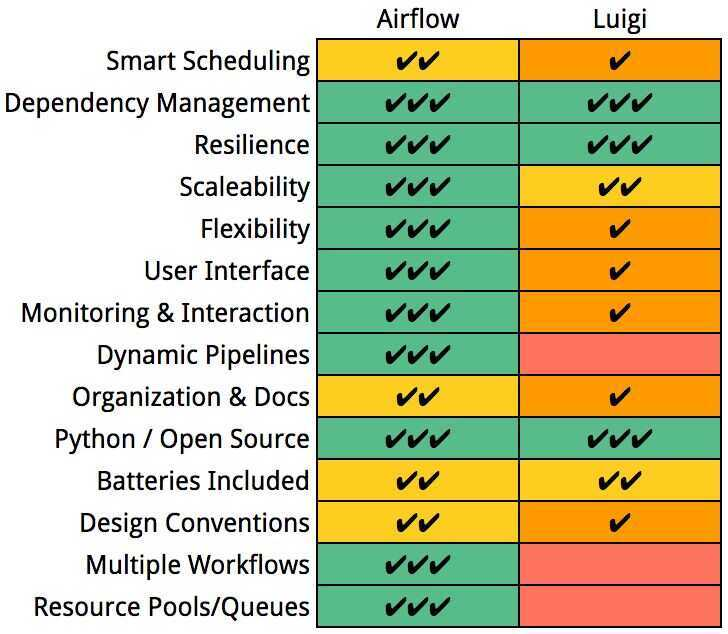

# Airflow

Airflow is a platform to programmatically author, schedule and monitor workflows.

Use airflow to author workflows as directed acyclic graphs (DAGs) of tasks. The airflow scheduler executes your tasks on an array of workers while following the specified dependencies. Rich command line utilities make performing complex surgeries on DAGs a snap. The rich user interface makes it easy to visualize pipelines running in production, monitor progress, and troubleshoot issues when needed.

When workflows are defined as code, they become more maintainable, versionable, testable, and collaborative.

Airflow is a WMS (Workflow Management System) that defines tasks and and their dependencies as code, executes those tasks on a regular schedule, and distributes task execution across worker processes. Airflow offers an excellent UI that displays the states of currently active and past tasks, shows diagnostic information about task execution, and allows the user to manually manage the execution and state of tasks.

## Workflows are DAGs

Workflows in Airflow are collections of tasks that have directional dependencies. Specifically, Airflow uses directed acyclic graphs - or DAG for short - to represent a workflow. Each node in the graph is a task, and edges define dependencies amongst tasks (The graph is enforced to be acyclic so that there are no circular dependencies that can cause infinite execution loops).

At a high level, a DAG can be thought of as a container that holds tasks and their dependencies, and sets the context for when and how those tasks should be executed. Each DAG has a set of properties, most important of which are its dag_id, a unique identifier amongst all DAGs, its start_date, the point in time at which the DAG's tasks are to begin executing, and the schedule_interval, or how often the tasks are to be executed. In addition to the dag_id, start_date, and schedule_interval, each DAG can be initialized with a set of default_arguments. These default arguments are inherited by all tasks in the DAG.

## Operators, Sensors, and Tasks

Although the DAG is used to organize tasks and set their execution context, DAGs do not perform any actual computation. Instead, **tasks** are the element of Airflow that actually "do the work" we want performed. Tasks can have two flavors: they can either execute some explicit operation, in which case they are an **Operator**, or they can pause the execution of dependent tasks until some criterion has been met, in which case they are a **Sensor**. In principle, Operators can perform any function that can be executed in Python. Similarly, Sensors can check the state of any process or data structure.

## DagRuns and TaskInstances

Once we've defined a DAG - i.e. we've instantiated tasks and defined their dependencies - we can then execute the tasks based on the parameters of the DAG. A key concept in Airflow is that of an execution_time. When the Airflow scheduler is running, it will define a regularly-spaced schedule of dates for which to execute a DAG's associated tasks. The execution times begin at the DAG's start_date and repeat every schedule_interval. For our example the scheduled execution times would be ('2017--01--01 00:00:00', '2017--01--02 00:00:00', ...). For each execution_time, a DagRun is created and operates under the context of that execution time. Thus a DagRun is simply a DAG with some execution time

## Principles

- **Dynamic:** Airflow pipelines are configuration as code (Python), allowing for dynamic pipeline generation. This allows for writing code that instantiates pipelines dynamically.
- **Extensible:** Easily define your own operators, executors and extend the library so that it fits the level of abstraction that suits your environment.
- **Elegant:** Airflow pipelines are lean and explicit. Parameterizing your scripts is built into the core of Airflow using the powerfulJinjatemplating engine.
- **Scalable:** Airflow has a modular architecture and uses a message queue to orchestrate an arbitrary number of workers. Airflow is ready to scale to infinity.

## Kubernetes + Airflow

- Modernized stack using containers + k8s
- Reduced deployment and management complexity
- Dynamic resource allocation
- Automatic fault remediation
- Improved resource utilization

## Kubernetes Executor

The kubernetes executor is introduced in Apache Airflow 1.10.0. The Kubernetes executor will create a new pod for every task instance.

### Dags

- By storing dags onto persistent disk, it will be made available to all workers
- Another option is to use git-sync. Before starting the container, a git pull of the dags repository will be performed and used throughout the lifecycle of the pod

### Logs

- By storing logs onto a persistent disk, the files are accessible by workers and the webserver. If you don't configure this, the logs will be lost after the worker pods shuts down
- Another option is to use S3/GCS/etc to store logs

https://airflow.apache.org/kubernetes.html

https://medium.com/datareply/airflow-lesser-known-tips-tricks-and-best-practises-cf4d4a90f8f

https://www.youtube.com/watch?v=VrsVbuo4ENE

## Airflow vs Luigi

https://towardsdatascience.com/why-quizlet-chose-apache-airflow-for-executing-data-workflows-3f97d40e9571

https://github.com/apache/airflow/blob/master/airflow/config_templates/default_airflow.cfg

### Maintenance Task Dags

- https://github.com/teamclairvoyant/airflow-maintenance-dags

### Testing

- https://docs.astronomer.io/learn/testing-airflow
- https://godatadriven.com/blog/testing-and-debugging-apache-airflow
- https://xebia.com/blog/testing-and-debugging-apache-airflow/

https://github.com/mumoshu/kube-airflow

## Airflow 2.0

- Stabilised REST API
- Adds an API to explicitly declare messages passed between tasks in a DAG. The so-called **TaskFlow API** is meant to help handle dependencies and promises to make declaring PythonOperator a tad easier. In order to improve the experience when grouping tasks via the UI, the Airflow team has come up with the concept of task groups, which can be used instead of SubDAGs but comes without drawbacks such as limited parallelism.
- KubernetesExecutor has been re-architected so users can easily access the Kubernetes API to create their.yaml pod_template_file without the need to specify parameters in the Airflow configuration. Switching from an executor_config dictionary to the pod_override parameter, "which takes a Kubernetes V1Pod object for a 1:1 setting override", helped to reduce the codebase of the executor and improved execution speed.
- Improve the performance of the scheduler, which seems to have reduced the time the component needs to start tasks. Practitioners using the scheduler with Postgres 9.6+ or MySQL 8+ can also profit from the option to run more than one scheduler instance at a time, which adds resiliency to any setup and makes the scheduler high availability compatible.
- Users who have been familiar with Airflow for a while will probably notice the cleaned up user interface, which features a slightly refreshed colour scheme, a new icon system, an updated global navigation menu, DAG views, and table presentation.
- Under the hood a lot has changed as well, since the project has been split into a core and 61 provider packages for things like external services, databases, and protocols. This should help make installations more flexible and offer the structure for better extendability to those looking to write their own providers and connection types.
- TasksGroup
- TaskFlowAPI (XComm)
- SmartSensor
- Scheduler HA (Fast follow)

https://devclass.com/2020/12/21/apache-airflow-2

https://airflow.apache.org/blog/airflow-two-point-oh-is-here

https://github.com/apache/airflow/releases?after=upgrade-check%2F1.1.0

https://www.astronomer.io/blog/taskflow-api-in-airflow-2-0

https://www.youtube.com/playlist?list=PLCi-q9vYo4x-PESoBcXN0tXCMgzh5c_Pj

- We have airflow in production, what if the Scheduler goes down?
- We have many variables used in many DAGs, can we build a tool to manage them?
- Many sensors are waiting, preventing other tasks to get triggered, can we solve this?
- Writing DAGs is long and repetitive. Is there a better, faster and easier way to create DAGs?
- We use SubDAGs extensively but they don't seem recommended. What should we use then?
- Is there a way to fully leverage the Kubernetes API within the KubernetesPodOperator?

## Debugging

https://www.astronomer.io/blog/7-common-errors-to-check-when-debugging-airflow-dag

## Changelog

[Apache Airflow 2.0 is here! | Apache Airflow](https://airflow.apache.org/blog/airflow-two-point-oh-is-here/)

[Introducing Airflow 2.8](https://www.astronomer.io/blog/introducing-airflow-2-8/)
