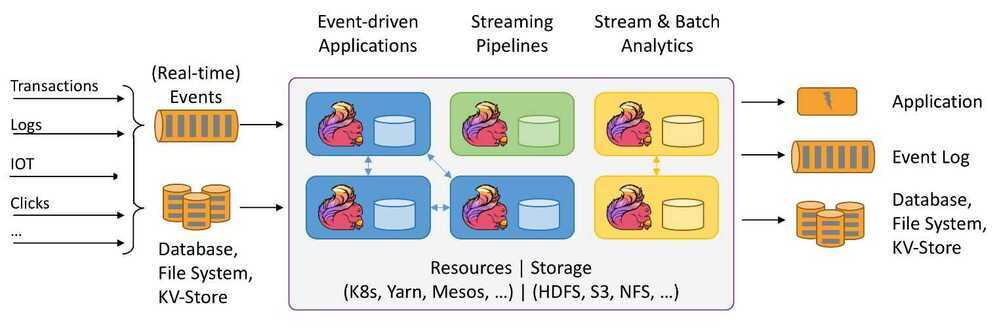

# Others

## Cadence

Cadence is a distributed, scalable, durable, and highly available orchestration engine to execute asynchronous long-running business logic in a scalable and resilient way.

Business logic is modeled as workflows and activities. Workflows are the implementation of coordination logic. Its sole purpose is to orchestrate activity executions. Activities are the implementation of a particular task in the business logic. The workflow and activity implementation are hosted and executed in worker processes. These workers long-poll the Cadence server for tasks, execute the tasks by invoking either a workflow or activity implementation, and return the results of the task back to the Cadence server. Furthermore, the workers can be implemented as completely stateless services which in turn allows for unlimited horizontal scaling.

The Cadence server brokers and persists tasks and events generated during workflow execution, which provides certain scalability and reliability guarantees for workflow executions. An individual activity execution is not fault tolerant as it can fail for various reasons. But the workflow that defines in which order and how (location, input parameters, timeouts, etc.) activities are executed is guaranteed to continue execution under various failure conditions.

Cadence fault-oblivious stateful code platform preserves complete multithreaded application state including thread stacks with local variables across hardware and software failures. It greatly simplifies coding of complex stateful distributed applications.

https://github.com/uber/cadence

[https://cadenceworkflow.io](https://cadenceworkflow.io/)

## Dynein

Dynein is Airbnb's Open-source Distributed Delayed Job Queueing System.

We can divide Dynein jobs into two categories: immediate jobs and delayed jobs.

### Immediate Jobs

For immediate jobs, or jobs that are scheduled to run within 15 minutes, Dynein simply works as a wrapper of the SQS API - Jobs submitted to Dynein will be relayed to an SQS queue immediately, and the job will then be consumed by consumers with the SQS dequeue API. We opted to wrap the SQS API rather than have services directly enqueue to SQS because this approach offers us expansive metrics coverage, as well as tight integration with Airbnb's internal rate-limiting and backpressure systems. Additionally, our users can use the same API they use for delayed jobs.

### Delayed Jobs

Dynein takes a more elaborate approach to delayed jobs. Delayed jobs, to Dynein, means deliver the right message to the right service queue at the right time. When a delayed job is submitted to Dynein, it is immediately put into an SQS queue - we call it inbound queue. This queue works as a write buffer for our scheduler, designed so that we can sustain small spikes in jobs submitted. Not only does the inbound queue protect our system from write spikes, but it also gives us clear indicating metrics that such issues are happening. SQS gives us enough time to figure out what the issue is, fix it, and then process the backlog.

Dynein service then picks up the job from the inbound queue with a consistent ingestion rate, and stores a trigger for the job into the scheduler. At the scheduled time, Dynein service selects the jobs from the scheduler, and then enqueues the jobs into SQS. The Dynein service is completely stateless, and runs as a simple Deployment on Kubernetes platform.

https://github.com/airbnb/dynein

https://medium.com/airbnb-engineering/dynein-building-a-distributed-delayed-job-queueing-system-93ab10f05f99

## Quartz

Quartz is a [richly featured](http://www.quartz-scheduler.org/documentation/2.4.0-SNAPSHOT/introduction.html#features), open source job scheduling library that can be integrated within virtually any Java application - from the smallest stand-alone application to the largest e-commerce system. Quartz can be used to create simple or complex schedules for executing tens, hundreds, or even tens-of-thousands of jobs; jobs whose tasks are defined as standard Java components that may execute virtually anything you may program them to do. The Quartz Scheduler includes many enterprise-class features, such as support for JTA transactions and clustering.

http://www.quartz-scheduler.org

https://github.com/quartz-scheduler/quartz

## Dkron

Dkron is a distributed cron service, easy to setup and fault tolerant with focus in:

- Easy: Easy to use with a great UI
- Reliable: Completely fault tolerant
- High scalable: Able to handle high volumes of scheduled jobs and thousands of nodes

Dkron is written in Go and leverage the power of distributed key-value stores and serf for providing fault tolerance, reliability and scalability while keeping simple and easily installable.

Dkron is inspired by the google whitepaper [Reliable Cron across the Planet](https://queue.acm.org/detail.cfm?id=2745840) and by Airbnb Chronos borrowing the same features from it.

https://github.com/victorcoder/dkron

https://dkron.io

## Airflow + Genie on AWS Platform

https://aws.amazon.com/blogs/big-data/orchestrate-big-data-workflows-with-apache-airflow-genie-and-amazon-emr-part-1

## Prefect

Prefect is a new workflow management system, designed for modern infrastructure and powered by the open-source Prefect Core workflow engine. Users organize Tasks into Flows, and Prefect takes care of the rest.

https://github.com/prefecthq/prefect

https://www.prefect.io

## Netflix Conductor (Archived)

Conductor is a microservices orchestration engine

We built Conductor to help us orchestrate microservices based process flows at Netflix with the following features:

- A distributed server ecosystem, which stores workflow state information efficiently.
- Allow creation of process / business flows in which each individual task can be implemented by the same / different microservices.
- A JSON DSL based blueprint defines the execution flow.
- Provide visibility and traceability into these process flows.
- Simple interface to connect workers, which execute the tasks in workflows.
- Full operational control over workflows with the ability to pause, resume, restart, retry and terminate.
- Allow greater reuse of existing microservices providing an easier path for onboarding.
- User interface to visualize, replay and search the process flows.
- Ability to scale to millions of concurrently running process flows.
- Backed by a queuing service abstracted from the clients.
- Be able to operate on HTTP or other transports e.g. gRPC.
- Event handlers to control workflows via external actions.
- Client implementations in Java, Python and other languages.
- Various configurable properties with sensible defaults to fine tune workflow and task executions like rate limiting, concurrent execution limits etc.

https://github.com/Netflix/conductor

https://netflix.github.io/conductor

## Temporal

Durable Execution: a new abstraction for developers

Durable Execution is a development abstraction that preserves complete application state so that upon host or software failure it can seamlessly migrate execution to another machine.

Temporal is an open source implementation of Durable Execution created by the originators of the abstraction.

The [Temporal Platform](https://docs.temporal.io/temporal) provides developers a suite of effective tools for building reliable applications at scale.

The concepts, components, and features of the platform are described in detail across the concept guides.

- [Temporal](https://docs.temporal.io/temporal)
- [Workflows](https://docs.temporal.io/workflows)
- [Activities](https://docs.temporal.io/activities)
- [Workers](https://docs.temporal.io/workers)
- [Retry Policies](https://docs.temporal.io/retry-policies)
- [Clusters](https://docs.temporal.io/clusters)
- [Visibility](https://docs.temporal.io/visibility)
- [Namespaces](https://docs.temporal.io/namespaces)
- [Data conversion](https://docs.temporal.io/dataconversion)

### Links

- [Open Source Durable Execution | Temporal Technologies](https://temporal.io/)
- [GitHub - temporalio/temporal: Temporal service](https://github.com/temporalio/temporal)
- [Getting to know Temporal - YouTube](https://www.youtube.com/watch?v=wIpz4ioK0gI)
- [Documentation | Temporal Documentation](https://docs.temporal.io/)
- [Temporal Web UI | Temporal Documentation](https://docs.temporal.io/web-ui)
- [Building Resilient Microservice Workflows with Temporal: A Next-Gen Workflow Engine | by Dixon Deng | SafetyCulture Engineering | Medium](https://medium.com/safetycultureengineering/building-resilient-microservice-workflows-with-temporal-a-next-gen-workflow-engine-a9637a73572d)
- [Maru: Load Testing Tool for Temporal Workflows | Mikhail Shilkov](https://mikhail.io/2021/03/maru-load-testing-tool-for-temporal-workflows/)
- [Introduction to Temporal | The Write Ahead Log](https://platformatory.io/blog/Introduction-to-Temporal/)

## Dagster

[Dagster](ai/big-data/tools.md#Dagster)

## Mage.ai

[GitHub - mage-ai/mage-ai: 🧙 Build, run, and manage data pipelines for integrating and transforming data.](https://github.com/mage-ai/mage-ai) - 8K stars

[Give your data team magical powers | Mage](https://www.mage.ai/)

[The Airflow alternative worth checking out: Mage.ai - YouTube](https://www.youtube.com/watch?v=3gXsFEC3aYA)

[mage-ai/mage\_integrations/mage\_integrations/destinations/bigquery/README.md at master · mage-ai/mage-ai · GitHub](https://github.com/mage-ai/mage-ai/blob/master/mage_integrations/mage_integrations/destinations/bigquery/README.md)

[\[BUG\] Pipelines stuck due to high CPU usage of Mage scheduler · Issue #5345 · mage-ai/mage-ai · GitHub](https://github.com/mage-ai/mage-ai/issues/5345)

## Flyte

Build & deploy data & ML pipelines, hassle-free

The infinitely scalable and flexible workflow orchestration platform that seamlessly unifies data, ML and analytics stacks.

Flyte is an open-source orchestrator that facilitates building production-grade data and ML pipelines. It is built for scalability and reproducibility, leveraging Kubernetes as its underlying platform. With Flyte, user teams can construct pipelines using the Python SDK, and seamlessly deploy them on both cloud and on-premises environments, enabling distributed processing and efficient resource utilization.

- [Build production-grade data and ML workflows, hassle-free with Flyte](https://flyte.org/)
- [GitHub - flyteorg/flyte: Scalable and flexible workflow orchestration platform that seamlessly unifies data, ML and analytics stacks.](https://github.com/flyteorg/flyte)
- [Flyte School: A Practical Introduction to Machine Learning Orchestration - YouTube](https://www.youtube.com/watch?v=0cP9pLLeqT4)
- [Self-serve Feature Engineering Platform Using Flyte and Feast - Ketan Umare, & Felix Wang, - YouTube](https://www.youtube.com/watch?v=Km2ii0F8Yl0)
- [Flyte: Production-Grade Data and Machine Learning Orchestration - Shivay Lamba & Ekansh Gupta - YouTube](https://www.youtube.com/watch?v=7ZDFhZ4hut0)
- [Flyte School: Flyte Architecture Deep Dive - YouTube](https://www.youtube.com/watch?v=EQSHqtlTXwM)

### Flyte vs Airflow

Flyte simplifies building data and ML workflows with its user-friendly SDK. It also supports flexible scaling with minimal infrastructure costs and effort. In contrast, Airflow does not offer an infrastructure-oriented setup, which means more effort to manage the platform. Designed for teams who want more productivity, Flyte helps you easily organize and manage your workflows from the start.

[Airflow Alternate • Flyte vs. Airflow](https://flyte.org/airflow-alternative)

[Orchestrating Data Pipelines at Lyft: comparing Flyte and Airflow | by Constantine Slisenka | Lyft Engineering](https://eng.lyft.com/orchestrating-data-pipelines-at-lyft-comparing-flyte-and-airflow-72c40d143aad)

## Others

[GitHub - alseambusher/crontab-ui: Easy and safe way to manage your crontab file](https://github.com/alseambusher/crontab-ui)

Amazon Managed Workflows for Apache Airflow (MWAA) [What Is Amazon Managed Workflows for Apache Airflow? - Amazon Managed Workflows for Apache Airflow](https://docs.aws.amazon.com/mwaa/latest/userguide/what-is-mwaa.html)

- [Amazon Managed Workflows for Apache Airflow: Getting Started - YouTube](https://www.youtube.com/watch?v=ZET50M20hkU)

