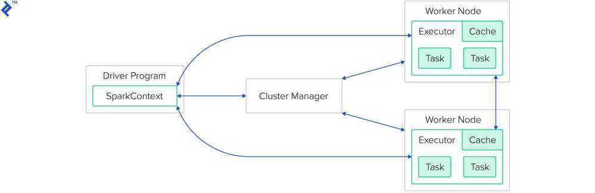

# Intro

Spark is a general purpose distributed data processing engine. Or in other words: load big data, do computations on it in a distributed way, and then store it.

Spark supports both Scala & Python. Even though Spark itself is written in Scala, I recommend you to use Python for your Spark jobs, as it is vastly more popular among Spark users (many data scientists use Python). It will be far easier for you to find documentation and get your question answered online.

**Apache Spark** is a lightning-fast cluster computing technology, designed for fast computation.

The basic structure of a Spark-cluster:



The cluster manager is not part of the Spark framework itself - even though Spark ships with its own, this one should not be used in production. Supported cluster managers are Mesos, Yarn, and Kubernetes.

The driver program is a Java, Scala, or Python application, which is executed on the Spark Master.

As part of the program, some Spark framework methods will be called, which themselves are executed on the worker nodes.

Each worker node might run multiple executors (as configured: normally one per available CPU core). Each of the executors will receive a task from the scheduler to be executed.

The modules of Apache Spark run directly on top of its core:


## Spark Abstractions & Concepts

- RDD: Resilient Distributed Dataset (Immutable)
- DAG: Directed Acyclic Graph
- SparkContext
- Transformations
- Actions

## Spark Memory Management

Two types of memory

- **Execution -** Memory used for shuffles, joins, sorts and aggregations
- **Storage memory -** Memory used to cache data that will be reused later

[Deep Dive: Apache Spark Memory Management - YouTube](https://www.youtube.com/watch?v=dPHrykZL8Cg&ab_channel=SparkSummit)

## Need of Spark

- Apache Spark is a big data analytics framework that was originally developed at the University of California, Berkely's AMP Lab, in 2012.
- It is an another system for big data analytics
- Isn't MapReduce good enough?
    - Simplifies batch processing on large commodity clusters

## Spark Applications

- Twitter spam classification
- EM algorithm for traffic prediction
- K-means clustering
- Alternating Least Squares matrix factorization
- In-memory OLAP aggregation on Hive data
- SQL on Spark

## Spark Implementation

### Spark ideas

- Expressive computing system, not limited to map-reduce model
- Facilitate system memory
    - avoid saving intermediate results to disk
    - cache data for repetitive queries. (e.g. for machine learning)
- Compatible with Hadoop

### RDD abstraction

- Partitioned collection of records
- Spread across the cluster
- Read-only
- Caching dataset in memory
    - different storage levels available
    - fallback to disk possible

### RDD operations

- Transformations to build RDDs through deterministic operations on other RDDs
    - transformations include map, filter, join
    - lazy operation
- Actions to return value or export data
    - actions include court, collect, save
    - triggers execution

### Available APIs

- You can write in Java, Scala or Python
- Interactive interpreter: Scala & Python only
- Standalone applications: any
- Performance: Java & Scala are faster thanks to static typing

### Commands

```bash
spark-shell # run scala spark interpreter
pyspark # python interpreter
spark-submit --master local --class GvaWeather target/scala-2.10/gva-weather_2.10-1.0.jar #job submission
```

[Submitting Applications - Spark 3.5.1 Documentation](https://spark.apache.org/docs/latest/submitting-applications.html)

### Summary

- Concept not limited to single pass map-reduce
- Avoid sorting intermediate results on disk or HDFS
- Speedup computations when reusing datasets

### Conclusion

- RDDs provide a simple and efficient programming model
- Generalized to a broad set of applications
- Leverages coarse-grained nature of parallel algorithms for failure recovery

## References

- Matei Zaharia, Mosharaf Chowdhury - Spark: Cluster Computing with Working Sets
- Matei Zaharia - Resilient Distributed Datasets: A fault-tolerant abstraction for in-memory cluster computing
- https://www.toptal.com/spark/interview-questions
- https://databricks.com - Free Spark Cluster
- https://medium.freecodecamp.org/how-to-use-spark-clusters-for-parallel-processing-big-data-86a22e7f8b50
- https://www.toptal.com/spark/introduction-to-apache-spark
- https://github.com/jaceklaskowski/mastering-spark-sql-book
- https://towardsdatascience.com/a-neanderthals-guide-to-apache-spark-in-python-9ef1f156d427
- https://www.freecodecamp.org/news/use-pyspark-for-data-processing-and-machine-learning
- [Apache Spark Tutorial with Examples - Spark By Examples](https://sparkbyexamples.com/)
- [Errors - PySpark 3.4.0 documentation](https://spark.apache.org/docs/latest/api/python/reference/pyspark.errors.html)
- [Quick Start - Spark 3.5.1 Documentation](https://spark.apache.org/docs/latest/quick-start.html)
