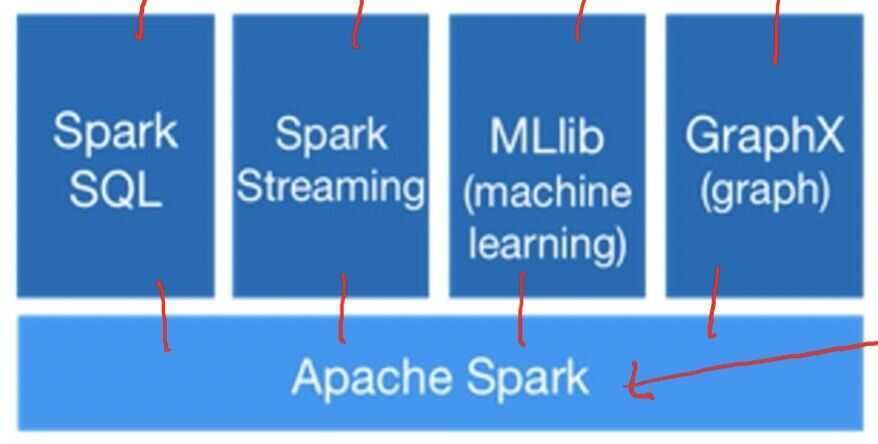

# Spark Built-in Libraries

## Intro

- Apache spark is a fast and general-purpose cluster computing system for large scale data processing
- High-level APIs in Java, Scala, Python and R



## Standard library for Big Data

- Big data apps lack libraries of common algorithms
- Spark's generality + support for multiple languages make it suitable to offer this
- Much of future activity will be in these libraries

## Machine Learning Library (MLlib)

1. Classification: logistic regression, linear SVM, naive Bayes, classification tree
2. Regression: generalized linear models (GLMs), regression tree
3. Collaborative filtering: alternating least squares (ALS), non-negative matrix factorization (NMF)
4. Clustering: K-means
5. Decomposition: SVD, PCA
6. Optimization: stochastic gradient descent, L-BFGS)

## GraphX

- General graph processing library
- Build graph using RDDs of nodes and edges
- Large library of graph algorithms with composable steps


## GraphX Algorithms

1. Collaborative Filtering
    - Alternating Least Squares
    - Stochastic Gradient Descent
    - Tensor Factorization

2. Structured Prediction
    - Loopy Belief Propagation
    - Max-produce linear programs
    - Gibbs sampling

3. Semi-supervised ML
    - Graph SSL
    - CoEM

4. Community Detection
    - Triangle-Counting
    - K-core decomposition
    - K-Truss

5. Graph Analytics
    - PageRank
    - Personalized PageRank
    - Shortest Path
    - Graph Coloring

6. Classification
    - Neural Networks

## Spark Streaming

- Large scale streaming computation
- Ensure exactly one semantics
- Integrated with Spark -> unifies batch, interactive, and streaming computations


## Spark SQL

Enables loading & querying structed data in Spark

From Hive:

```python
c = HiveContext(sc)
rows = c.sql("select text, year from hivetable")
rows.filter(lambda r: r.year > 2013).collect()
```

From JSON:

```python
c.jsonFile("tweets.json").registerAsTable("tweets")
c.sql("select text, user.name from tweets")
```
