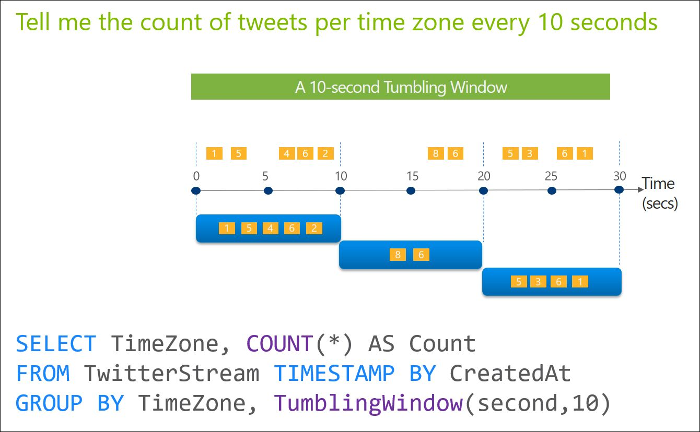
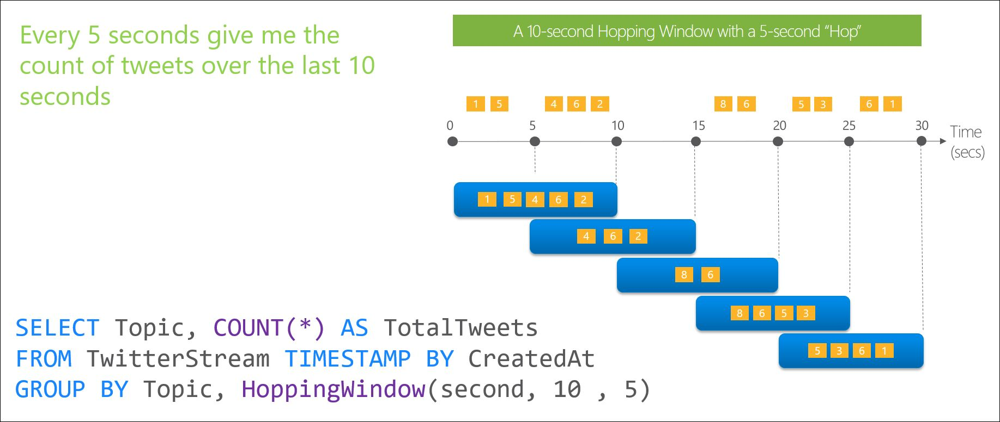
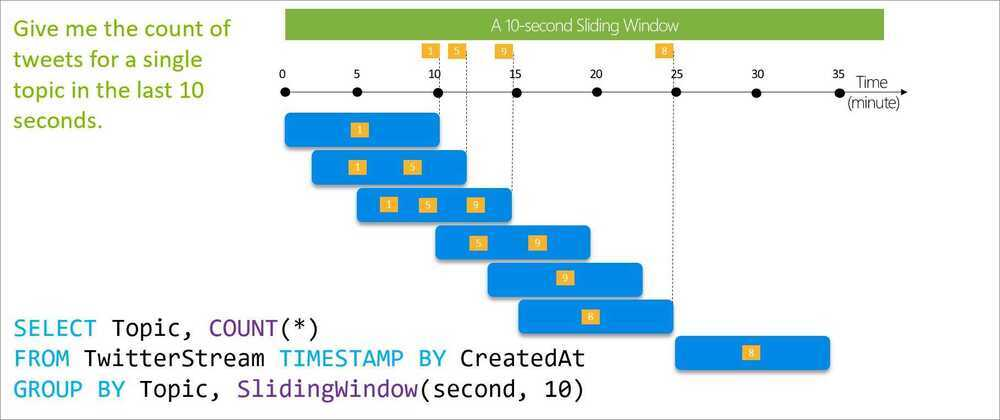
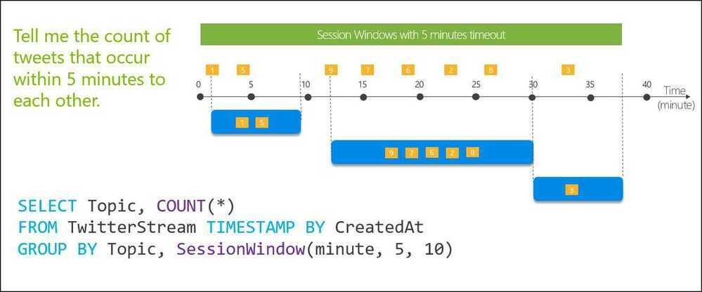

Stream processing framework that is

- Scalable to large clusters
- Achieves second-scale latencies
- Has simple programming model
- Integrates with batch & interactive workloads
- Ensures efficient fault-tolerance in stateful computations

## Types of window frames

### Cumulative

Enables computing rolling values from the beginning of the window to the current row or from the current row to the end of the window.

### Sliding

Enables computing rolling values between any two rows (inclusive) in the window, relative to the current row.

## Windows

In time-streaming scenarios, performing operations on the data contained in temporal windows is a common pattern.

There are four kinds of temporal windows to choose from

### Tumbling Windows

Tumbling window functions are used to segment a data stream into distinct time segments and perform a function against them, such as the example below. The key differentiators of a Tumbling window are that they repeat, do not overlap, and an event cannot belong to more than one tumbling window.

### Hopping Windows

Hopping window functions hop forward in time by a fixed period. It may be easy to think of them as Tumbling windows that can overlap, so events can belong to more than one Hopping window result set. To make a Hopping window the same as a Tumbling window, specify the hop size to be the same as the window size.

### Sliding Windows

Sliding window functions, unlike Tumbling or Hopping windows, produce an output **only** when an event occurs. Every window will have at least one event and the window continuously moves forward by an € (epsilon). Like hopping windows, events can belong to more than one sliding window.

### Session Windows

Session window functions group events that arrive at similar times, filtering out periods of time where there is no data. It has three main parameters: timeout, maximum duration, and partitioning key (optional).

A session window begins when the first event occurs. If another event occurs within the specified timeout from the last ingested event, then the window extends to include the new event. Otherwise if no events occur within the timeout, then the window is closed at the timeout.

If events keep occurring within the specified timeout, the session window will keep extending until maximum duration is reached. The maximum duration checking intervals are set to be the same size as the specified max duration. For example, if the max duration is 10, then the checks on if the window exceed maximum duration will happen at t = 0, 10, 20, 30, etc.

When a partition key is provided, the events are grouped together by the key and session window is applied to each group independently. This partitioning is useful for cases where you need different session windows for different users or devices.

https://docs.microsoft.com/en-us/azure/stream-analytics/stream-analytics-window-functions

### Other Window Functions

- Global window
- Interval window
- Calendar window
- Stagger window

https://dev.to/frosnerd/window-functions-in-stream-analytics-1m6c

## Spark Structured Streaming

Spark Structured Streaming is **a scalable and fault-tolerant stream processing engine built on the Spark SQL engine**. It allows you to express streaming computations similarly to batch computations on static data using the familiar [DataFrame and Dataset APIs](https://spark.apache.org/docs/latest/streaming/apis-on-dataframes-and-datasets.html) in Scala, Java, Python, or R.

However, since Spark 2.3, we have introduced a new low-latency processing mode called **Continuous Processing**, which can achieve end-to-end latencies as low as 1 millisecond with at-least-once guarantees. Without changing the Dataset/DataFrame operations in your queries, you will be able to choose the mode based on your application requirements.

### Core Concepts

- **Unbounded Table Model:** Structured Streaming treats a live data stream as a table that is being continuously appended. Every new data record is like a new row appended to this input table.
- **Incremental Processing:** The engine runs "incremental" queries that only process new data from the source and update the final result table.
- **Event-Time Processing:** It naturally handles data that arrives late or out of order by using "event-time" columns and watermarking to discard data that is too old.
- **Fault Tolerance:** It achieves end-to-end exactly-once guarantees through checkpointing and write-ahead logs, ensuring data is not lost even if nodes fail.

### Processing Modes

1. **Micro-Batch Processing (Default):** Processes data in small batches, achieving latencies as low as 100 milliseconds with exactly-once guarantees.
2. **Continuous Processing (Experimental):** Introduced in Spark 2.3, this mode can achieve ultra-low latencies (~1 ms) with at-least-once guarantees.
3. **Real-Time Mode:** A newer mode on Databricks designed for sub-second latencies (typically around 300 ms).

### Common Sources and Sinks

- **Sources:**
    - **File Source:** Reads files written in a directory (CSV, JSON, Parquet, Text).
    - **Kafka Source:** Streams data from one or more topics in [Apache Kafka](https://spark.apache.org/docs/latest/structured-streaming-kafka-integration.html).
    - **Socket Source:** Primarily for testing, reads UTF-8 text from a socket connection.
- **Sinks:**
    - **File Sink:** Saves output to a directory.
    - **Kafka Sink:** Writes output back to Kafka topics.
    - **Console Sink:** Displays output on the console for debugging.
    - **Foreach/ForeachBatch:** Allows writing output to custom locations like Cassandra or DynamoDB.

### Output Modes

When results are written to a sink, you must specify an [output mode](https://spark.apache.org/docs/latest/streaming/getting-started.html):

- **Append Mode:** Only new rows added to the result table since the last trigger are written.
- **Complete Mode:** The entire updated result table is written to the sink every time there is new data.
- **Update Mode:** Only the rows that were updated since the last trigger are written.

### Links

- [Structured Streaming Programming Guide - Spark 4.1.1 Documentation](https://spark.apache.org/docs/latest/streaming/index.html)
- [Structured Streaming \| Databricks](https://www.databricks.com/spark/getting-started-with-apache-spark/streaming)
- [Structured Streaming concepts - Azure Databricks \| Microsoft Learn](https://learn.microsoft.com/en-us/azure/databricks/structured-streaming/concepts)
- [Introducing Native Support for Session Windows in Spark Structured Streaming - The Databricks Blog](https://www.databricks.com/blog/2021/10/12/native-support-of-session-window-in-spark-structured-streaming.html)
