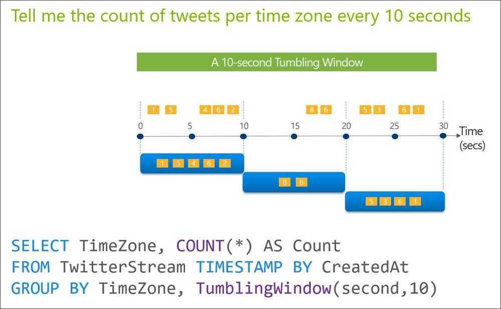
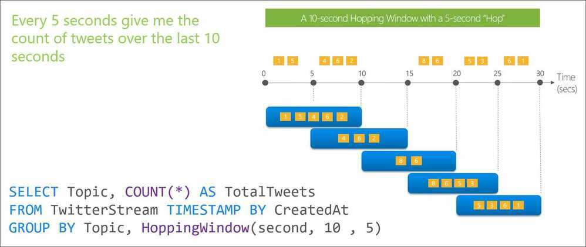

# Sliding Window Analytics

Stream processing framework that is

- Scalable to large clusters
- Achieves second-scale latencies
- Has simple programming model
- Integrates with batch & interactive workloads
- Ensures efficient fault-tolerance in stateful computations

## Types of window frames

### Cumulative

Enables computing rolling values from the beginning of the window to the current row or from the current row to the end of the window.

### Sliding

Enables computing rolling values between any two rows (inclusive) in the window, relative to the current row.

## Windows

In time-streaming scenarios, performing operations on the data contained in temporal windows is a common pattern.

There are four kinds of temporal windows to choose from

### Tumbling Windows

Tumbling window functions are used to segment a data stream into distinct time segments and perform a function against them, such as the example below. The key differentiators of a Tumbling window are that they repeat, do not overlap, and an event cannot belong to more than one tumbling window.

### Hopping Windows

Hopping window functions hop forward in time by a fixed period. It may be easy to think of them as Tumbling windows that can overlap, so events can belong to more than one Hopping window result set. To make a Hopping window the same as a Tumbling window, specify the hop size to be the same as the window size.

### Sliding Windows

Sliding window functions, unlike Tumbling or Hopping windows, produce an output **only** when an event occurs. Every window will have at least one event and the window continuously moves forward by an € (epsilon). Like hopping windows, events can belong to more than one sliding window.

### Session Windows

Session window functions group events that arrive at similar times, filtering out periods of time where there is no data. It has three main parameters: timeout, maximum duration, and partitioning key (optional).

A session window begins when the first event occurs. If another event occurs within the specified timeout from the last ingested event, then the window extends to include the new event. Otherwise if no events occur within the timeout, then the window is closed at the timeout.

If events keep occurring within the specified timeout, the session window will keep extending until maximum duration is reached. The maximum duration checking intervals are set to be the same size as the specified max duration. For example, if the max duration is 10, then the checks on if the window exceed maximum duration will happen at t = 0, 10, 20, 30, etc.

When a partition key is provided, the events are grouped together by the key and session window is applied to each group independently. This partitioning is useful for cases where you need different session windows for different users or devices.

https://docs.microsoft.com/en-us/azure/stream-analytics/stream-analytics-window-functions

### Other Window Functions

- Global window
- Interval window
- Calendar window
- Stagger window

https://dev.to/frosnerd/window-functions-in-stream-analytics-1m6c

[Introducing Native Support for Session Windows in Spark Structured Streaming - The Databricks Blog](https://www.databricks.com/blog/2021/10/12/native-support-of-session-window-in-spark-structured-streaming.html)
