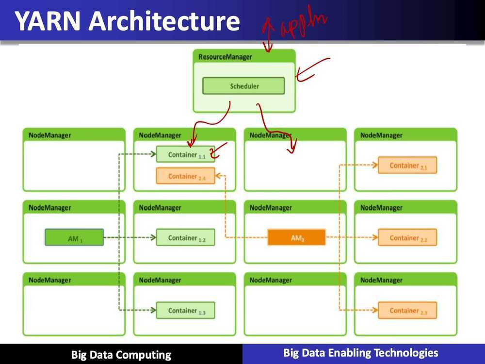

# Apache Hadoop

- MapReduce API (Processing large parallel data)
- MapReduce job management
- Distributed Filesystem (HDFS)

Java based file system which is distributed and fault-tolerant and hadoop relies on HDFS for doing all its processing

- Enormous ecosystem

## Key points

- Open source framework
- Stores data in a distributed manner
- Process data in parallel

## Layers

- HDFS, reliable storage layer
- MapReduce, batch processing engine
- YARN, resouce management layer

## Hadoop

- It has two basic parts
  - Hadoop Distributed File System (HDFS) is the storage system of Hadoop which splits big data and distribute across many nodes in a cluster
    - Scaling out of H/W resources
    - Fault Tolerant
  - MapReduce: Programming model that simplifies parallel programming
    - Map -> apply()
    - Reduce -> summarize()

Google uses MapReduce for indexing websites

Hadoop is an open-source framework to store and process Big Data in a distributed environment. It contains two modules, one is MapReduce and another is Hadoop Distributed File System (HDFS).

- MapReduce:It is a parallel programming model for processing large amounts of structured, semi-structured, and unstructured data on large clusters of commodity hardware.
- HDFS:Hadoop Distributed File System is a part of Hadoop framework, used to store and process the datasets. It provides a fault-tolerant file system to run on commodity hardware.

The Hadoop ecosystem contains different sub-projects (tools) such as Sqoop, Pig, and Hive that are used to help Hadoop modules.

- Sqoop:It is used to import and export data to and from between HDFS and RDBMS.
- Pig:It is a procedural language platform used to develop a script for MapReduce operations.
- Hive:It is a platform used to develop SQL type scripts to do MapReduce operations.

Note:There are various ways to execute MapReduce operations:

- The traditional approach using Java MapReduce program for structured, semi-structured, and unstructured data.
- The scripting approach for MapReduce to process structured and semi structured data using Pig.
- The Hive Query Language (HiveQL or HQL) for MapReduce to process structured data using Hive.

5 daemons run on Hadoop in these 3 layers. Daemons are the processes that run in the background. 5 daemons of Hadoop are as follows:

- **NameNode**

It works asMasterin Hadoop cluster. Namenode stores meta-data i.e. number of blocks, replicas and other details. Meta-data is present in memory in the master. NameNode also assigns tasks to the slave node. As it is the centerpiece of HDFS, so it should deploy on reliable hardware

- **DataNode**

It works asSlavein Hadoop cluster. In Hadoop HDFS, DataNode is responsible for storing actual data in HDFS. DataNode performs read and write operation as per request for the clients. DataNodes can also deploy on commodity hardware.

- **Secondary NameNode**

Its main function is to take checkpoints of the file system metadata present on namenode. It is not the backup namenode. It is a helper to the primary NameNode but it does not replace the primary namenode.

- **ResourceManager**

It is a cluster level component and runs on the Master machine. Hence it manages resources and schedule applications running on the top of YARN. It has two components: Scheduler & Application Manager.

- **NodeManager**

It is a node level component. NodeManager runs on each slave machine. It continuously communicate with Resource Manager to remain up-to-date

## Working

To process any data, the client first submits data and program. Hadoop store data usingHDFSand then process the data using MapReduce.

1. **Hadoop Data Storage**

    Hadoop Distributed File System-- HDFS is the primary storage system of Hadoop. It stores very large files running on a cluster of commodity hardware. HDFS stores data reliably even in the case of machine failure. It also provides high throughput access to the application by accessing in parallel.

    The data is broken into small chunks as blocks. Block is the smallest unit of data that the file system store. Hadoop application distributes data blocks across the multiple nodes. Then, each block is replicated as per the replication factor (by default 3). Once all the blocks of the data are stored on datanode, the user can process the data.

2. **Hadoop Data Processing**

    Hadoop MapReduce is the data processing layer. It is the framework for writing applications that process the vast amount of data stored in the HDFS. MapReduce processes a huge amount of data in parallel by dividing the job into a set of independent tasks (sub-job). In Hadoop, MapReduce works by breaking the processing into phases: Map and Reduce.

      - Map --It is the first phase of processing. In which we specify all the complex logic/business rules/costly code. The map takes a set of data and converts it into another set of data. It also breaks individual elements into tuples (key-value pairs).
      - Reduce --It is the second phase of processing. In which we specify light-weight processing like aggregation/summation. The output from the map is the input to Reducer. Then, reducer combines tuples (key-value) based on the key. And then, modifies the value of the key accordingly.

Map Reduce

- MapReduce is a programming model and an associated implmentation for processing and generating large data sets
- Users specify a map function that processs a key/value pair to generate a set of intermediate key/value pairs, and a reduce function that merges all intermediate values associated with the same intermediate key

## YARN - Yet Another Resource Manager

- Apache Hadoop YARN is the resource management and job scheduling technology in the open source Hadoop distributed processing framework
- YARN is responsible for allocating system resources to the various applications running in a Hadoop cluster and scheduling tasks to be executed on different cluster nodes

## References

<https://techvidvan.com/tutorials/how-hadoop-works-internally>

<https://www.toptal.com/hadoop/interview-questions>
