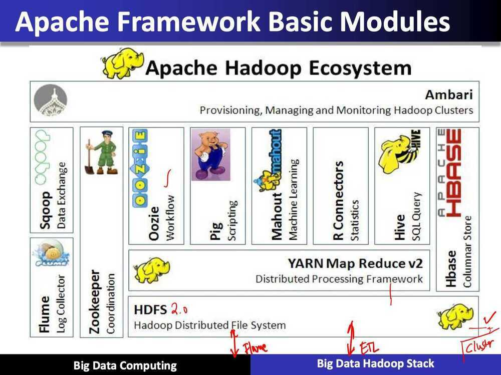
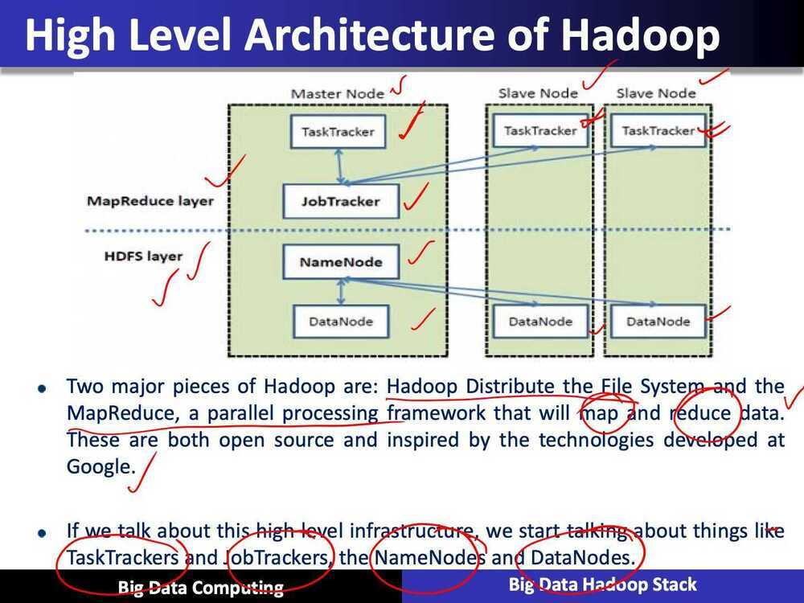
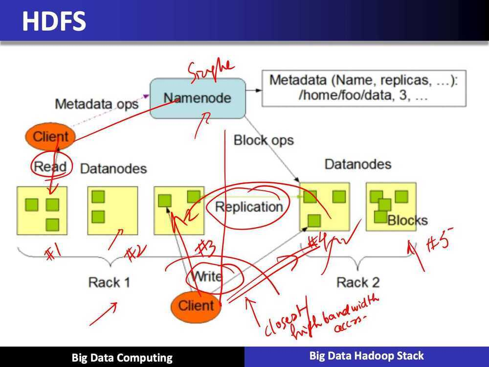
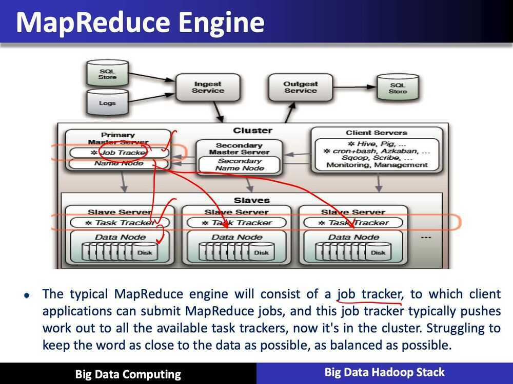
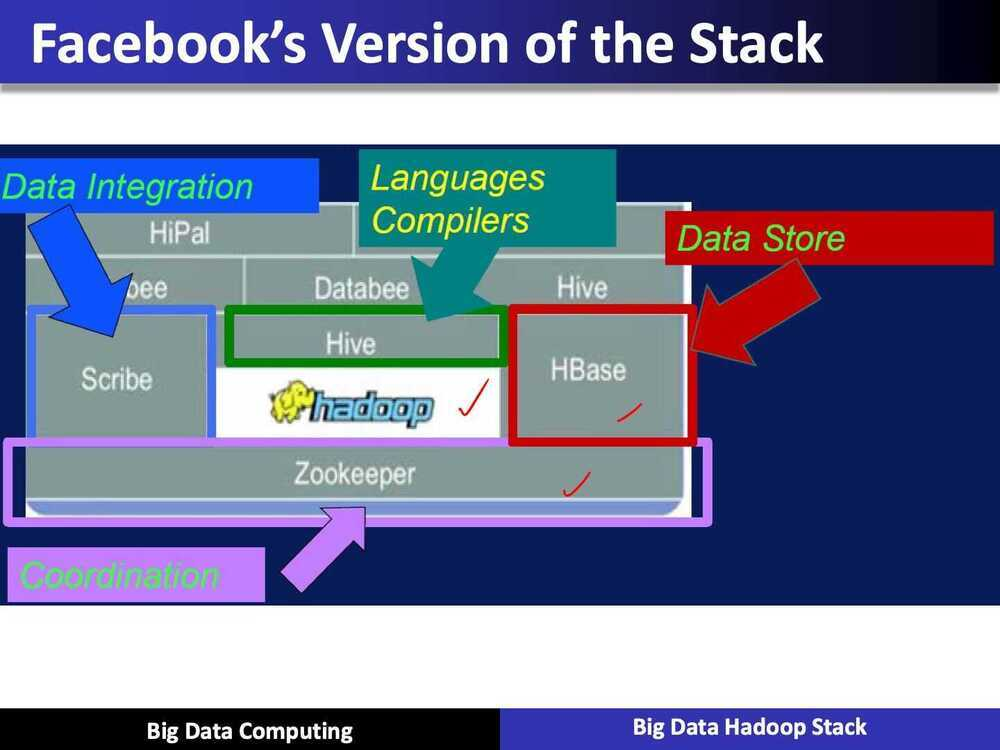

# Big Data Hadoop Stack

## Hadoop

- Apache Hadoop is an open source software framework for storage and large scale processing of th data-sets on clusters of commodity hardware

## History

- Hadoop was created by Doug Cutting and Mike Cafarella in 2005
- It was originally developed to support distribution of the Nutch Search Engine Project
- Doug, who was working at Yahoo at the time, who is now actually a chief architect at Cloudera, has named this project after his son's toy elephant, Hadoop

## Summary - Design issues in Hadoop

- Moving computation to data
- Scalability
- Reliability
- Keep all data

## Moving Computation to Data

- Hadoop started out as a simple batch processing framework
- The idea behind Hadoop is that instead of moving data to computation, we move computation to data

## Reliability

- Hardware failures handles automatically
- If we think about an individual machine or rack of machines, or a large cluster or super computer, they all fail at some point of time or some of their components will fail. These failures are so common that we have to account for them ahead of the time
- Failure is the norm

## New approach to data: keep all data

- A new approach is, we can keep all the data that we have, and we can take that data and analyze it in new interesting ways. We can do something that's called schema and read style
- And we can actually allow new analysis. We can bring more data into simple algorithms, which has shown that with more granularity, you can actually achieve often better results in taking a small amount of data and then some really complex analytics on it

## Apache Framework Basic Modules

- **Hadoop Common:** It contains libraries and utilities needed by other Hadoop modules
- **Hadoop Distributed File System (HDFS):** It is a distributed file system that stores data on a commodity machine. Providing very high aggregate bandwidth across the entire cluster
- **Hadoop YARN:** It is a resource management platform responsible for managing compute resoures in the cluster and using them in order to schedule users and applications
- **Hadoop MapReduce:** It is a programming model that scales across a lot of different processes

## Hadoop Distributed File System (HDFS)

- Distributed, scalable, and portable file-system written in Java for the Hadoop framework
- Each node in Hadoop instance typically has a single name node, and a cluster of data nodes that formed this HDFS cluster
- Each HDFS stores large files, typically in ranges of gigabytes to terabytes, and now petabytes, across multiple machines. And it can achieve reliability by replicating the cross multiple hosts, and therefore does not require any range storage on hosts

App mstr - Application master

Every application has application master

Application master knows about all the containers running

Resource manager and Node manager are client-server architecture

## Yarn

- It does have an improved cluster utilization as well. The resource manager is a pure schedule or they just optimize this cluster utilization according to the criteria such as capacities, guarantees, fairness, how to be fair, maybe different SLAs
- Scalability
- MapReduce compatibility
- Improved cluster utilization

## What is Yarn?

- It supports other work flows other than just map reduce
- Now we can bring in additional programming models, such as graph process or iterative modeling, and now it's possible to process the data in your base. This is especially useful when we talk about machine learning applications
- Yarn allows multiple access engines, either open source or proprietary, to use Hadoop as a common standard for either batch or interactive processing, and even real time engines that can simultaneous acts as a lot of different data, so you can put streaming kind of applications on top of YARN inside a Hadoop architecture, and seamlessly work and communicate between these environments.

## Hadoop Zoo

## Hadoop Ecosystem Major Components

## Apache Sqoop - SQL on Hadoop

- Tool designed for efficiently transferring bulk data between Apache Hadoop and structured datastores such as relational databases like SQL

## HBASE

- Hbase is a key component of the Hadoop stack, as its design caters to applications that require really fast random access to significant data set
- Column-oriented database management system
- Key-value store
- Based on Google Big Table
- Can hold extremely large data
- Dynamic data model
- Not a Relational DBMS

## PIG

- High level programming on top of Hadoop MapReduce
- The language: Pig Latin
- Data analysis problems as data flows
- Originally developed at Yahoo 2006

## PIG for ETL

- A good example of PIG applications is ETL transaction model that describes how a process will extract data from a source, transporting according to the rules set that we specify, and then load it into a data store
- PIG can ingest data from files, streams, or any other sources using the UDF: a user-defined functions that we can write ourselves
- When it has all the data it can perform, select, iterate and do kinds of transformations

## Apache Hive

- Data warehouse software facilitates querying and managing large datasets residing in distributed storage
- SQL-like language
- Facilitates qurying and managing large datasets in HDFS
- Mechanism to project structure onto this data and query the data using a SQL-like language called HiveQL

## Oozie

- Workflow scheduler system to manage Apache Hadoop jobs
- Oozie Coordinator jobs
- Supports MapReduce, Pig, Apache Hive, and Sqoop, etc.

## Zookeeper

- Provides operational services for a Hadoop cluster group services
- Centralized service for: maintaining configuration information naming services
- Providing distributed synchonization and providing group services

## Flume

- Distributed, reliable, and available service for efficiently collecting, aggregating, and moving large amount of log data
- It has a simple and very flexible architecture based on streaming data flows. It's quite robust and fault tolerant, and it's really tunable to enhance the reliability mechanisms, fail over, recovery, and all the other mechanisms that keep the cluster safe and reliable
- It uses simple extensible data model that allows us to apply all kinds of online analytic applications

## Impala

- Cloudera, Impala was designed specifically at Cloudera, and it's a query engine that runs on top of the Apache Hadoop. The project was officially announced at the end of 2012, and became a publicly available, open source distribution
- Impala brings scalable parallel database technology to Hadoop and allows users to submit low latencies queries to the data that's stored within the HDFS or the Hbase without acquiring a ton of data movement and manipulation
- Impala is integrated with Hadoop, and it works within the same power system, within the same format metadata, all the security and reliability resources and management workflows
- It brings that scalable parallel database technology on top of the Hadoop. It actually allows us to submit SQL like queries at much faster speeds with a lot less latency

## Spark

- Apache Spark is a fast and general engine for large-scale data processing
- Spark is a scalable data analytics platform that incorporates primitives for in-memory computing and therefore, is allowing to exercise some different performance advantages over traditional Hadoop's cluster storage system approach. And it's implemented and supports something called Scala language, and provides unique environment for data processing
- Spark is really great for more complex kinds of analytics, and it's great at supporting machine learning libraries
- It is yet again another open source computing framework and it was originally developed at MP labs at the University of California Berkeley and it was later denoted to the Apache software foundation where it remains today as well

## Spark Benefits

- In contrast to Hadoop's two stage disk based MapReduce paradigm Multi-stage in-memory primitives provides performance up to 100 times faster for certain applications
- Allows user programs to load data into a cluster's memory and query it repeatedly
- Spark is really well suited for these machined learning kinds of applications that often times have iterative sorting in memory kinds of computation
- Spark requires a cluster management and a distibuted storage system. So for the cluster management, Spark supports, or you can actually run Spark on top of a Hadoop yarn, or via patching mesas
- For distributor storage, Spark can interface with any of the variety of storage systems, including the HDFS, Amazon S3
