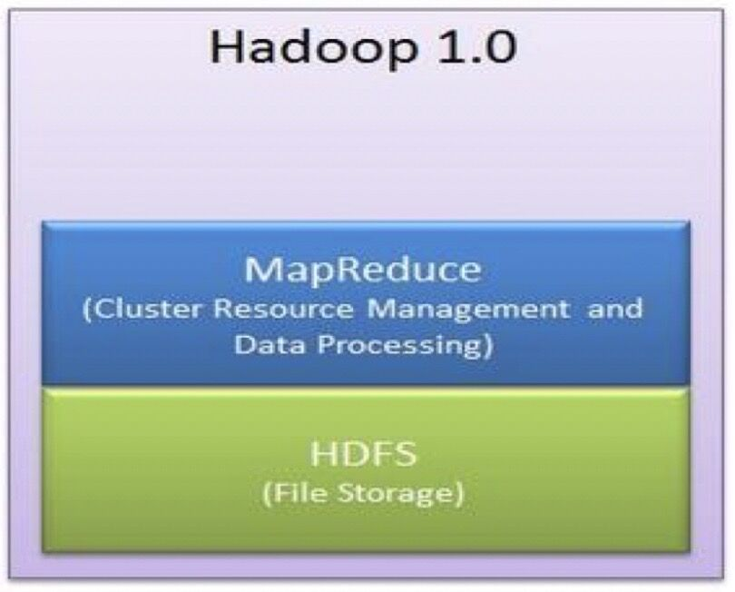
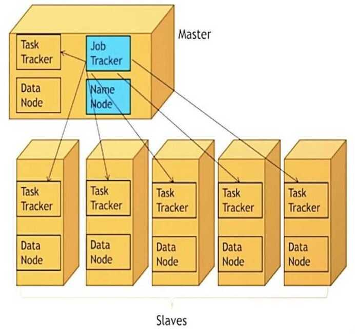
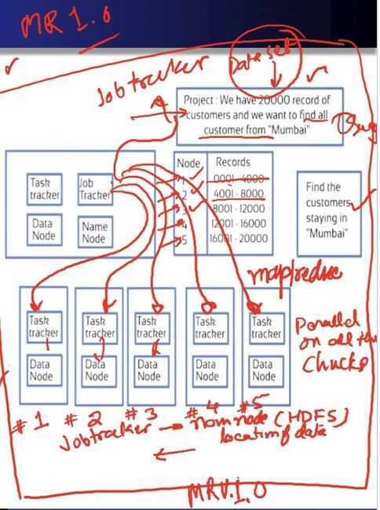

# Hadoop MapReduce 1.0

## What is Map Reduce

- MapReduce is the execution engine of Hadoop

## Map Reduce Componenets

- The Job Tracker
- Task Tracker

## The Job Tracker

- The Job Tracker is hosted inside the master and it receives the job execution request from the client.
- It's main duties are to break down the receive job that is big computations in small parts allocate the partial computations that is tasks to the slave nodes monitoring the progress and report of task execution from the slave.
- The unit of execution is job

## The Task Tracker

- Task tracker is the MapReduce component on the slave machine as there are multiple slave machines
- Many task trackers are available in a cluster its duty is to perform computation given by job tracker on the data available on the slave machine
- The task tracker will communicate the progress and report the results to the job tracker
- The master node contains the job tracker and name node whereas all slaves contain the task tracker and data node

## Execution Steps

Step 1 - The client submits the job to Job Tracker

Step 2 - Job Tracker asks Name node the location of data

Step 3 - As per the reply from name node, the Job Tracker ask respective task trackers to execute the task on their data

Step 4 - All the results are stored on some Data Node and the Name Node is informed about the same

Step 5 - The task trackers inform the job completion and progress to Job Tracker

Step 6 - The Job Tracker inform the completion to client

Step 7 - Client contacts the Name Node and retrieve the results

