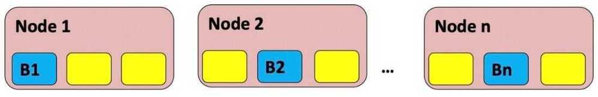
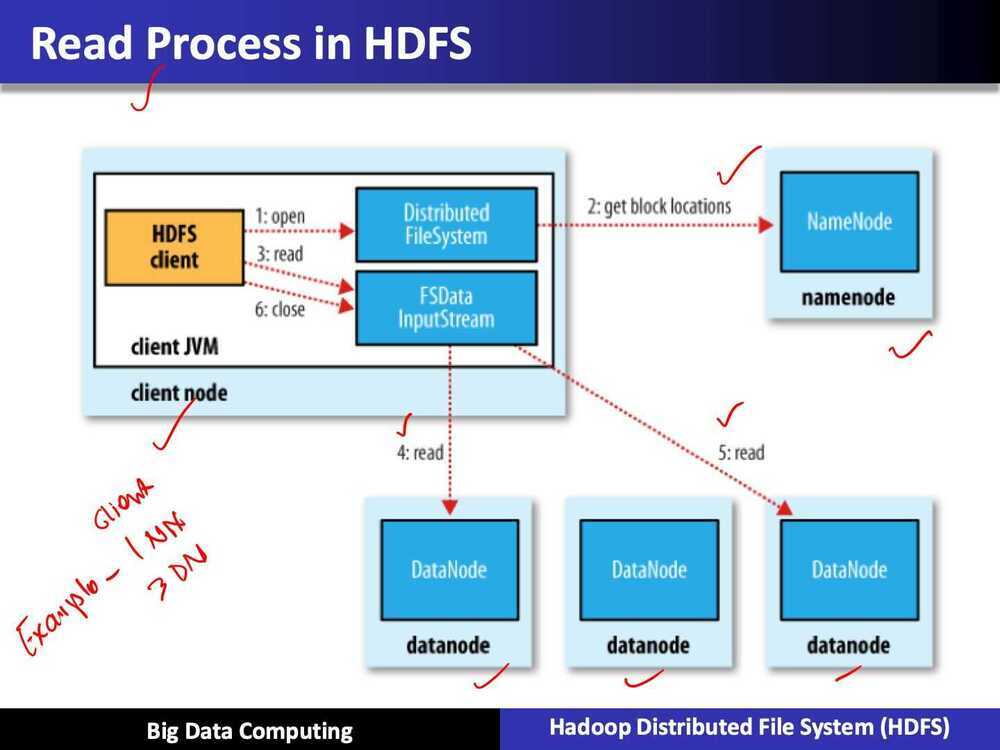
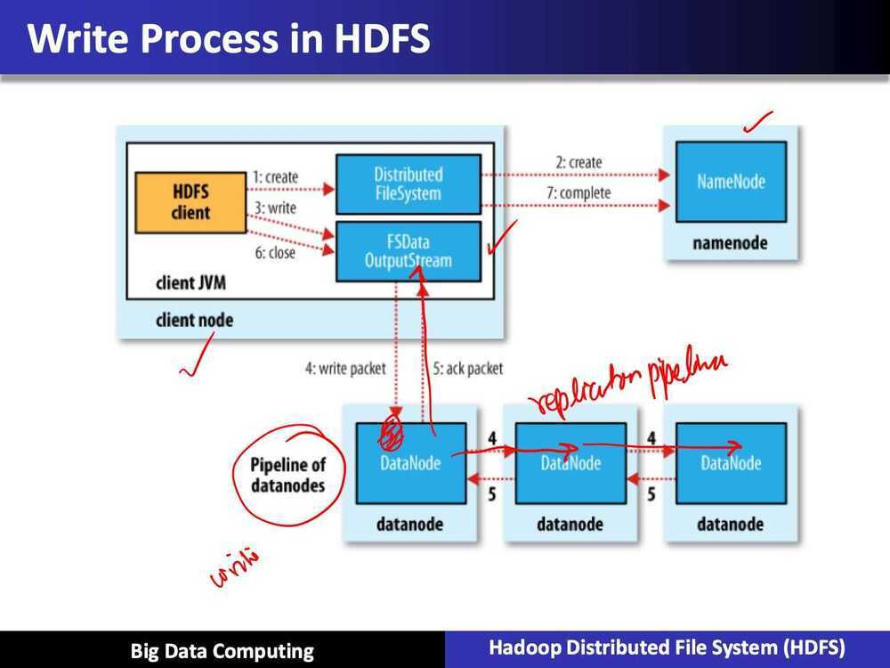

# HDFS

The Hadoop Distributed File System (HDFS) is designed to store very large data sets reliably, and to stream those data sets at high bandwidth to user applications. In a large cluster, thousands of servers both host directly attached storage and execute user application tasks. By distributing storage and computation across many servers, the resource can grow with demand while remaining economical at every size.

64 MB Chunk Size

Block Size - 128 MB

## Contents

- design goals of HDFS
- read/write process to HDFS
- main configuration tuning parameters to control HDFS performance and robustness

## Introduction

- Hadoop provides a distributed file system and a framework for the analysis and transformation of very large data sets using the MapReduce paradigm
- An important characteristic of Hadoop is the partitioning of data and computation across many (thousands) of hosts, and executing computations in parallel close to their data
- A Hadoop cluster scales computation capacity, storage capacity and IO bandwidth by simply adding commodity servers.
- Yahoo has developed and contributed to 80% of the core of Hadoop (HDFS and MapReduce)
- HBase was originally developed at Powerset, now a department at Microsoft
- Hive was originated and developed at Facebook
- Pig, Zookeeper, and Chukwa were originated and developed at Yahoo
- Avro was originated at Yahoo and is being co-developed with Cloudera

## Hadoop Project Components

| HDFS      | Distributed file system                            |
|-----------|----------------------------------------------------|
| MapReduce | Distributed computation framework                  |
| HBase     | Column-oriented table service                      |
| Pig       | Dataflow language and parallel execution framework |
| Hive      | Data warehouse infrastructure                      |
| Zookeeper | Distributed coordination service                   |
| Chukwa    | System for collecting management data              |
| Avro      | Data serialization system                          |

## HDFS Design Concepts

- Scalable distributed filesystem: So essentially, as you add disks you get scalable performance. And as you add more, you're adding a lot of disks, and that scales out the performance.
- Distributed data on local disks on serveral nodes.
- Low cost commodity hardware: A lot of performance out of it because you're aggregating performance.

## HDFS Design Goals

- Hundreds/thousands of nodes and disks:
  - It means there's a higher probability of hardware failure. So the design needs to handle node/disk failures
- Portability across heterogeneous hardware/software:
  - Implementation across lots of different kinds of hardware and software
- Handle large data sets:
  - Need to handle terabytes to petabytes
- Enable processing with high throughput

## Techniques to meet HDFS design goals

- Simplified coherency model
  - The idea is to write once and then read many times. And that simplifies the number of operations required to commit the write
- Data replication
  - Helps to handle hardware failures
  - Try to spread the data, same piece of data on different nodes
- Move computation close to the data
  - So you're not moving data around. That improves your performance and throughput
- Relax POSIX requirements to increase the throughput

## Basic architecture of HDFS

## HDFS Architecture: Key components

- Single NameNode: A master server that manages the file system namespace and basically regulates access to these files from clients, and it also keeps track of where the data is on the DataNodes and where the blocks are distributed essentially.
- Multiple DataNodes: Typically one per node in a cluster. So you're basically using storage which is local
- Basic Functions:
  - Manage the storage on the DataNode
  - Read and write requests on the clients
  - Block creation, deletion, replication is all based on instructions from the NameNode

## Original HDFS Design

- Single NameNode
- Multiple DataNodes
  - Manage storage-blocks of data
  - Service read/write requests from clients
  - Block creation, deletion, replication

## HDFS in Hadoop 2.0

- **HDFS Federation:** Multiple name nodes.

So that we can increase the name space data. In Hadoop 1.0, we had a single node handling all the namespace responsibilities. And when we have thousands of nodes that then it will not scale, and if we have billions of files, it will have scalability issues.

Basically what we are doing is trying to have multiple data nodes, and multiple name nodes. So that we can increase the name space data. So, if you recall from the first design you have essentially a single node handling all the namespace responsibilities. And you can imagine as you start having thousands of nodes that they'll not scale, and if you have billions of files, you will have scalability issues. So to address that, the federation aspect was brought in. That also brings performance improvements.

- **Benefits**
  - Increase namespace scalability
  - Performance
  - Isolation

- Multiple namenode servers
- Multiple namespaces
- Data is now stored in Block pools
- So there is a pool associated with each namenode or namespace
- And these pools are essentially spread out over all the data nodes
- High Availability (Redundant namenodes)
- Heterogeneous storage and archival storage
  - ARCHIVE, DISK, SSD, RAM_DISK

## HDFS Performance Measures

- Determine the number of blocks for a given file size
- Key HDFS and system components that are affected by the block size (64 MB to 128 MB)
- An impact of using a lot of small files on HDFS and system

## Recall: HDFS Architecture

- Distributed data on local disks on several nodes

## HDFS Block Size

- Default block size is 64 megabytes
- Good for large files
- So a 10GB file will be broken into: 10 x 1024/64 = 160 blocks

## Importance of no. of blocks in a file

- **NameNode memory usage:** Every block that you create basically every file could be a lot of blocks as we saw in the previous case, 160 blocks. And if you have millions of files that's millions of objects essentially. And for each object, it uses a bit of memory on the NameNode, so that is a direct effect of the number of blocks. But if you have replication, then you have 3 times the number of blocks
- **Number of map tasks:** Number of maps typically depends on the number of blocks being processed.

## Large No. of small files: Impact on Name node

- **Memory usage:** Typically, the usage is around 150 bytes per object. Now, if you have a billion objects, that's going to be like 300GB of memory.
- **Network load:** Number of checks with datanodes proportional to number of blocks
- **Number of map tasks:** Suppose we have 10GB of data to process and you have them all in lots of 32k file sizes? Then we will end up with 327680 map tasks
- Huge list of tasks that are queued
- The other impact of this is the map tasks, each time they spin up and spin down, there's a latency involved with that because you are starting up Java processes and stopping them
- Inefficient disk I/O with small sizes

## HDFS optimized for large files

- Lots of small files is bad
- **Solution:**
  - Merge/Concatenate files
  - Sequence files
  - HBase, HIVE configuration
  - CombineFileInputFormat

## Read / Write Processes in HDFS

## HDFS Tuning Parameters

### Overview

- Tuning parameters
- Specifically DFS block size
- NameNode, DataNode system/dfs parameters

### HDFS XML configuration files

- Tuning environment typically in HDFS XML configuration files, for example, in the hdfs-site.xml
- This is more for system administrators of Hadoop clusters, but it's good to know what changes affect impact the peformance, and especially if your trying things out on your own there some important parameters to keep in mind
- Commercial vendors have GUI based management console

### HDFS Block Size

- Recall: impacts how much NameNode memory is used, number of map tasks that are showing up, and also have impacts on performance
- Default 64 megabytes: Typically bumped up to 128 megabytes and can be change based on workloads
- The parameter that this changes dfs.blocksize or dfs.block.size

### HDFS Replication

- Default replication is 3
- Parameter: dfs.replication
- **Tradeoffs:**
  - Lower it to reduce replication cost
  - Less robust
  - Higher replication can make data local to more workers
  - Lower replication -> More space

### Lot of other parameters

- Various tunables for datanode, namenode
- **Examples**
  - Dfs.datanode.handler.count (10): Sets the number of server threds on each datanode
  - Dfs.namenode.fs-limits.max-blocks-per-file: Maximum number of blocks per file
- **Full List:**
  - <http://hadoop.apache.org/docs/current/hadoop-project-dist/hadoop-hdfs/hdfs-default.xml>

## HDFS Performance and Robustness

### Common Failures

- **DataNode Failures:** Server can fail, disk can crash, data corruption.
- **Network Failures:** Sometimes there's data corruption because of network issues or disk issue. So, all of that could lead to a failure in the DataNode aspect of HDFS. You could have network failures. So, you could have a network go down between a particular and the name node that can affect a lot of data nodes at the same time.
- **NameNode Failures:** Could have name node failures, disk failure on the name node itself or the name node itself could corrupt this process

### HDFS Robustness

- NameNode receives heartbeat and block reports from DataNodes

### Mitigation of common failures

- Periodic heartbeat: from DataNode to NameNode
- DataNodes without recent heartbeat:
  - Mart the data. And any new I/O that comes up is not going to be sent to that data node. Also remember that NameNode has information on all the replication information for the files on the file system. So, if it knows that a datanode fails which blocks will follow that replication factor
  - Now this replication factor is set for the entire system and also you could set it for particular file when you're writing the file. Either way, the NameNode knows which blocks fall below replication factor. And it will restart the process to re-replicate

### Mitigation of common failures

- Checksum computed on file creation
- Checksums stored in HDFS namespace
- Used to check retrieved data
- Re-read from alternate replica
- Multiple copies of central meta data structures
- Failover to standby NameNode - manual by default

## Performance

- Changing blocksize and replication factor can improve performance
- **Example: Distributed copy**
- Hadoop distcp allows parallel transfer of files

## Replication trade off with respect to robustness

- One performance tradeoff is, actually when you go out to do some of the map reduce jobs, having replicas gives additional locality possibilities, but the big trade off is the robustness. In this case, we said no replicas. Might lose a node or a local disk: can't recover because there is no replication
- Similarly, with data corruption, if you get a checksum that's bad, now you can't recover because you don't have a replica
- Other parameters changes can have similar effects

## References

<https://www.aosabook.org/en/hdfs.html>

<https://www.tutorialspoint.com/hadoop/hadoop_hdfs_overview.htm>

<https://hadoop.apache.org/docs/r1.2.1/hdfs_design.html>
