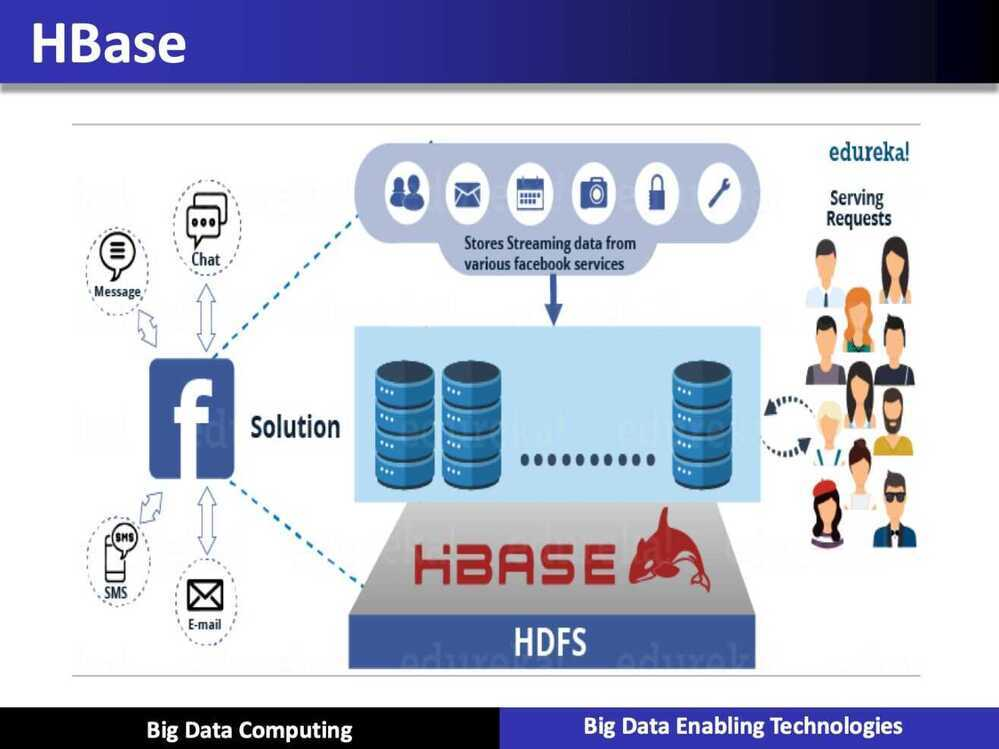

# Apache HBase

HBaseis an [open-source](https://en.wikipedia.org/wiki/Open-source), [non-relational](https://en.wikipedia.org/wiki/Non-relational_database), [distributed database](https://en.wikipedia.org/wiki/Distributed_database) modeled after [Google's](https://en.wikipedia.org/wiki/Google)[Bigtable](https://en.wikipedia.org/wiki/Bigtable) and written in [Java](https://en.wikipedia.org/wiki/Java_(programming_language)). It is developed as part of [Apache Software Foundation](https://en.wikipedia.org/wiki/Apache_Software_Foundation)'s [Apache Hadoop](https://en.wikipedia.org/wiki/Hadoop) project and runs on top of [HDFS (Hadoop Distributed File System)](https://en.wikipedia.org/wiki/Hadoop_Distributed_File_System), providing Bigtable-like capabilities for Hadoop. That is, it provides a [fault-tolerant](https://en.wikipedia.org/wiki/Fault-tolerant) way of storing large quantities of [sparse](https://en.wikipedia.org/wiki/Sparse_file) data (small amounts of information caught within a large collection of empty or unimportant data, such as finding the 50 largest items in a group of 2 billion records, or finding the non-zero items representing less than 0.1% of a huge collection).

HBase features compression, in-memory operation, and [Bloom filters](https://en.wikipedia.org/wiki/Bloom_filter) on a per-column basis as outlined in the original Bigtable paper.Tables in HBase can serve as the input and output for [MapReduce](https://en.wikipedia.org/wiki/Mapreduce) jobs run in Hadoop, and may be accessed through the Java API but also through [REST](https://en.wikipedia.org/wiki/REST), [Avro](https://en.wikipedia.org/wiki/Avro_(serialization_system)) or [Thrift](https://en.wikipedia.org/wiki/Thrift_(protocol)) gateway APIs. HBase is a column-oriented key-value data store and has been idolized widely because of its lineage with Hadoop and HDFS. HBase runs on top of HDFS and is well-suited for faster read and write operations on large datasets with high throughput and low input/output latency.

HBase is not a direct replacement for a classic [SQL](https://en.wikipedia.org/wiki/SQL)[database](https://en.wikipedia.org/wiki/Database), however [Apache Phoenix](https://en.wikipedia.org/wiki/Apache_Phoenix) project provides a SQL layer for HBase as well as [JDBC](https://en.wikipedia.org/wiki/JDBC) driver that can be integrated with various [analytics](https://en.wikipedia.org/wiki/Analytics) and [business intelligence](https://en.wikipedia.org/wiki/Business_intelligence) applications. The [Apache Trafodion](https://en.wikipedia.org/wiki/Apache_Trafodion) project provides a SQL query engine with [ODBC](https://en.wikipedia.org/wiki/ODBC) and [JDBC](https://en.wikipedia.org/wiki/JDBC) drivers and [distributed ACID transaction protection](https://en.wikipedia.org/wiki/ACID#Distributed_transactions) across multiple statements, tables and rows that uses HBase as a storage engine.

Unlike relational and traditional databases, HBase does not support SQL scripting; instead the equivalent is written in Java, employing similarity with a MapReduce application.

In the parlance of Eric Brewer's [CAP Theorem](https://en.wikipedia.org/wiki/CAP_Theorem), HBase is a CP type system.

Use Apache HBase™ when you need random, realtime read/write access to your Big Data. This project's goal is the hosting of very large tables -- billions of rows X millions of columns -- atop clusters of commodity hardware. Apache HBase is an open-source, distributed, versioned, non-relational database modeled after Google's [Bigtable: A Distributed Storage System for Structured Data](http://research.google.com/archive/bigtable.html) by Chang et al. Just as Bigtable leverages the distributed data storage provided by the Google File System, Apache HBase provides Bigtable-like capabilities on top of Hadoop and HDFS.

Features

- Linear and modular scalability.
- Strictly consistent reads and writes.
- Automatic and configurable sharding of tables
- Automatic failover support between RegionServers.
- Convenient base classes for backing Hadoop MapReduce jobs with Apache HBase tables.
- Easy to use Java API for client access.
- Block cache and Bloom Filters for real-time queries.
- Query predicate push down via server side Filters
- Thrift gateway and a REST-ful Web service that supports XML, Protobuf, and binary data encoding options
- Extensible jruby-based (JIRB) shell
- Support for exporting metrics via the Hadoop metrics subsystem to files or Ganglia; or via JMX

## References

<https://en.wikipedia.org/wiki/Apache_HBase>

<https://hbase.apache.org>
