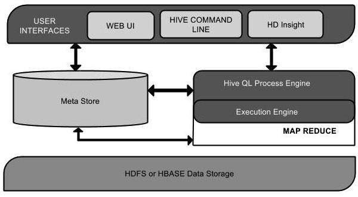
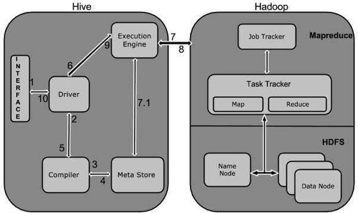

# Apache Hive

- Hive is a distributed data management for Hadoop
- It supports SQL-like query option HiveSQL (HSQL) to access big data
- It can be primarily used for Data mining purpose
- It runs on top of Hadoop

## Hive is not

- A relational database
- A design for OnLine Transaction Processing (OLTP)
- A language for real-time queries and row-level updates

## Features of Hive

- It stores schema in a database and processed data into HDFS.
- It is designed for OLAP.
- It provides SQL type language for querying called HiveQL or HQL.
- It is familiar, fast, scalable, and extensible.

Apache Hive is a [data warehouse](https://en.wikipedia.org/wiki/Data_warehouse) software project built on top of [Apache Hadoop](https://en.wikipedia.org/wiki/Apache_Hadoop) for providing data query and analysis.Hive gives an [SQL](https://en.wikipedia.org/wiki/SQL)-like interface to query data stored in various databases and file systems that integrate with Hadoop. Traditional SQL queries must be implemented in the [MapReduce](https://en.wikipedia.org/wiki/MapReduce) Java API to execute SQL applications and queries over distributed data. Hive provides the necessary SQL abstraction to integrate SQL-like queries ([HiveQL](https://en.wikipedia.org/wiki/Apache_Hive#HiveQL)) into the underlying Java without the need to implement queries in the low-level Java API. Since most data warehousing applications work with SQL-based querying languages, Hive aids portability of SQL-based applications to Hadoop

## Partitioning of table

Hive stores tables in partitions. Partitions are used to divide the table into related parts. Partitions make data querying more efficient. For example in the above weather table the data can be partitioned on the basis of year and month and when query is fired on weather table this partition can be used as one of the column.

```sql
CREATE EXTERNAL TABLE IF NOT EXSISTS weatherext ( wban INT, date STRING)
PARTITIONED BY (year INT, month STRING)
ROW FORMAT DELIMITED
FIELDS TERMINATED BY ','
LOCATION ' /hive/data/weatherext';
```

Loading data in partitioned tables is different than non-partitioned one. There is little manual work of mentioning the partition data. Data can be loaded in partition, year 2012 and month 01 and 02 as follows:

```sql
LOAD DATA INPATH 'hdfs:/data/2012.txt' INTO TABLE weatherext PARTITION (year=2012, month='01');
LOAD DATA INPATH 'hdfs:/data/2012.txt' INTO TABLE weatherext PARTITION (year=2012, month='02');
```

This creates the partitioned table and makes different folder for each partition which helps in querying data.

https://www.dezyre.com/hadoop-tutorial/apache-hive-tutorial-tables

Hive organizes tables into partitions. It is a way of dividing a table into related parts based on the values of partitioned columns such as date, city, and department. Using partition, it is easy to query a portion of the data.

Tables or partitions are sub-divided into buckets, to provide extra structure to the data that may be used for more efficient querying. Bucketing works based on the value of hash function of some column of a table.

https://www.tutorialspoint.com/hive/hive_partitioning.htm

## Built-in Operators

https://www.tutorialspoint.com/hive/hive_built_in_operators.htm

## Built-in Functions

https://www.tutorialspoint.com/hive/hive_built_in_functions.htm

## Hive LLAP

Hive LLAP stands for Long Live and Process that is part of HortonWorks distribution. It is being said that it was launched to compete with impala of cloudera.

It consists of daemons that runs hive queries so worker tasks are being run inside daemons only.

And all small queries run by these daemons rather than YARN container. It helps in pre fetching and caching of columns before query runs.

https://cwiki.apache.org/confluence/display/Hive/LLAP

## Architecture



| **Unit Name** | **Operation** |
|---|---|
| User Interface | Hive is a data warehouse infrastructure software that can create interaction between user and HDFS. The user interfaces that Hive supports are Hive Web UI, Hive command line, and Hive HD Insight (In Windows server). |
| Meta Store | Hive chooses respective database servers to store the schema or Metadata of tables, databases, columns in a table, their data types, and HDFS mapping. |
| HiveQL Process Engine | HiveQL is similar to SQL for querying on schema info on the Metastore. It is one of the replacements of traditional approach for MapReduce program. Instead of writing MapReduce program in Java, we can write a query for MapReduce job and process it. |
| Execution Engine | The conjunction part of HiveQL process Engine and MapReduce is Hive Execution Engine. Execution engine processes the query and generates results as same as MapReduce results. It uses the flavor of MapReduce. |
| HDFS or HBASE | Hadoop distributed file system or HBASE are the data storage techniques to store data into file system. |

## Working of Hive

The following diagram depicts the workflow between Hive and Hadoop.



The following table defines how Hive interacts with Hadoop framework:

| **Step No.** | **Operation** | **Description** |
|---|---|---|
| 1 | Execute Query | The Hive interface such as Command Line or Web UI sends query to Driver (any database driver such as JDBC, ODBC, etc.) to execute. |
| 2 | Get Plan | The driver takes the help of query compiler that parses the query to check the syntax and query plan or the requirement of query. |
| 3 | Get Metadata | The compiler sends metadata request to Metastore (any database). |
| 4 | Send Metadata | Metastore sends metadata as a response to the compiler. |
| 5 | Send Plan | The compiler checks the requirement and resends the plan to the driver. Up to here, the parsing and compiling of a query is complete. |
| 6 | Execute Plan | The driver sends the execute plan to the execution engine. |
| 7 | Execute Job | Internally, the process of execution job is a MapReduce job. The execution engine sends the job to JobTracker, which is in Name node and it assigns this job to TaskTracker, which is in Data node. Here, the query executes MapReduce job. |
| 7.1 | Metadata Ops | Meanwhile in execution, the execution engine can execute metadata operations with Metastore. |
| 8 | Fetch Result | The execution engine receives the results from Data nodes. |
| 9 | Send Results | The execution engine sends those resultant values to the driver. |
| 10 | Send Results | The driver sends the results to Hive Interfaces. |

## Others - Presto

https://blog.treasuredata.com/blog/2015/03/20/presto-versus-hive

## References

https://en.wikipedia.org/wiki/Apache_Hive

https://www.tutorialspoint.com/hive/hive_introduction.htm

[Difference between COLLECT_SET and COLLECT_LIST in Hive](https://analyticshut.com/hive-collect-set-vs-collect-list/)
