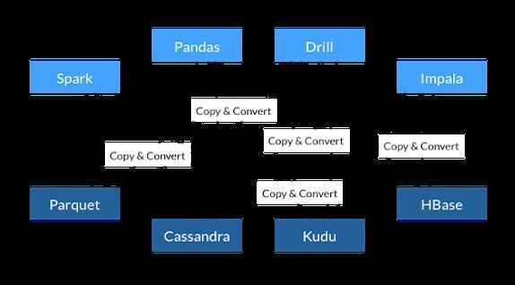
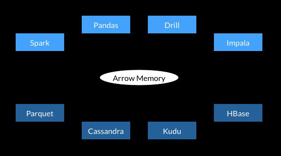
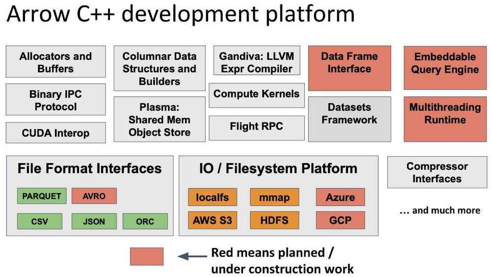

# Apache Projects

- [HTTP Server](http://httpd.apache.org/)

## A

- [Accumulo](http://accumulo.apache.org/)
- [ActiveMQ](http://activemq.apache.org/)
- [Airavata](http://airavata.apache.org/)
- Airflow
- [Allura](http://allura.apache.org/)
- [Ambari](http://ambari.apache.org/) - Hadoop cluster provisioning, management, and monitoring
- [Ant](http://ant.apache.org/)
- [Any23](http://any23.apache.org/)
- [Apex](http://apex.apache.org/) - Stream and batch processing on YARN
- [APR](http://apr.apache.org/)
- [Archiva](http://archiva.apache.org/)
- [Aries](http://aries.apache.org/)
- [AsterixDB](http://asterixdb.apache.org/)
- [Atlas](http://atlas.apache.org/)
- [Aurora](http://aurora.apache.org/)
- [Avro](http://avro.apache.org/) - Data serialization system (data structure, binary format, container, RPC)
- [Axis](http://axis.apache.org/)

### [Arrow](http://arrow.apache.org/)

Apache Arrow is a cross-language development platform for in-memory data. It specifies a standardized language-independent columnar memory format for flat and hierarchical data, organized for efficient analytic operations on modern hardware. It also provides computational libraries and zero-copy streaming messaging and interprocess communication. Languages currently supported include C, C++, C#, Go, Java, JavaScript, MATLAB, Python, R, Ruby, and Rust.

- All systems utilize the same memory format
- No overhead for cross-system communication
- Projects can share functionality (eg, Parquet-to-Arrow reader)

#### Apache Arrow Flight

Arrow Flight provides a high-performance wire protocol for large-volume data transfer for analytics, designed for the needs of the modern data world including cross-platform language support, infinite parallelism, high efficiency, robust security, multi-region distribution, and efficient network utilization

- A gRPC-based framework for defining custom data services that send and receive Arrow columnar data natively
- Uses Protocol Buffers v3 for client protocol
- Pluggable command execution layer, authentication
- Low-level gRPC optimizations to avoid unnecessay serialization

https://www.dremio.com/understanding-apache-arrow-flight

https://www.dremio.com/apache-arrow-explained

## B

- [Bahir](http://bahir.apache.org/)
- [Beam](http://beam.apache.org/) - Programming model for batch and streaming data processing
- [Bigtop](http://bigtop.apache.org/)
- [Bloodhound](http://bloodhound.apache.org/)
- [BookKeeper](http://bookkeeper.apache.org/) - A scalable, fault-tolerant, and low-latency storage service optimized for real-time workloads - https://streaml.io/blog/why-apache-bookkeeper
- [Brooklyn](http://brooklyn.apache.org/)
- [Buildr](http://buildr.apache.org/)
- [BVal](http://bval.apache.org/)

## C

- [Calcite](http://calcite.apache.org/)
- [Camel](http://camel.apache.org/)
- [Carbondata](http://carbondata.apache.org/)
- [Cassandra](http://cassandra.apache.org/)
- [Cayenne](http://cayenne.apache.org/)
- [Celix](http://celix.apache.org/)
- [Chemistry](http://chemistry.apache.org/)
- [Clerezza](http://clerezza.apache.org/)
- [CloudStack](http://cloudstack.apache.org/)
- [Cocoon](http://cocoon.apache.org/)
- [Commons](http://commons.apache.org/)
- [Cordova](http://cordova.apache.org/)
- [Creadur](http://creadur.apache.org/)
- [Crunch](http://crunch.apache.org/) - Java library for writing, testing, running MapReduce pipelines
- [cTAKES](http://ctakes.apache.org/)
- [Curator](http://curator.apache.org/)
- [CXF](http://cxf.apache.org/)

### [Chukwa](http://chukwa.apache.org/)

Apache Chukwa is an open source data collection system for monitoring large distributed systems. Apache Chukwa is built on top of the Hadoop Distributed File System (HDFS) and Map/Reduce framework and inherits Hadoop's scalability and robustness. Apache Chukwa also includes a flexible and powerful toolkit for displaying, monitoring and analyzing results to make the best use of the collected data.

https://chukwa.apache.org

### [CouchDB](http://couchdb.apache.org/)

Seamless multi-master sync, that scales from Big Data to Mobile, with an IntuitiveHTTP/JSON API and designed forReliability.

Apache CouchDB™ lets you access your data where you need it. The [Couch Replication Protocol](http://docs.couchdb.org/en/stable/replication/protocol.html) is implemented in a variety of projects and products that span every imaginable computing environment from globally distributed server-clusters, over mobile phones to web browsers.

Store your data safely, on your own servers, or with any leading cloud provider. Your web- and native applications love CouchDB, because it speaksJSON natively and supports binary data for all your data storage needs.

[The Couch Replication Protocol](http://docs.couchdb.org/en/stable/replication/protocol.html) lets your data flow seamlessly between server clusters to mobile phones and web browsers, enabling a compelling [offline-first](http://offlinefirst.org/) user-experience while maintaining high performance and strong reliability. CouchDB comes with a developer-friendly query language, and optionally MapReduce for simple, efficient, and comprehensive data retrieval.

https://docs.couchdb.org/en/stable/intro/index.html

## D

- [DataFu](http://datafu.apache.org/)
- [DB](http://db.apache.org/)
- [DeltaSpike](http://deltaspike.apache.org/)
- [Directory](http://directory.apache.org/)
- [DRAT](http://drat.apache.org/)
- Druid

### [Drill](http://drill.apache.org/)

Distributed queries on multiple data stores and formats

Schema-free SQL Query Engine for Hadoop, NoSQL and Cloud Storage

- Columnar execution engine (the first ever to support complex data!)
- Data-driven compilation and recompilation at execution time
- Specialized memory management that reduces memory footprint and eliminates garbage collections
- Locality-aware execution that reduces network traffic when Drill is co-located with the datastore
- Advanced cost-based optimizer that pushes processing into the datastore when possible

## E

- [Eagle](http://eagle.apache.org/)
- [Empire-db](http://empire-db.apache.org/)

## F

- [Falcon](http://falcon.apache.org/) - Data governance engine for Hadoop clusters
- [Felix](http://felix.apache.org/)
- [Fineract](http://fineract.apache.org/)
- [Flex](http://flex.apache.org/)
- [Flink](http://flink.apache.org/)
- [Flume](http://flume.apache.org/) - Streaming data ingestion for Hadoop
- [Fluo](http://fluo.apache.org/)
- [Forrest](http://forrest.apache.org/)

### [FreeMarker](http://freemarker.apache.org/)

FreeMarker is a [free](https://en.wikipedia.org/wiki/Free_software)[Java](https://en.wikipedia.org/wiki/Java_(programming_language))-based [template engine](https://en.wikipedia.org/wiki/Template_engine_(web)), originally focusing on dynamic web page generation with [MVC](https://en.wikipedia.org/wiki/Model-view-controller)[software architecture](https://en.wikipedia.org/wiki/Software_architecture). However, it is a general purpose template engine, with no dependency on [servlets](https://en.wikipedia.org/wiki/Servlet) or [HTTP](https://en.wikipedia.org/wiki/HTTP) or [HTML](https://en.wikipedia.org/wiki/HTML), and is thus often used for generating source code, configuration files or e-mails

## G

- [Geode](http://geode.apache.org/)
- [Geronimo](http://geronimo.apache.org/)
- [Giraph](http://giraph.apache.org/) - Iterative distributed graph processing framework
- [Gora](http://gora.apache.org/) - Open source framework provides an in-memory data model and persistence for big data
- [Groovy](http://groovy.apache.org/)
- [Guacamole](http://guacamole.apache.org/)
- [Gump](http://gump.apache.org/)

## H

- [Hadoop](http://hadoop.apache.org/) - MapReduce implementation
- [Hama](http://hama.apache.org/) - Bulk synchronous parallel (BSP) implementation for big data analytics
- [HAWQ](http://hawq.apache.org/) - Massively parallel SQL on Hadoop
- [HBase](http://hbase.apache.org/)
- [Hive](http://hive.apache.org/) - Data warehousing framework on YARN
- [HttpComponents](http://hc.apache.org/)

### [Helix](http://helix.apache.org/)

Apache Helix is a generic cluster management framework used for the automatic management of partitioned, replicated and distributed resources hosted on a cluster of nodes.Helix automates reassignment of resources in the face of node failure and recovery, cluster expansion, and reconfiguration.

- Automatic assignment of resources and partitions to nodes
- Node failure detection and recovery
- Dynamic addition of resources
- Dynamic addition of nodes to the cluster
- Pluggable distributed state machine to manage the state of a resource via state transitions
- Automatic load balancing and throttling of transitions
- Optional pluggable rebalancing for user-defined assignment of resources and partitions

### Hudi

Apache Hudi ingests & manages storage of large analytical datasets over DFS (hdfs or cloud stores).

https://hudi.apache.org

## I

- [Isis](http://isis.apache.org/)
- [Ignite](http://ignite.apache.org/) - In-memory data fabric
- [Impala](http://impala.apache.org/) - Distributed SQL on YARN

### Iceberg

  Iceberg is a high-performance format for huge analytic tables. Iceberg brings the reliability and simplicity of SQL tables to big data, while making it possible for engines like Spark, Trino, Flink, Presto, and Hive to safely work with the same tables, at the same time.

- Expressive SQL
- Full Schema Evolution
- Hidden Partitioning
- Time Travel and Rollback
- Data Compaction

https://iceberg.apache.org

[Streaming from Apache Iceberg - Building Low-Latency and Cost-Effective Data Pipelines - YouTube](https://youtu.be/x6WX_JE96bU?si=hvcH0LIdafH6ZNBU)

## J

- [Jackrabbit](http://jackrabbit.apache.org/)
- [James](http://james.apache.org/)
- [jclouds](http://jclouds.apache.org/)
- [Jena](http://jena.apache.org/)
- [JMeter](http://jmeter.apache.org/)
- [JSPWiki](http://jspwiki.apache.org/)
- [Johnzon](http://johnzon.apache.org/)
- [jUDDI](http://juddi.apache.org/)
- [Juneau](http://juneau.apache.org/)

## K

- [Kafka](http://kafka.apache.org/) - Distributed pub-sub messaging
- [Karaf](http://karaf.apache.org/)
- [Kibble](http://kibble.apache.org/)
- [Knox](http://knox.apache.org/)
- [Kylin](http://kylin.apache.org/)

### [Kudu](http://kudu.apache.org/)

[Apache Kudu](http://kudu.apache.org/overview.html) is a columnar data store that aims to replace HDFS + Parquet pair in many cases. It combines space-efficient columnar storage with ability to make fast single-row reads and writes.

A Kudu cluster stores tables that look just like tables you're used to from relational (SQL) databases. A table can be as simple as a binarykey andvalue, or as complex as a few hundred different strongly-typed attributes.

https://kudu.apache.org

## L

- [Lens](http://lens.apache.org/)
- [Libcloud](http://libcloud.apache.org/)
- [Logging](http://logging.apache.org/)

### [Lucene](http://lucene.apache.org/)

Is a high-performance, full-featured text search engine library written entirely in Java. It is a technology suitable for nearly any application that requires full-text search, especially cross-platform.

**Scalable, High-Performance Indexing**

- over [150GB/hour on modern hardware](http://home.apache.org/~mikemccand/lucenebench/indexing.html)
- small RAM requirements -- only 1MB heap
- incremental indexing as fast as batch indexing
- index size roughly 20-30% the size of text indexed

**Powerful, Accurate and Efficient Search Algorithms**

- ranked searching -- best results returned first
- many powerful query types: phrase queries, wildcard queries, proximity queries, range queries and more
- fielded searching (e.g. title, author, contents)
- sorting by any field
- multiple-index searching with merged results
- allows simultaneous update and searching
- flexible faceting, highlighting, joins and result grouping
- fast, memory-efficient and typo-tolerant suggesters
- pluggable ranking models, including the [Vector Space Model](http://en.wikipedia.org/wiki/Vector_Space_Model) and [Okapi BM25](http://en.wikipedia.org/wiki/Okapi_BM25)
- configurable storage engine (codecs)

[Lucene.Net](http://lucenenet.apache.org/)

## M

- [MADlib](http://madlib.apache.org/) - Big data machine learning in SQL
- [ManifoldCF](http://manifoldcf.apache.org/)
- [Marmotta](http://marmotta.apache.org/)
- [Maven](http://maven.apache.org/) - `apt install maven` `brew install maven`
- [Mesos](http://mesos.apache.org/) - Distributed systems kernel (all compute resources abstracted)
- [MetaModel](http://metamodel.apache.org/)
- [Metron](http://metron.apache.org/)
- [MINA](http://mina.apache.org/)
- [Mnemonic](http://mnemonic.apache.org/)
- [MyFaces](http://myfaces.apache.org/)
- [Mynewt](http://mynewt.apache.org/)

### [Mahout](http://mahout.apache.org/)

Machine learning and data mining on Hadoop

Apache Mahout is adistributed linear algebra frameworkandmathematically expressive Scala DSLdesigned to let mathematicians, statisticians, and data scientists quicklyimplement their own algorithms. Apache Spark is the recommended out-of-the-box distributed back-end, or can be extended to other distributed backends.

- Mathematically Expressive Scala DSL
- Support for Multiple Distributed Backends (including Apache Spark)
- Modular Native Solvers for CPU/GPU/CUDA Acceleration

## N

- [Nutch](http://nutch.apache.org/)

### [Nifi](http://nifi.apache.org/)

An easy to use, powerful, and reliable system to process and distribute data.

Apache NiFi supports powerful and scalable directed graphs of data routing, transformation, and system mediation logic.

**Apache NiFi** is an open-source data integration and automation tool that enables the automation of data flow between different systems. NiFi provides a user-friendly interface to design, control, and manage the flow of data between various sources and destinations. The tool is particularly useful in handling data from different sources, applying transformations, and routing it to different systems in real-time.

[Documentation for Version 2 - Apache NiFi](https://nifi.apache.org/documentation/v2/)

## O

- [ODE](http://ode.apache.org/)
- [OFBiz](http://ofbiz.apache.org/)
- [Olingo](http://olingo.apache.org/)
- [OODT](http://oodt.apache.org/)
- [Oozie](http://oozie.apache.org/) - Workflow scheduler (DAGs) for Hadoop
- [Open Climate Workbench](http://climate.apache.org/)
- [OpenJPA](http://openjpa.apache.org/)
- [OpenMeetings](http://openmeetings.apache.org/)
- [OpenNLP](http://opennlp.apache.org/)
- [OpenOffice](http://openoffice.apache.org/)
- [OpenWebBeans](http://openwebbeans.apache.org/)

### [ORC](http://orc.apache.org/) (Optimized Row Columnar)

Columnar storage format

The smallest, fastest columnar storage for Hadoop workloads.

- Schema segregated into footer
- Column major with stripes
- Integrated compression, indexes, and stats
- Support for predicate pushdown

https://orc.apache.org

## P

- [Parquet](http://parquet.apache.org/) - Columnar storage format
- [PDFBox](http://pdfbox.apache.org/)
- [Perl](http://perl.apache.org/)
- [Pig](http://pig.apache.org/) - Turns high-level data analysis language into MapReduce programs
- [Pivot](http://pivot.apache.org/)
- [POI](http://poi.apache.org/)
- [Polygene](http://polygene.apache.org/)
- [Portals](http://portals.apache.org/)
- [Predictionio](http://predictionio.apache.org/)
- [Pulsar](http://pulsar.apache.org/)

### [Phoenix](http://phoenix.apache.org/)

  OLTP and operational analytics for Apache Hadoop

  Apache Phoenixis an [open source](https://en.wikipedia.org/wiki/Open-source_software), [massively parallel](https://en.wikipedia.org/wiki/Massively_parallel_(computing)), [relational database](https://en.wikipedia.org/wiki/Relational_database) engine supporting [OLTP](https://en.wikipedia.org/wiki/OLTP) for Hadoop using [Apache HBase](https://en.wikipedia.org/wiki/Apache_HBase) as its backing store. Phoenix provides a [JDBC](https://en.wikipedia.org/wiki/Java_Database_Connectivity) driver that hides the intricacies of the noSQL store enabling users to create, delete, and alter SQL tables, views, indexes, and sequences; insert and delete rows singly and in bulk; and query data through [SQL](https://en.wikipedia.org/wiki/SQL).Phoenix compiles queries and other statements into native noSQL store APIs rather than using [MapReduce](https://en.wikipedia.org/wiki/MapReduce) enabling the building of low latency applications on top of noSQL stores.

  https://phoenix.apache.org

  https://en.wikipedia.org/wiki/Apache_Phoenix

### Pinot

Pinot is a realtime distributed OLAP datastore, which is used at LinkedIn to deliver scalable real time analytics with low latency. It can ingest data from offline data sources (such as Apache Hadoop and flat files) as well as online sources (such as Apache Kafka). Pinot is designed to scale horizontally.

#### Features

- A column-oriented database with various compression schemes such as Run Length, Fixed Bit Length
- Pluggable indexing technologies - Sorted Index, Bitmap Index, Inverted Index
- Ability to optimize query/execution plan based on query and segment metadata
- Near real time ingestion from Kafka and batch ingestion from Hadoop
- SQL like language that supportsselection, aggregation, filtering, group by, order by, distinctqueries on fact data
- Support for multivalued fields
- Horizontally scalable and fault tolerant
- User Facing Analytics / Site Facing Analytics

https://github.com/apache/incubator-pinot

https://engineering.linkedin.com/blog/2019/03/pinot-joins-apache-incubator

[Building Latency Sensitive User Facing Analytics via Apache Pinot - YouTube](https://www.youtube.com/watch?v=JV0WxBwJqKE)

## Q

- [Qpid](http://qpid.apache.org/)

## R

- [Ranger](http://ranger.apache.org/) - Apache Ranger is a framework to enable, monitor and manage comprehensive data security across the Hadoop platform.
- [REEF](http://reef.apache.org/)
- [River](http://river.apache.org/)
- [RocketMQ](http://rocketmq.apache.org/)
- [Roller](http://roller.apache.org/)
- [Royale](http://royale.apache.org/)

## S

- [Samza](http://samza.apache.org/) - Distributed stream processing framework - https://engineering.linkedin.com/blog/2018/11/samza-1-0--stream-processing-at-massive-scale
- [Santuario](http://santuario.apache.org/)
- [Sentry](http://sentry.apache.org/)
- [Serf](http://serf.apache.org/)
- [ServiceMix](http://servicemix.apache.org/)
- [Shiro](http://shiro.apache.org/)
- [SIS](http://sis.apache.org/)
- [Sling](http://sling.apache.org/)
- [SpamAssassin](http://spamassassin.apache.org/)
- [Spark](http://spark.apache.org/) - General-purpose cluster computing framework
- [Stanbol](http://stanbol.apache.org/)
- [STeVe](http://steve.apache.org/)
- [Storm](http://storm.apache.org/) - Distributed realtime (streaming) computing framework
- [Streams](http://streams.apache.org/)
- [Struts](http://struts.apache.org/)
- [Subversion](http://subversion.apache.org/)
- [Synapse](http://synapse.apache.org/)
- [Syncope](http://syncope.apache.org/)
- [SystemML](http://systemml.apache.org/)

### [Sqoop](http://sqoop.apache.org/)

  Bulk data transfer between Hadoop and structured datastores such as relational databases.

  Sqoop is a [command-line interface](https://en.wikipedia.org/wiki/Command-line_interface) application for transferring data between [relational databases](https://en.wikipedia.org/wiki/Relational_database) and [Hadoop](https://en.wikipedia.org/wiki/Hadoop)

  https://sqoop.apache.org

### Solr

  Solr is the popular, blazing-fast, open source enterprise search platform built on Apache Lucene.

  Solr is highly reliable, scalable and fault tolerant, providing distributed indexing, replication and load-balanced querying, automated failover and recovery, centralized configuration and more.

[Cross Data Center Replication (CDCR) | Apache Solr Reference Guide 6.6](https://solr.apache.org/guide/6_6/cross-data-center-replication-cdcr.html)

## T

- [Tajo](http://tajo.apache.org/)
- [Tapestry](http://tapestry.apache.org/)
- [Tez](http://tez.apache.org/) - Dataflow (DAG) framework on YARN
- [Thrift](http://thrift.apache.org/) - Data serialization framework (full-stack)
- [Tika](http://tika.apache.org/)
- [Tiles](http://tiles.apache.org/)
- [Tomcat](http://tomcat.apache.org/)
- [TomEE](http://tomee.apache.org/)
- [Traffic Control](http://trafficcontrol.apache.org/)
- [Traffic Server](http://trafficserver.apache.org/)
- [Trafodion](http://trafodion.apache.org/)
- [Turbine](http://turbine.apache.org/)
- [Twill](http://twill.apache.org/)

### [TinkerPop](http://tinkerpop.apache.org/)

  Apache TinkerPop™ is a graph computing framework for both graph databases (OLTP) and graph analytic systems (OLAP).

  Apache TinkerPop™ is an open source, vendor-agnostic, graph computing framework distributed under the commercial friendly [Apache2 license](https://www.apache.org/licenses/LICENSE-2.0). When a data system is [TinkerPop-enabled](http://tinkerpop.apache.org/providers.html), its users are able to model their domain as a graph and analyze that graph using the [Gremlin graph traversal language](http://tinkerpop.apache.org/gremlin.html). Furthermore, all TinkerPop-enabled systems integrate with one another allowing them to easily expand their offerings as well as allowing users to choose the appropriate graph technology for their application. Sometimes an application is best served by an in-memory, transactional graph database. Sometimes a multi-machine distributed graph database will do the job. Or perhaps the application requires both a distributed graph database for real-time queries and, in parallel, a Big(Graph) Data processor for batch analytics. Whatever the application's requirements, there exists a TinkerPop-enabled graph system out there to meet its needs.

  http://tinkerpop.apache.org

### [Tcl](http://tcl.apache.org/)

TCL is a [high-level](https://en.wikipedia.org/wiki/High-level_programming_language), [general-purpose](https://en.wikipedia.org/wiki/General-purpose_programming_language), [interpreted](https://en.wikipedia.org/wiki/Interpreter_(computing)), [dynamic programming language](https://en.wikipedia.org/wiki/Dynamic_programming_language). It was designed with the goal of being very simple but powerful. Tcl casts everything into the mold of a [command](https://en.wikipedia.org/wiki/Command_(computing)), even programming constructs like variable assignment and procedure definition. Tcl supports multiple [programming paradigms](https://en.wikipedia.org/wiki/Programming_paradigm), including [object-oriented](https://en.wikipedia.org/wiki/Object-oriented_programming), [imperative](https://en.wikipedia.org/wiki/Imperative_programming) and [functional programming](https://en.wikipedia.org/wiki/Functional_programming) or [procedural](https://en.wikipedia.org/wiki/Procedural_programming) styles

It is commonly used embedded into [C](https://en.wikipedia.org/wiki/C_(programming_language)) applications,  for [rapid prototyping](https://en.wikipedia.org/wiki/Rapid_application_development), scripted applications, GUIs, and testing. Tcl interpreters are available for many [operating systems](https://en.wikipedia.org/wiki/Operating_system), allowing Tcl code to run on a wide variety of systems. Because Tcl is a very compact language, it is used on [embedded systems](https://en.wikipedia.org/wiki/Embedded_systems) platforms, both in its full form and in several other small-footprint versions.

The popular combination of Tcl with the [Tk](https://en.wikipedia.org/wiki/Tk_(software)) extension is referred to as **Tcl/Tk**, and enables building a [graphical user interface](https://en.wikipedia.org/wiki/Graphical_user_interface)(GUI) natively in Tcl. Tcl/Tk is included in the standard [Python](https://en.wikipedia.org/wiki/Python_(programming_language)) installation in the form of [Tkinter](https://en.wikipedia.org/wiki/Tkinter).

## U

- [UIMA](http://uima.apache.org/)
- [Usergrid](http://usergrid.apache.org/)

### Unomi

Apache Unomi is a Java Open Source **customer data platform**, a Java server designed to manage customers, leads and visitors data and help personalize customers experiences while also offering features to respect visitor privacy rules (such as GDPR)

https://unomi.apache.org

## V

- [VCL](http://vcl.apache.org/)
- [Velocity](http://velocity.apache.org/)
- [VXQuery](http://vxquery.apache.org/)

## W

- [Web Services](http://ws.apache.org/)
- [Whimsy](http://whimsical.apache.org/)
- [Wicket](http://wicket.apache.org/)

## X

- [Xalan](http://xalan.apache.org/)
- [Xerces](http://xerces.apache.org/)
- [XMLBeans](http://xmlbeans.apache.org/)
- [XML Graphics](http://xmlgraphics.apache.org/)

## Y

- [Yetus](http://yetus.apache.org/)

## Z

### [Zeppelin](http://zeppelin.apache.org/)

Interactive data visualization

Web-based notebook that enables data-driven, interactive data analytics and collaborative documents with SQL, Scala and more.

https://zeppelin.apache.org

- [ZooKeeper](http://zookeeper.apache.org/) - Coordination and state management

## Incubator - Heron

A realtime, distributed, fault-tolerant stream processing engine from Twitter

https://apache.github.io/incubator-heron
