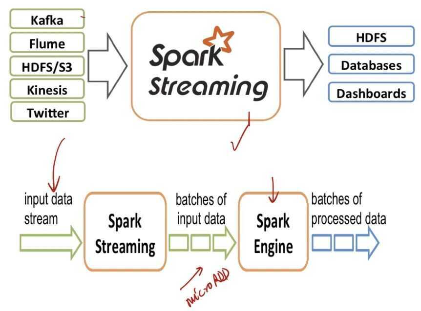
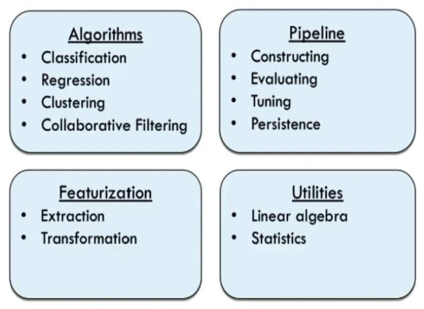
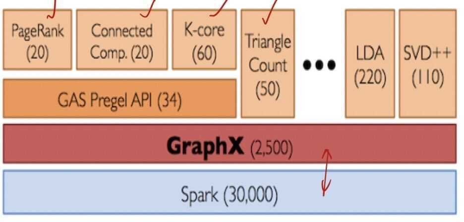

# Spark Modules

## Apache Spark (Core)

Spark consists of a core framework that manages the internal representation of data, including:

- serialization
- memory allocation
- caching
- increasing resilience by storing intermediate snapshots on disk
- automatic retries
- data exchange (shuffling) between worker nodes

It also provides a bunch of methods to transform data (likemapandreduce). All of these methods work on **resilient distributed datasets (RDD).**

Spark automatically recognizes dependencies between single steps and thereby knows which of them can be executed in parallel.

This is accomplished by building a directed acyclic graph (DAG), which also implies that transformations are not executed right away, but when action functions are called.

So basically, the methods can be divided into two types: RDD transformations and actions.

These are RDD transformations:

- map(func)
- flatMap()
- filter(func)
- mapPartitions(func)
- mapPartitionWithIndex()
- union(dataset)
- intersection(dataset)
- distinct()
- groupByKey()
- reduceByKey(func, [numTasks])
- sortByKey()
- join()
- coalesce()

And these are RDD actions:

- count()
- collect()
- take(n)
- top()
- countByValue()
- reduce()
- fold()
- aggregate()
- foreach()

The DAG of a running job can be viewed in the Spark UI web interface. It also shows the pending jobs, the lists of tasks, and current resource usage and configuration.

Most of the information can also be reviewed for finished (or failed) jobs if the history server is configured.

## Spark SQL

This is an abstraction of Spark's core API. Whereas the core API works with RDD, and all transformations are defined by the developer explicitly, Spark SQL represents the RDD as so-called DataFrames. The DataFrame API is more like a DSL that looks like SQL.

The developer can even more abstract the RDD by registering a DataFrame as a named in-memory table. This table can then be queried as one would query a table in a relational database using SQL.

## GraphX

This lets you represent RDD as a graph (nodes are connected via edges) and perform some basic graph operations on it. Currently (only) three more advanced algorithms are provided: PageRank, ConnectedComponents, andTriangleCounting.

## Spark Streaming

This can poll distributed logs like Apache Kafka or Amazon Kinesis (and some other messaging systems, like ActiveMQ) to process the messages in micro-batches. (Nearly) all functionality available for Spark batch jobs can also be applied on the RDD provided by Spark Streaming.

- Spark Streaming is an extension of the core Spark API that enables scalable, high-throughput, fault-tolerant stream processing of live data streams.
- Streaming data inputs from HDFS, Kafka, Flume, TCP sockets, kinesis, etc
- Spark ML (Machine Learning) functions and GraphX graph processing algorithms are fully applicable to streaming data

## Spark Streaming vs Kafka Streams vs Flink

- Kafka Streams is just a library (no additional infrastructure component, but it has the responsibility to deploy and scale the streaming application).
- Flink is currently the most superior/feature-rich framework when it comes to low-latency stream processing (which is important when streams are used as the core communication between services in real-time).
- Spark's main benefit is the whole existing eco-system including the MLlib/GraphX abstractions and that parts of the code can be reused for both batch- and stream-processing functionality.

|  | **Flink** | **Kafka Streams** | **Spark Streaming** |
|---|---|---|---|
| **Deployment** | A framework that also takes care of deployment in a cluster | A library that can be included in any Java program. Deployment depends how the Java application is deployed. | A framework that also takes care of deployment in a cluster |
| **Life cycle** | Stream processing logic is run as a job in the Flink cluster | Stream processing logic is run as part of a "standard" Java application | Stream processing logic is run as a job in the Spark cluster |
| **Responsibility** | Dedicated infrastructure team | Application developer | Dedicated infrastructure team |
| **Coordination** | Flink master (JobManager), part of the streaming program | Leverages the Kafka cluster for coordination, load balancing, and fault-tolerance | Spark Master |
| **Source of continuous data** | Kafka, File Systems, other message queues | Kafka only | Common streaming platforms like Kafka, Flume, Kinesis, etc. |
| **Sink for results** | Any storage where an implementation using the Flink Sink API is available | Kafka or any other storage where a Kafka Sink is implemented using the Kafka Connect API | File and Kafka as a predefined sink, any other destination using the forEach-sink (manual implementation) |
| **Bounded and unbounded data streams** | Unbounded and bounded | Unbounded | Unbounded (bounded using Spark Batch jobs) |
| **Semantical guarantees** | Exactly once for internal Flink state; end-to-end exactly once with selected sources and sinks (e.g., Kafka to Flink to HDFS); at least once when Kafka is used as a sink | Exactly once, end-to-end with Kafka | Exactly once |
| **Stream processing approach** | Single record | Single record | Micro-batches |
| **State management** | Key-value storage, transparent to the developer | No, must be implemented manually | No, stateless by nature |
| **Feature set** | Rich feature set, including event time (opposed to processing time), sliding windows, and watermarks | Simple features set to aggregate in tumbling windows | Wide feature set but lacking some of the more advanced features that Flink offers |
| **Low latency** | Yes | Yes | No |
| **Example of when to choose as stream processor** | Setup of a new event-driven architecture that needs advanced stream-processing features and has low-latency requirements | JVM application that should consume an existing Kafka event stream | Add stream processing when Spark is already used for batch processing and low latency is not mandatory |

## Spark MLlib

MLlib provides high-level algorithms that are commonly used in general data analysis (like clustering and regression) and in machine learning. It provides the functionality to define pipelines, train models and persist them, and read trained models to apply them to live data.

- Spark MLlib is a distributed machine-learning framework on top of Spark. Core
- MLlib is Spark's scalable machine learning library consisting of common learning algorithms and utilities, including classfication, regression, clustering, collaborative filtering, dimensionality reduction

## Spark MLlib Component

## Spark GraphX

- GraphX is a new component in Spark for graphs and graph-parallel computation. At a high level, GraphX extends the Spark RDD by introducing a new graph abstraction
- GraphX reuses Spark RDD concept, simplifies graph analytics tasks, provides the ability to make operations on a directed multigraph with properties attached to each vertex and edge
- GraphX is a thin layer on top of the Spark general-purpose dataflow framework

## pyspark

`docker run -p 8888:8888 jupyter/pyspark-notebook`

<https://realpython.com/pyspark-intro>

<https://www.datacamp.com/community/blog/big-data-with-pyspark>

<http://spark.apache.org/docs/2.1.0/api/python/pyspark.sql.html>

<https://towardsdatascience.com/natural-language-processing-with-spark-9efef3564270>

[Koalas: pandas API on Apache Spark - Koalas 1.8.2 documentation](https://koalas.readthedocs.io/en/latest/)

## Spark UI

<https://spark.apache.org/docs/3.0.0-preview/web-ui.html>
