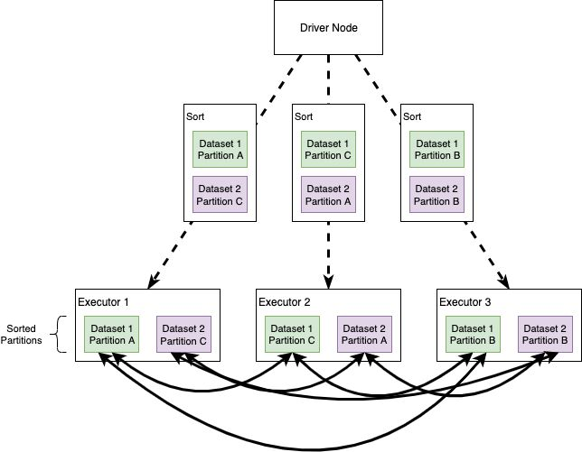
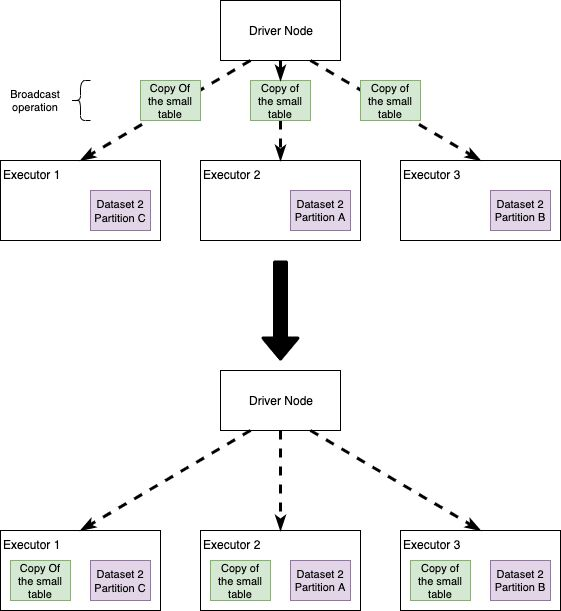

# Joins

### What Factors affect Join Operations?

1. **Dataset Size -** The size of the datasets participating in the join will directly affect the join operation performance.
2. **Condition of Join -** The condition of join derives from the logical comparison of the fields in the datasets. These conditions can be categorized as Equivalence condition `( = )` or Non-Equivalence condition `( >, <, ≥, ≤, <>)`.
3. **Type of Join -** After selecting the condition of Join, we need to check for the type of join which is categorized as _Inner, Outer, Semi, or Cross Join_.

### Spark strategies for join execution

1. Broadcast Hash Join
2. Shuffle Hash Join
3. Shuffle Sort Merge Join
4. Cartesian Join
5. Broadcast Nested Loop Join

### Hash Join

In the case of a Hash Join, a hash table is created based on the join key of the smaller dataset and then looping over the larger dataset to match the hashed join key fields. It only supports the equivalence join condition. And this strategy is applied at the **per node level (all partitions on the nodes where the dataset is available).** The creation of the hash table improves the searching. Once the hash table is created for the smaller dataset, loop over the larger dataset and based on the join key attribute, search the hash value in the smaller dataset **(O(1) operation).**

## Sort Merge Joins

When Spark translates an operation in the execution plan as a Sort Merge Join it enables an all-to-all communication strategy among the nodes: the Driver Node will orchestrate the Executors, each of which will hold a particular set of joining keys. Before running the actual operation, the partitions are first sorted (this operation is obviously heavy itself). As you can imagine this kind of strategy can be expensive: nodes need to use the network to share data; note that Sort Merge Joins tend to **minimize data movements** in the cluster, especially compared to Shuffle Hash Joins.

In a Sort Merge Join partitions are sorted on the join key prior to the join operation.

## Broadcast Joins / Map End Join

Broadcast joins happen when Spark decides to send a copy of a table to all the executor nodes. The intuition here is that, if we broadcast one of the datasets, Spark no longer needs an all-to-all communication strategy and each Executor will be self-sufficient in joining the big dataset records in each node, with the small (broadcasted) table. We'll see that this simple idea improves performance... usually.

In a Broadcast Join a copy of the small table is sent to all the Executors. Each executor will then perform the join without the need of network communication

1. The **broadcasted dataset should fit** in the driver as well as executor nodes. The **driver first gets the dataset** from the executor side and then **broadcasts the datasets to all the worker nodes** where the partitions for the larger dataset are present.
2. **Equivalence Join condition** and **join types except Full Outer Join** is supported.
3. The property is configurable and has a max limit of 8GB.
4. The table is cached on the driver node as well on the executor nodes and if a large table is broadcasted then it will be a network intensive operation leading to performance degradation.

## Shuffle Hash Join

Shuffle Hash Join involves a two-phase process, the shuffle and hash join phase. Datasets with the same join key are **moved** to the same executor node and then on the executor node, create a hash table for the smaller table and apply **Hash** Join.

1. The join keys need **_NOT_** be sortable.
2. **Equivalence Join condition** and **join types except Full Outer Join** is supported.
3. This is an expensive join as it involves shuffling as well as creating a hash table on the dataset participating in the join operation.
4. To enable this join to need to set Shuffle Sort Merge Join to false

> **spark.sql.join.preferSortMergeJoin=false (Default value is true)**

## Shuffle Sort Merge Join

Shuffle Sort Merge Join as the name suggest involves a shuffle and sort-merge phase. Datasets with the same join key are **moved** to the same executor node and then on the executor node, the dataset partitions on the node are **sorted** by the join keys and then **merged** based on the join keys.

1. This is the default join strategy in Apache Spark since Spark 2.3. It can be disabled using **_spark.sql.join.preferSortMergeJoin=false._**
2. **Equivalence Join condition** and **join types except Full Outer Join** is supported.
3. The join keys need to be sortable.
4. All join types are supported.

## Cartesian Join

If the participating datasets do not specify the join key(on condition), the cartesian product strategy will be picked.

1. Only inner join types are supported.
2. Supports equivalence and non-equivalence join conditions.

## Broadcast Nested Loop Join

This join strategy is selected when no suitable join mechanism to choose from. In other words, if the join condition and hint type are not mentioned, then this join is chosen.

1. Supports equivalence and non-equivalence join conditions.
2. All join types are supported.
3. This is a very expensive join and Spark automatically optimizes the join by looking for an appropriate dataset that can be broadcasted.

## Spark Join Selection Strategy

### Case-I Equivalence Join Condition

Look at the join hints in the following order:

1. **_Broadcast Hint_ -** Pick Broadcast Hash Join if join type is supported.
2. **_Sort Merge Hint_** - Pick Sort-Merge to join if join keys are sortable.
3. **_Shuffle Hash Hint_** - Pick Shuffle Hash Join if join type is supported.
4. **_Shuffle Replicate NL Hint_** - Pick Cartesian Product if join type is inner like.

If no hints are applicable

1. If one of the datasets is small enough to be broadcasted and join type is supported then pick **_Broadcast Hash Join_**.
2. If join keys are sortable then pick **_Sort Merge Join_**.
3. If one of the datasets is small enough to build a Hash table, and **_spark.sql.join.preferSortMergeJoin=false_**, choose **_Shuffle Hash Join_**.
4. If the join type is inner type, then pick **_Cartesian Product Join_**.
5. Call the **_Broadcast Nested Loop Join_** if none of the options satisfies.

### Case-II Non-Equivalence Join Conditions

Look at the join hints in the following order:

1. **_Broadcast Hint —_** Pick the Broadcast Nested Loop Join.
2. **_Shuffle Replicate NL Hint_** - Pick Cartesian Product if the join type is inner like.

## Takeaways

- Joins can be difficult to tune since performance are bound to both the code and the Spark configuration (number of executors, memory, etc.)
- Some of the most common issues with joins are all-to-all communication between the nodes and data skewness
- We can avoid all-to-all communication using broadcasting of small tables or of medium-sized tables if we have enough memory in the cluster
- Broadcasting is not always beneficial to performance: we need to have an eye for the Spark config
- Broadcasting can make the code unstable if broadcast tables grow through time
- Skewness leads to an uneven workload on the cluster, resulting in a very small subset of tasks to take much longer than the average
- There are multiple ways to fight skewness, one is repartitioning.
- We can create our own repartitioning key, e.g. using the key salting technique

https://towardsdatascience.com/the-art-of-joining-in-spark-dcbd33d693c

[Join Strategies in Apache Spark— Deep Dive | by Siddharth Ghosh | Medium](https://medium.com/@ghoshsiddharth25/apache-spark-join-strategies-deep-dive-26bf7e85db28)

[Spark Join Strategies - How & What? | by Jyoti Dhiman | Towards Data Science](https://towardsdatascience.com/strategies-of-spark-join-c0e7b4572bcf)

**[On Improving Broadcast Joins in Apache Spark SQL – Databricks](https://www.databricks.com/session_na20/on-improving-broadcast-joins-in-apache-spark-sql)**
