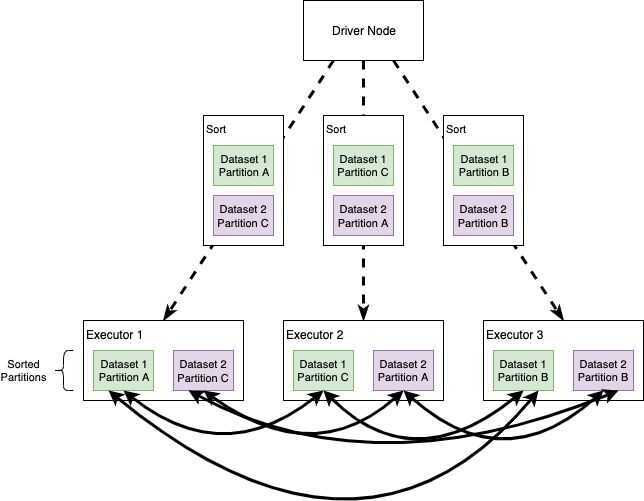
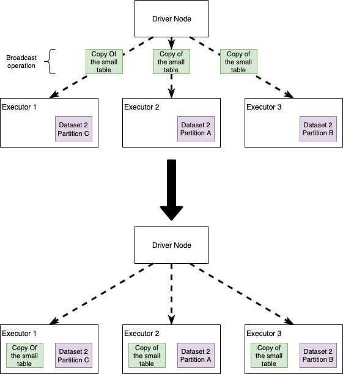

# Joins

## Sort Merge Joins

When Spark translates an operation in the execution plan as a Sort Merge Join it enables an all-to-all communication strategy among the nodes: the Driver Node will orchestrate the Executors, each of which will hold a particular set of joining keys.Before running the actual operation, the partitions are first sorted(this operation is obviously heavy itself). As you can imagine this kind of strategy can be expensive: nodes need to use the network to share data;note that Sort Merge Joins tend to minimize data movements in the cluster, especially compared to Shuffle Hash Joins.

In a Sort Merge Join partitions are sorted on the join key prior to the join operation.

## Broadcast Joins

Broadcast joins happen when Spark decides to senda copy of a table to all the executor nodes. The intuition here is that, if we broadcast one of the datasets, Spark no longer needs an all-to-all communication strategy andeach Executor will be self-sufficient in joining the big dataset records in each node, with the small (broadcasted) table. We'll see that this simple idea improves performance... usually.

In a Broadcast Join a copy of the small table is sent to all the Executors. Each executor will then perform the join without the need of network communication

## Takeaways

- Joins can be difficult to tune since performance are bound to both the code and the Spark configuration (number of executors, memory, etc.)
- Some of the most common issues with joins are all-to-all communication between the nodes and data skewness
- We can avoid all-to-all communication using broadcasting of small tables or of medium-sized tables if we have enough memory in the cluster
- Broadcasting is not always beneficial to performance: we need to have an eye for the Spark config
- Broadcasting can make the code unstable if broadcast tables grow through time
- Skewness leads to an uneven workload on the cluster, resulting in a very small subset of tasks to take much longer than the average
- There are multiple ways to fight skewness, one is repartitioning.
- We can create our own repartitioning key, e.g. using the key salting technique

<https://towardsdatascience.com/the-art-of-joining-in-spark-dcbd33d693c>
