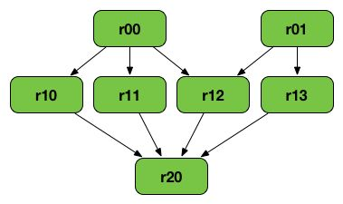

# Terms

## RDDs, DataFrames, DataSets, Oh My

    Spark RDDs(Resilient Distributed Datasets) are data structures that are the core building blocks of Spark. A RDD is an immutable, partitioned collection of records, which means that it can hold values, tuples, or other objects, these records are partitioned so as to be processed on a distributed system, and that once an RDD has been made, it is impossible to alter it. That basically sums up its acronym: they are resilient due to their immutability and lineage graphs (which will be discussed shortly), they can be distributed due to their partitions, and they are datasets because, well, they hold data

A crucial thing to note is that RDDsdo not have a schema, which means that they do not have a columnar structure. Records are just recorded row-by-row, and are displayed similar to a list. Enter **Spark DataFrames**. Not to be confused with Pandas DataFrames, as they are distinct, Spark DataFrame have all of the features of RDDs but also have a schema. This will make them our data structure of choice for getting started with PySpark.

Spark has another data structure, **Spark DataSets.** These are similar to DataFrames but arestrongly-typed, meaning that the type is specified upon the creation of the DataSet and is not inferred from the type of records stored in it. This means DataSets are not used in PySpark because Python is a dynamically-typed language.

## Transformations

    Transformations are one of the things you can do to an RDD in Spark. They are lazy operations that create one or more new RDDs. It's important to note that Transformations createnewRDDs because, remember, RDDs are immutable so they can't be altered in any way once they've been created. So, in essence, Transformations take an RDD as an input and perform some function on them based on what Transformation is being called, and outputs one or more RDDs. Recalling the section on lazy evaluation, as a compiler comes across each Transformation, it doesn't actually build any new RDDs, but rather constructs a chain of hypothetical RDDs that would result from those Transformations which will only be evaluated once an**Actionis called. This chain of hypothetical, or "child", RDDs, all connected logically back to the original "parent" RDD, is what a lineage graph is

## Actions

    An Action is any RDD operation that does not produce an RDD as an output. Some examples of common Actions are doing a count of the data, or finding the max or min, or returning the first element of an RDD, etc. As was mentioned before, an Action is the cue to the compiler to evaluate the lineage graph and return the value specified by the Action

## Lineage Graph

    Most of what a lineage graph is was described in the Transformations and Actions sections, but to summarize, a lineage graph outlines what is called a "logical execution plan". What that means is that the compiler begins with the earliest RDDs that aren't dependent on any other RDDs, and follows a logical chain of Transformations until it ends with the RDD that an Action is called on. This feature is primarily what drives Spark's fault tolerance. If a node fails for some reason, all the information about what that node was supposed to be doing is stored in the lineage graph, which can be replicated elsewhere

## Spark Applications and Jobs

    There is a lot of nitty gritty when it comes to how a processing engine like Spark actually executes processing tasks on a distributed system. The following is just as much as you'll need to know in order to have a working understanding of what certain snippets of Spark code do. In Spark, when an item of processing has to be done, there is a "driver" process that is in charge of taking the user's code and converting it into a set of multiple tasks. There are also "executor" processes, each operating on a separate node in the cluster, that are in charge of running the tasks, as delegated by the driver. Each driver process has a set of executors that it has access to in order to run tasks. A Spark **application** is a user built program that consists of a driver and that driver's associated executors. A Spark**jobis task or set of tasks to be executed with executor processes, as directed by the driver. A job is triggered by the calling of an RDD Action. This stuff can be rather confusing, so don't sweat it if it doesn't make total sense at first, it's just helpful to be familiar with these terms when they are implemented in code later on
