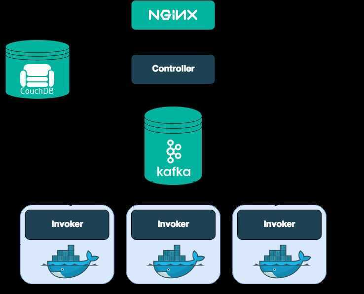

# Others

## Apache Tez

The Apache TEZ project is aimed at building an application framework which allows for a complex directed-acyclic-graph of tasks for processing data. It is currently built atop [Apache Hadoop YARN](http://hadoop.apache.org/docs/current/hadoop-yarn/hadoop-yarn-site/YARN.html).

The 2 main design themes for Tez are:

- **Empowering end users by:**
  - Expressive dataflow definition APIs
  - Flexible Input-Processor-Output runtime model
  - Data type agnostic
  - Simplifying deployment
- **Execution Performance**
  - Performance gains over Map Reduce
  - Optimal resource management
  - Plan reconfiguration at runtime
  - Dynamic physical data flow decisions

http://tez.apache.org

## Apache Spark

Apache Sparkis an [open-source](https://en.wikipedia.org/wiki/Open-source_software) distributed general-purpose [cluster-computing](https://en.wikipedia.org/wiki/Cluster_computing)[framework](https://en.wikipedia.org/wiki/Software_framework). Spark provides an [interface](https://en.wikipedia.org/wiki/Application_programming_interface) for programming entire clusters with implicit [data parallelism](https://en.wikipedia.org/wiki/Data_parallelism) and [fault tolerance](https://en.wikipedia.org/wiki/Fault_tolerance)

### Features

- Scatter/gather paradigm (similar to MapReduce)
- More general data model (RDDs, DataSets)
- More general programming model (transform/action)
- Storage agnostic
- Faster version of MapReduce(does all the mapreduce in-memory)

https://en.wikipedia.org/wiki/Apache_Spark

## Apache Superset

Modern, enterprise-ready business intelligence web application

### Features

- A rich set of data visualizations
- An easy-to-use interface for exploring and visualizing data
- Create and share dashboards
- Enterprise-ready authentication with integration with major authentication providers (database, OpenID, LDAP, OAuth & REMOTE_USER through Flask AppBuilder)
- An extensible, high-granularity security/permission model allowing intricate rules on who can access individual features and the dataset
- A simple semantic layer, allowing users to control how data sources are displayed in the UI by defining which fields should show up in which drop-down and which aggregation and function metrics are made available to the user
- Integration with most SQL-speaking RDBMS through SQLAlchemy
- Deep integration with Druid.io

https://superset.incubator.apache.org/index.html

## Apache Beam

An advanced unified programming model

Implement batch and streaming data processing jobs that run on any execution engine.

### ParDo

Overall, there are five core transforms in the Apache Beam model. **`ParDo`** is one of the most commonly used transform functions. `ParDo` works similar to the map phase of the [map-reduce](https://en.wikipedia.org/wiki/MapReduce) algorithm.

`ParDo` is the transform for parallel processing. It applies the processing function to every element in the `PCollection` input and returns zero or more elements to the output `PCollection`.

Using the `ParDo` function requires a user-defined `DoFn.` This function will have the transformation you plan to apply. `DoFn` is a Beam SDK class that describes a distributed processing function.

[What is ParDo transform in Apache Beam?](https://www.educative.io/answers/what-is-pardo-transform-in-apache-beam)

[ParDo](https://beam.apache.org/documentation/transforms/python/elementwise/pardo/)

## Apache Storm

Apache Storm is a free and open source distributed realtime computation system. Storm makes it easy to reliably process unbounded streams of data, doing for realtime processing what Hadoop did for batch processing. Storm is simple, can be used with any programming language.

Storm has many use cases: realtime analytics, online machine learning, continuous computation, distributed RPC, ETL, and more. Storm is fast: a benchmark clocked it at overa million tuples processed per second per node. It is scalable, fault-tolerant, guarantees your data will be processed, and is easy to set up and operate.

Storm integrates with the queueing and database technologies you already use. A Storm topology consumes streams of data and processes those streams in arbitrarily complex ways, repartitioning the streams between each stage of the computation however needed.

http://storm.apache.org

## Apache Flink- Stateful Computations over Data Streams

Apache Flink is a framework and distributed processing engine for stateful computations over *unbounded and bounded* data streams. Flink has been designed to run in *all common cluster environments*, perform computations at *in-memory speed* and at *any scale*.

https://flink.apache.org/flink-architecture.html

## Apache OpenWhisk (Incubating)

Apache OpenWhisk (Incubating) is an open source, distributed [Serverless](https://en.wikipedia.org/wiki/Serverless_computing) platform that executes functions (fx) in response to events at any scale. OpenWhisk manages the infrastructure, servers and scaling using Docker containers so you can focus on building amazing and efficient applications.

The OpenWhisk platform supports a programming model in which developers write functional logic (called [Actions](https://github.com/apache/incubator-openwhisk/blob/master/docs/actions#openwhisk-actions)), in any supported programming language, that can be dynamically scheduled and run in response to associated events (via [Triggers](https://github.com/apache/incubator-openwhisk/blob/master/docs/triggers_rules#creating-triggers-and-rules)) from external sources ([Feeds](https://github.com/apache/incubator-openwhisk/blob/master/docs/feeds#implementing-feeds)) or from HTTP requests. The project includes a REST API-based Command Line Interface (CLI) along with other tooling to support packaging, catalog services and many popular container deployment options.

### Architecture

https://openwhisk.apache.org
