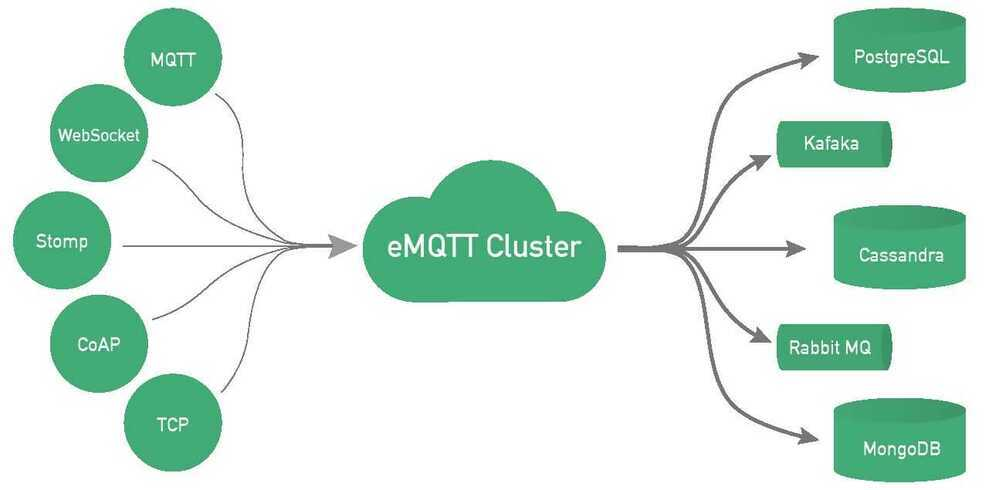

# EMQTT

*EMQ X*broker is a fully open source, distributed, highly scalable, highly extensible, highly available distributed MQTT messaging broker for IoT, M2M and Mobile applications that can handle tens of millions of concurrent clients.

Written in Erlang/OTP.

Starting from 3.0 release,*EMQ X*broker fully supports MQTT V5.0 protocol specifications and backward compatible with MQTT V3.1 and V3.1.1, as well as other communication protocols such as MQTT-SN, CoAP, LwM2M, WebSocket and STOMP. The 3.0 release of the*EMQ X*broker can scale to 10+ million concurrent MQTT connections on one cluster.

The 1.0 release of the*EMQ X*broker has scaled to 1.3 million concurrent MQTT connections on a 12 Core, 32G CentOS server.

## Highlights of theEMQ Xbroker

- Full MQTT V3.1/3.1.1 & V5.0 Protocol Specifications Support
- Easy to Install - Quick Install on Linux, Mac and Windows
- Massively scalable - Scaling to 1 million connections on a single server
- Cluster and Bridge Support
- Easy to extend - Hooks and plugins to customize or extend the broker
- Pluggable Authentication - LDAP, MySQL, PostgreSQL, Redis Authentication Plugins

## Features

- Full MQTT V3.1/V3.1.1 & V5.0 protocol specifications support
- QoS0, QoS1, QoS2 Publish and Subscribe
- Session Management and Offline Messages
- Retained Message
- Last Will Message
- TCP/SSL Connection
- MQTT Over WebSocket(SSL)
- HTTP Publish API
- STOMP protocol
- MQTT-SN Protocol
- CoAP Protocol
- STOMP over SockJS
- $SYS/# Topics
- ClientID Authentication
- IpAddress Authentication
- Username and Password Authentication
- Access control based on IpAddress, ClientID, Username
- Authentication with LDAP, Redis, MySQL, PostgreSQL and HTTP API
- Cluster brokers on several servers
- Bridge brokers locally or remotely
- mosquitto, RSMB bridge
- Extensible architecture with Hooks, Modules and Plugins
- Passed eclipse paho interoperability tests
- Local subscription
- Shared subscription

## Table of Content

1. Deployment
2. Installation
3. Configuration
4. Clustering
5. Bridge
6. User Guide
7. Advanced features
    - Shared Subscription

    *EMQ X*3.0 supports shared subscription at cluster level. It allows load balancing between multiple subscribers in the same group when distributing MQTT messages.

8. Design
9. Commands
10. Plugins
11. REST API
12. Tuning Guide
13. Changes
14. MQTT Protocol
15. MQTT-SN Protocol
16. LWM2M Protocol

## Mqtt Messages Persistence

https://developer.emqx.io/docs/tutorial/en/backend/whats_backend.html

## References

https://github.com/emqx/emqx

https://github.com/emqx/emqx-docker

http://emqtt.io/docs/v2/getstarted.html

MQTT-SN: http://emqtt.io/docs/v3/mqtt-sn.html

Enterpise: https://www.emqx.io/products/enterprise
