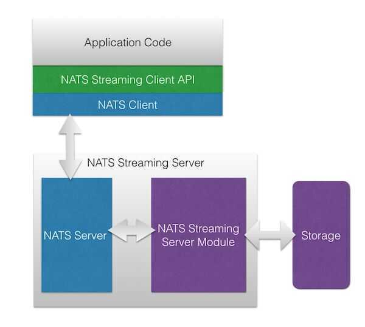

# Others

## NSQ - A realtime distributed messaging platform

NSQ is a realtime distributed messaging platform designed to operate at scale, handling billions of messages per day. It promotes distributed and decentralized topologies without single points of failure, enabling fault tolerance and high availability coupled with a reliable message delivery guarantee.

https://nsq.io/overview/internals.html

https://nsq.io/overview/performance.html

https://pynsq.readthedocs.io/en/latest

## Scribe

Scribe processes logs with an input rate that can exceed 2.5 terabytes per second and an output rate that can exceed 7 terabytes per second.

https://engineering.fb.com/data-infrastructure/scribe

## Brooklin

Brooklin is a distributed system intended for streaming data between various heterogeneous source and destination systems with high reliability and throughput at scale. Designed for multitenancy, Brooklin can simultaneously power hundreds of data pipelines across different systems and can easily be extended to support new sources and destinations.

https://engineering.linkedin.com/blog/2019/brooklin-open-source

https://github.com/linkedin/Brooklin

## NATS

NATSis an [open-source](https://en.wikipedia.org/wiki/Open-source_software) messaging system (sometimes called [message-oriented middleware](https://en.wikipedia.org/wiki/Message-oriented_middleware)). The NATS server is written in the [Go programming language](https://en.wikipedia.org/wiki/Go_(programming_language)). Client libraries to interface with the server are available for dozens of major programming languages. The core design principles of NATS are performance, scalability, and ease of use.

[NATS](https://nats.io/) is a mature, seven-year-old open source messaging technology that implements the publish/subscribe, request/reply and distributed queue patterns to help create a performant and secure method of InterProcess Communication (IPC). Simplicity, performance, scalability and security are the core tenets of NATS.

The project consists of a family of open source components that are tightly integrated but can be deployed independently. NATS is based on a client-server architecture with servers that can be clustered to operate as a single entity -- clients connect to these clusters to exchange data encapsulated in messages.

"While most messaging systems provide a mechanism to persist messages and ensure message delivery, NATS does this through log based streaming -- which we've found to be an easier way to store and replay messages," "NATS is a simple yet powerful messaging system written to support modern cloud native architectures. Because complexity does not scale, NATS is designed to be easy to use while acting as a central nervous system for building distributed applications."

NATS Streaming subscribers can retrieve messages published when they were offline, or replay a series of messages. Streaming inherently provides a buffer in the distributed application ecosystem, increasing stability. This allows applications to offload local message caching and buffering logic into NATS and ensures a message is never lost.

## Main features

- Pure pub-sub
- Clustered mode server
- Auto-pruning of subscribers
- Text-based protocol
- Multiple qualities of service (QoS)
- Durable subscriptions
- Event streaming service
- Last/Initial value caching

## NATS and NATS Streaming

For context, [NATS](https://nats.io/) and [NATS Streaming](https://nats.io/documentation/streaming/nats-streaming-intro/) are two different things. NATS Streaming is a log-based streaming system built on top of NATS, and NATS is a lightweight pub/sub messaging system. NATS was originally built (and then open sourced) as the control plane for Cloud Foundry. NATS Streaming was built in response to the community's ask for higher-level guarantees - durability, at-least-once delivery, and so forth - beyond what NATS provided. It was built as a separate layer on top of NATS. I tend to describe NATS as a dial tone - ubiquitous and always on - perfect for "online" communications. NATS Streaming is the voicemail - leave a message after the beep and someone will get to it later. There are, of course, more nuances than this, but that's the gist.

The key point here is that NATS and NATS Streaming are distinct systems with distinct protocols, distinct APIs, and distinct client libraries. In fact, NATS Streaming was designed to essentially act as aclientto NATS. As such, clients don't talk to NATS Streaming directly, rather all communication goes through NATS. However, the NATS Streaming binary can be configured to either embed NATS or point to a standalone deployment.

https://bravenewgeek.com/building-a-distributed-log-from-scratch-part-5-sketching-a-new-system

https://en.wikipedia.org/wiki/NATS_Messaging

https://github.com/nats-io

https://www.cncf.io/blog/2018/03/15/cncf-to-host-nats

https://nats.io/documentation

Used by - Zerodha

internal streaming technology has changed from a custom TCP protocol to ZeroMQ to Nanomsg/Mango to NATS finally, which is rock solid and highly scalable

## LiftBridge

Liftbridge provides lightweight, fault-tolerant message streams by implementing a durable stream augmentation for the [NATS messaging system](https://nats.io/). It extends NATS with a Kafka-like publish-subscribe log API that is highly available and horizontally scalable. Use Liftbridge as a simpler and lighter alternative to systems like Kafka and Pulsar or use it to add streaming semantics to an existing NATS deployment.

https://github.com/liftbridge-io/liftbridge

## LSD Live Streaming Daemon

- extremely high availability, reliability and local buffering capabilities, limited only by producer's disk storage capacity
- lightweight text-based data format
- simple configuration, deployment and support
- ability to create complex routing schemes for different data streams
- in general you don't need any specific library to send events (just write to plain files)

https://github.com/badoo/lsd

## Message DB

A fully-featured event store and message store implemented in PostgreSQL for Pub/Sub, Event Sourcing, Messaging, and Event Microservices applications.

Message DB supports:

- Pub/Sub
- JSON message data
- Event streams
- Stream categories
- Metadata
- Message queues
- Message storage
- Consumer groups
- Service host
- Administration tools
- Reports

http://docs.eventide-project.org/user-guide/message-db

## Others

- [apache-pulsar](technologies/apache/apache-pulsar.md)
