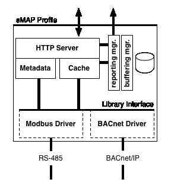

# sMAP

**sMAP: the Simple Measurement and Actuation Profile**

An enormous amount of physical information; that is, information from and about the world is available today as the cost of communication and instrumentation has fallen. However, making use of that information is still challenging. The information is frequently siloed into proprietary systems, available only in batch, fragmentary, and disorganized. The sMAP project aims to change this by making it available and usable:

- a [**specification**](https://people.eecs.berkeley.edu/~stevedh/smap2/_downloads/v2.pdf) for transmitting physical data and describing its contents,
- a [***large set***](https://people.eecs.berkeley.edu/~stevedh/smap2/driver_index.html#driver-index) of free and open drivers for communicating with devices using native protocols and transforming it to the sMAP profile, and
- tools for building, organizing, and querying large repositories of physical data.

The core object in sMAP is the timeseries, a single progression of(time, value)tuples. Each timeseries in sMAP is identified by aUUID, and can be tagged with metadata; all grouping of time series occurs using these tags. These objects are exchanged between all components in this ecosystem.

## Key Elements

- sMAP Sources
- Archiver
- Front-ends

## Sources

- Drivers
- Send data to the archiver

## Patterns for driver writing

- Periodic scraping
- Actuation

## sMAP Archiver Interface

- ArchiverAPI
- Query Language
- Real-time data access
- Manual data publication
  - JSON Edition
  - CSV Edition

## sMAP Toolbox

- smap-query
- smap-tool
- smap-monitize
- smap-load
- smap-load-csv

## sMAP Architecture

The sMAP architecture consists of several components which may be used together to capture, transmit, store, and present time-series data:

- **sMAP Sources** communicate with existing instrumentation, and collect time-series data using a large variety of underlying protocols. They use thesMAP Libraryto describe and reliably communicate this data to consumers, as well as provide uniform access to actuators.
- the **sMAP Archiver** is a high-performance historian for storing large volumes of stored data. It provides a simple and powerful interface for making use of historical data and real-time data, and addresses locating and cleaning the raw data.
- **Applications** make use of historical and/or real-time data in order to achieve a higher-level goal; for instance, providing attractive visualizations, computing optimal control strategies, or providing user feedback. By default, the sMAP project provides **powerdb2**, a time-series organization and plotting application.

- sMAP Sources

- Archiver

- Front-Ends

the **powerdb2** project provides plotting and organization of time-series data. Due to the decoupled nature of sMAP, this front-end can be run by anyone without installing the database. The application is designed to give users a large amount of flexibility to organize, display and plot streams using [***Query Language***](https://people.eecs.berkeley.edu/~stevedh/smap2/archiver.html#archiverquery) to generate tree views of their streams.

## Sending data via API

**Manual Data Publication**

curl -XPOST -d @data.json -H "Content-Type: application/json" [http://iiitd.example.com:9101/add/**rOxFkkkoigEEKTei39Zi72zevAxsQbqqCY9c**](http://iiitd.example.com:9101/add/rOxFkkkoigEEKTei39Zi72zevAxsQbqqCY9c)

## References

[https://people.eecs.berkeley.edu/~stevedh/smap2/index.html#](https://people.eecs.berkeley.edu/~stevedh/smap2/index.html)
