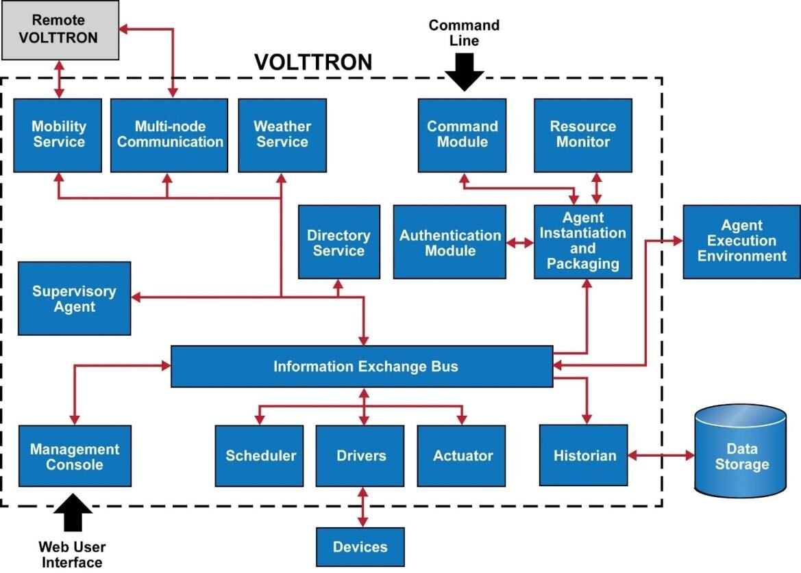

# Volttron

VOLTTRON is an open source platform for distributed sensing and control. The platform provides services for collecting and storing data from buildings and devices and provides an environment for developing applications which interact with that data.

## Features

- [Message Bus](https://volttron.readthedocs.io/en/latest/core_services/messagebus/index.html#messagebus-index) allows agents to subcribe to data sources and publish results and messages
- [Driver framework](https://volttron.readthedocs.io/en/latest/core_services/drivers/index.html#volttron-driver-framework) for collecting data from and sending control actions to buildings and devices
- [Historian framework](https://volttron.readthedocs.io/en/latest/core_services/historians/index.html#historian-index) for storing data
- [Agent lifecycle management](https://volttron.readthedocs.io/en/latest/core_services/control/AgentManagement.html#agentmanagement) in the platform
- [Web UI](https://volttron.readthedocs.io/en/latest/core_services/service_agents/central_management/VOLTTRON-Central.html#volttron-central) for managing deployed instances from a single central instance.

## Volttron Platform



## Volttron Central

- Web UI
- Manage Deployed Devices
- Tree View
- Charts/graphs
- Extending
  - Driver framework
  - Historians

## Platform Agent

The Platform Agent allows communication from a VOLTTRON Central instance. Each VOLTTRON instance that is to be controlled through the VOLTTRON Central agent should have one and only one Platform Agent. The Platform Agent must have the VIP identity of platform.agent.

## Forward Historian

The Forward Historian is used to send data from one instance of VOLTTRON to another. This agents primary purpose is to allow the target instance's pubsub bus to simulate data coming from a real device. If the target instance becomes unavailable or one of the "required agents" becomes unavailable then the cache of this agent will build up until it reaches it's maximum capacity or the instance and agents come back online.

The Forward Historian now uses the configuration store for storing its configurations. This allows dynamic updating of configuration without having to rebuild the agent.

## Commands

```bash
python bootstrap.py
. env/bin/activate
scripts/core/make-listener
tail volttron.log
volttron-ctl shutdown --platform
volttron -vv (./start-volttron, ./stop-volttron)
volttron --vv --l volttron.log& (start and log)
volttron cfg
vctl status
volttron-ctl status
volttron-ctl start <uuid>
cat /home/test/.volttron2/config
volttron -l log1& (start the volttron instance with logging)

## volttron-ctl
- 'install', 'tag', 'remove', 'list', 'status', 'health', 'clear', 'enable', 'disable', 'start', 'stop', 'restart', 'run', 'upgrade', 'auth', 'config', 'shutdown', 'send', 'stats'
- volttron-ctl auth serverkey #get server key

## Scripts
- ./scripts/historian-scripts/start-historian-sqlite.sh
  - apt-get install tzdata (reconfigure timezone information)
  - Create Platform historian (add "identity": "platform.historian" to services/core/SQLHistorian/config.sqlite)

## Installation scripts
## Install Forward Historian
./scripts/core/pack_install.sh services/core/ForwardHistorian services/core/ForwardHistorian/config hist

## Install SQLite Historian
./scripts/core/pack_install.sh services/core/SQLHistorian services/core/SQLHistorian/config.sqlite hist

```

## URLs

- http://localhost:8080/vc/index.html
- http://localhost:8080/discovery

## Mongod

```bash
mongo_install/bin/mongod --config /volttron/mongo_install/mongo_config.cfg &
mongo_install/bin/mongod --config /volttron/mongo_install/mongo_config.cfg --shutdown
```

## VIP - Volttron Interconnect Platform

Create different Volttron instances

```bash
export VOLTTRON_HOME=~/.volttron1
volttron-ctl auth add --credentials "/.*/"
```

### References

https://github.com/VOLTTRON/volttron

https://github.com/so3500/volttron-kafka

## Problems

- If there are two historians (SQLite(platform) and Forward), if forward is turned off, then also data is lost.
- If server's platform historian is down then also data is lost
- client_volttron do not reconnect after the server starts again without restarting vcplatformagent-4.7 and data is lost
