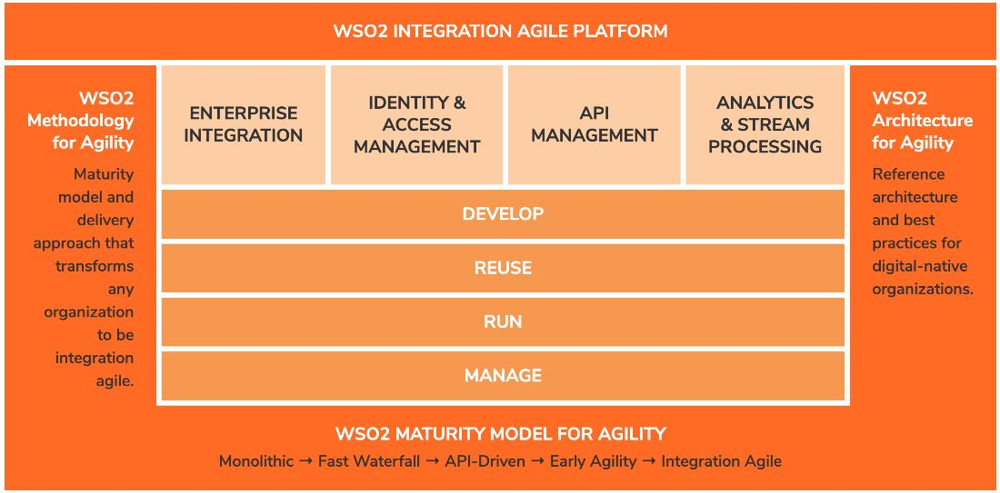
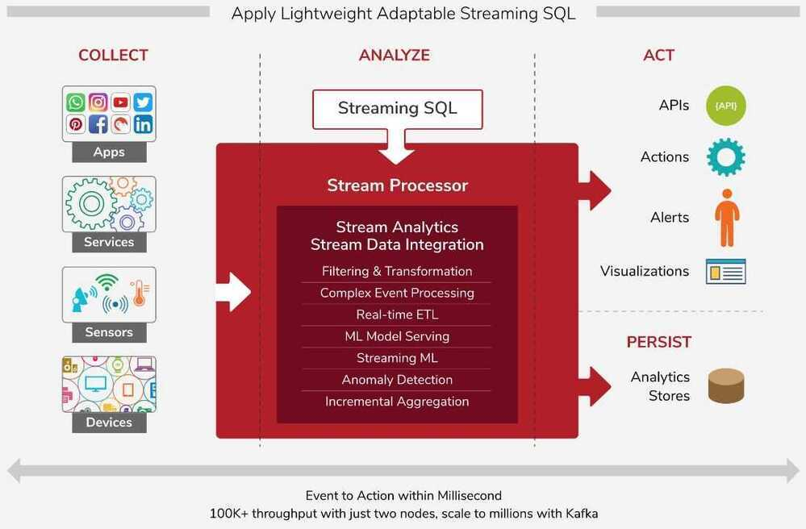
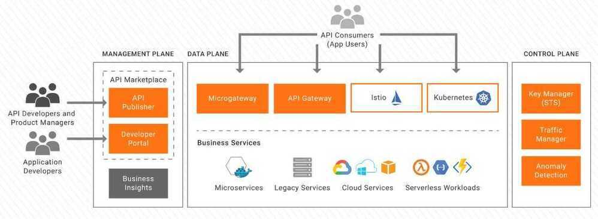

**WSO2** is a global technology company that provides an open-source platform for **enterprise integration**, **API management**, and **identity and access management (IAM)**.

Founded in 2005, it is known for being one of the few vendors that offers a "complete" middleware stack where every component is released under an open-source license (specifically the **Apache License 2.0**). This allows businesses to build, connect, and secure their digital services without the initial heavy cost of proprietary licensing.

## Core Product Offerings

WSO2's ecosystem is built around three primary pillars that help organizations transition into "digital enterprises":

| **Product**              | **Primary Function**                   | **Key Features**                                                                  |
| ------------------------ | -------------------------------------- | --------------------------------------------------------------------------------- |
| **WSO2 API Manager**     | Full lifecycle API management.         | API Gateway, Developer Portal, Monetization, and Rate Limiting.                   |
| **WSO2 Integrator**      | Connecting disparate systems and data. | Support for Microservices, ESB (Enterprise Service Bus), and Streaming data.      |
| **WSO2 Identity Server** | Managing user identities and security. | Single Sign-On (SSO), Multi-Factor Authentication (MFA), and Customer IAM (CIAM). |

## WSO2 Integrator

**WSO2 Integrator** (officially known as **WSO2 Micro Integrator**) is an open-source, low-code platform used to connect different software applications, data sources, and services.

Think of it as the "glue" or the "universal translator" of an enterprise. It takes data from one system (like an old SAP database), transforms it into a modern format (like JSON), and sends it to another system (like a mobile app or a cloud service) without those two systems needing to speak the same language.

### Core Capabilities

The Integrator is built to handle the "heavy lifting" of backend communication:

- **Service Orchestration:** It can combine multiple calls to different services into a single response. For example, a "Get Customer Profile" request might pull data from a CRM, a billing system, and a shipping database simultaneously.
- **Protocol Switching:** It can talk to almost anything. It can receive a request via **HTTP/REST** and then communicate with a backend via **JMS, FTP, MQTT,** or even legacy **SOAP**.
- **Data Transformation:** It converts data formats on the fly (e.g., transforming XML to JSON or CSV to a database record).
- **600+ Connectors:** It has pre-built adapters for popular services like Salesforce, Google Drive, SAP, Amazon S3, and ServiceNow.

### Key Components (2026 Version)

As of 2026, the product has evolved to focus on "Cloud-Native" and "Agentic AI" architectures:

1. **Micro Integrator (MI):** The core engine. It is lightweight and designed to run in **Docker and Kubernetes**. It starts up in milliseconds, making it perfect for modern microservices environments.
2. **MI Dashboard:** A centralized web interface used to monitor and manage running integrations, view logs, and track message flows.
3. **Integration Studio / VS Code Extension:** The developer tools. Most integrations are built using a **drag-and-drop graphical editor**, though developers can also write the underlying XML-based logic (Synapse) directly.
4. **AI Integration (New):** The latest versions include **AI Gateway** capabilities, allowing you to integrate AI agents into your workflows. You can use the Integrator to feed your internal company data into an LLM safely via the **Model Context Protocol (MCP)**.

### WSO2 Integrator vs. Traditional ESB

| **Feature**      | **Traditional ESB**     | **WSO2 Micro Integrator**         |
| ---------------- | ----------------------- | --------------------------------- |
| **Footprint**    | Heavy, monolithic.      | Lightweight, container-optimized. |
| **Startup Time** | Minutes.                | Milliseconds.                     |
| **Deployment**   | Physical servers / VMs. | Kubernetes, Serverless, or SaaS.  |
| **Development**  | Complex XML coding.     | Low-code / AI-assisted.           |

## WSO2 Integration with Kafka

Integrating WSO2 Micro Integrator (MI) with **Apache Kafka** is one of the most common patterns for building event-driven architectures. In this setup, WSO2 acts as the bridge between your standard APIs/applications and the high-speed streaming world of Kafka.

WSO2 can interact with Kafka in two primary ways: as a **Producer** (sending data to Kafka) or as a **Consumer** (reading data from Kafka).

### 1. WSO2 as a Kafka Producer

In this scenario, WSO2 MI receives data from an external source (like a REST API or a file) and publishes it to a Kafka topic.

- **How it works:** You use the **Kafka Connector** within WSO2.
- **The Flow:**
	1. A client sends a JSON payload to a WSO2 REST API.
    2. WSO2 processes or transforms the data (e.g., adding a timestamp).
    3. WSO2 uses the `publish` operation to push the message into a specific Kafka Topic.
- **Use Case:** Capturing website clickstream data or transaction logs and feeding them into a real-time analytics engine.

### 2. WSO2 as a Kafka Consumer

Here, WSO2 listens to a Kafka topic and triggers an integration flow whenever a new message arrives.

- **How it works:** You configure a **Kafka Inbound Endpoint** in WSO2.
- **The Flow:**
    1. WSO2 polls the Kafka topic (acting as part of a Consumer Group).
    2. When a message is detected, WSO2 "consumes" it.
    3. The message is injected into a sequence where it can be sent to a database, emailed to a user, or pushed to a legacy ERP system like SAP.
- **Use Case:** An "Order Placed" event is published to Kafka by a storefront; WSO2 consumes that event to update the Inventory database and notify the Warehouse.

### Key Configuration Steps

To set this up in **WSO2 Integration Studio** or **VS Code Extension**:

1. **Add the Connector:** Download the Kafka Connector from the WSO2 Connector Store.
2. **Define Connection:** Provide the `bootstrap.servers` (the IP/Port of your Kafka brokers) and any security credentials (SASL/SSL).
3. **Transformation:** Use the **Data Mapper** in WSO2 to ensure the message format matches what the Kafka consumer or the destination system expects.
4. **Error Handling:** Configure a "Fault Sequence" in WSO2. If Kafka is down, WSO2 can store the message in a **Message Store** and retry later (Guaranteed Delivery).

### Why use WSO2 with Kafka instead of writing custom code?

|**Feature**|**WSO2 + Kafka**|**Custom Java/Python Script**|
|---|---|---|
|**Connectivity**|Pre-built connectors for 600+ apps.|You must write code for every integration point.|
|**Transformation**|Visual Data Mapper (drag-and-drop).|Manual parsing of JSON/XML.|
|**Reliability**|Built-in retry logic and Dead Letter Channels.|Must be manually coded and managed.|
|**Observability**|View message flows in the MI Dashboard.|Requires custom logging/tracing.|

### Advanced: Streaming Integrator

While the **Micro Integrator** handles atomic messages (one by one), WSO2 also offers a **Streaming Integrator** (based on Siddhi) if you need to perform complex math or "windowing" (e.g., "Calculate the average temperature from this Kafka topic over the last 5 minutes") before sending it to another destination.

## WSO2 Integration Agile Platform

The WSO2 Integration Agile Platform is a broad framework to develop, reuse, run and manage integrations. It's architected around a common code base of fully open source integration technologies. Components can be used individually, or as a cohesive integration-agile platform.

## WSO2 Stream Processor

WSO2 Stream Processor is an open source, cloud native and lightweight stream processing platform that understands streaming SQL queries in order to capture, analyze, process and act on events in real time. This facilitates real-time streaming data integration and analytics. With the product's powerful streaming SQL, simple deployment, and ability to adapt to changes rapidly, enterprises can go to market faster and achieve greater ROI. Unlike other offerings, it provides a simple two-node deployment for high availability and scales beyond with its distributed deployment to cater to extremely high workloads.

## WSO2 API Manager

WSO2 API Manager is an open source enterprise-class solution that supports API publishing, lifecycle management, application development, access control, rate limiting and analytics in one cleanly integrated system.

## WSO2 Identity Server

WSO2 Identity Server is API-driven, is based on open standards with the deployment options of on-premise, cloud or hybrid. It supports complex IAM requirements given its high extensibility.

WSO2 Identity Server helps you do single sign-on and identity federation backed by strong and adaptive authentication, securely expose APIs, and manage identities by connecting to heterogeneous user stores.

Leverage the power of open-source IAM in your enterprise to innovate fast and build secure Customer IAM (CIAM) solutions to provide an experience your users will love.

## Links

- [27-wso2-case-studies](about-deepak-sood/projects/27-wso2-case-studies.md)
- [26-wso2-real-time-fraud-detection](about-deepak-sood/projects/26-wso2-real-time-fraud-detection.md)
- [25-wso2-automated-claims-processing](about-deepak-sood/projects/25-wso2-automated-claims-processing.md)
- [WSO2 \| Open by Design. Intelligent by Nature.](https://wso2.com)
