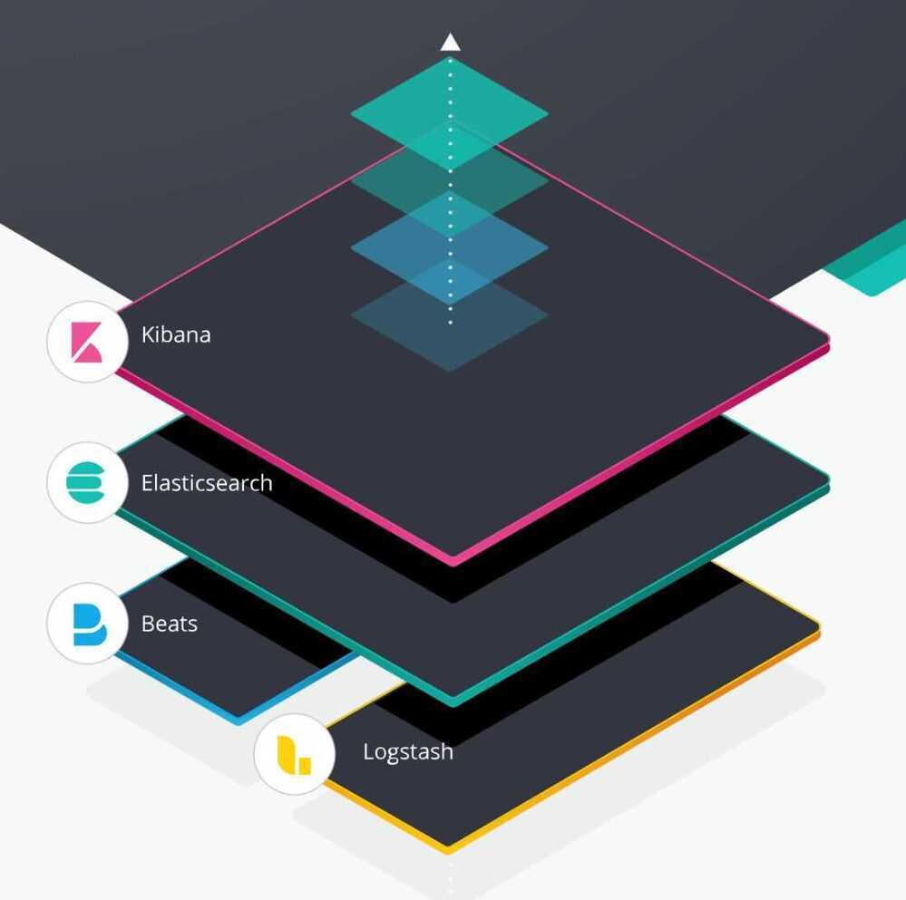

# ELK/EFK Stack /Elastic Stack / ElasticSearch

## ELK stands for Elasticsearch - Logstash - Kibana

## Elasticsearch

- Elasticsearch is a search and analytics engine.
- Elasticsearch is a NoSQL database that is based on the Lucene search engine.
- Elasticsearch uses Apache Lucene to index documents for fast searching.

## Solr, ElasticSearch

- Search platform
- Highly available
- Very scalable
- Fault tolerant search platform
- Provides full-text search

## Logstash

Logstash is a server‑side data processing pipeline that ingests data from multiple sources simultaneously, transforms it, and then sends it to a "stash" like Elasticsearch.

Logstash is a log pipeline tool that accepts inputs from various sources, executes different transformations, and exports the data to various targets.

## S3 output plugin

https://www.elastic.co/guide/en/logstash/current/plugins-outputs-s3.html

## Kibana

Kibana lets users visualize data with charts and graphs in Elasticsearch.

Kibana is a visualization layer that works on top of Elasticsearch.

kibana.example.com/status - to show all status of plugins and elasticsearch

Together, these three different open source products are most commonly used in log analysis in IT environments (though there are many more use cases for the ELK Stack starting including business intelligence, security and compliance, and web analytics). Logstash collects and parses logs, and then Elasticsearch indexes and stores the information. Kibana then presents the data in visualizations that provide actionable insights into one's environment.

## Lumberjack Protocol

https://logz.io/blog/filebeat-vs-logstash

## References

- https://www.elastic.co/elk-stack
- https://qbox.io/blog/elasticsearch-logstash-kibana-apache-logs
- [Elasticsearch Course for Beginners - YouTube](https://www.youtube.com/watch?v=a4HBKEda_F8)
