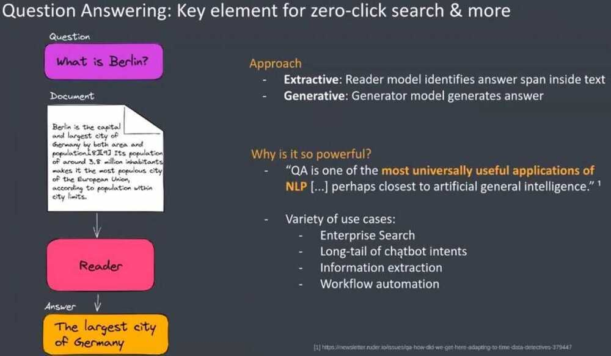

# Full Text Searches

- Ignoring "stop words" such as "a", 'the', 'and'
- Stemming words, so that 'pony' and 'ponies' are considered similar
- Weighting words absed on different criteria such as how frequently they appear in the text, or the importance of the fields, such as the title or keywords, that they appear in.

## Entity vs. attribute

In search, an entity iswhat you search for, and an attribute iswhat you search it by. This can get confusing, as a search term can be both simultaneously. Sticking with the previous example, you can look for the Song entity by the attributes 'name' and 'artist'. But you can also look for the Artist entity by the attributes 'artist name' and 'songs'.

Typically, an entity will correspond to a table in your database, and the attributes will correspond with the fields of that table.

## Document-based search solutions

1. Elastic
2. Solr
3. vespa

## Faceted Search

Faceted searchis a technique that involves augmenting traditional search techniques with a faceted navigation system, allowing users to narrow down search results by applying multiple filters based on [faceted classification](https://en.wikipedia.org/wiki/Faceted_classification) of the items.A faceted classification system classifies each information element along multiple explicit dimensions, called facets, enabling the classifications to be accessed and ordered in multiple ways rather than in a single, pre-determined, [taxonomic](https://en.wikipedia.org/wiki/Taxonomy_(general)) order.

Facets correspond to properties of the information elements. They are often derived by analysis of the text of an item using [entity extraction](https://en.wikipedia.org/wiki/Entity_extraction) techniques or from pre-existing fields in a database such as author, descriptor, language, and format. Thus, existing web-pages, product descriptions or online collections of articles can be augmented with navigational facets.

https://en.wikipedia.org/wiki/Faceted_search

https://www.enterprisedb.com/postgres-tutorials/how-implement-faceted-search-django-and-postgresql

https://django-haystack.readthedocs.io/en/v2.4.1/faceting.html

## Omni Search

### Searchable entities

The first thing you need in order to build your omni-search, is to map the entities users might be searching for. Remember: it's not what they search it by - just what they'd like to find.

You might not be sure what's considered 'an entity'. For example, on Google Drive, you can search for PDFs, Sheets, or Docs. Are these different entities? While there's a technical discussion I won't get into, as a rule of thumb, if all candidates share the same attributes (e.g. doc name, creator, date...) - then it can be considered the same entity with a 'type' attribute.

### Searchable attributes

Once you've selected the entities to be searched, let's select the attributes that the users can search by. Don't be tempted to use all available attributes - this will slow performance and produce bad results. Instead, only use the attributes your users are likely to use. If you're not sure, guess, and then go back after the release and see what your users have tried searching by.

Example: on Spotify, each artist has an 'about' attribute, which you can see after you've clicked on the artist (all the way on the bottom). However, if you tried copy-pasting that 'about' text to the omni-search, you won't find the artist, because Spotify doesn't search artists by the 'about' attribute, which makes sense: it's unlikely anyone will try searching by it, in any reasonable use-case.

### Search behavior

There are a few other parameters you need to define in your search:

### Substring location

Let's take The Chainsmokers. Which of these search terms do you think should find them: 'the chain', 'chain', or 'smokers'?

If you guessed all three, then you're right. But that's not always the case. Let's try to look for the Medium publicationNoteworthy.You'll find it if you search for 'notew', but not if you look for 'worthy'.

This has a lot to do with how the data is being indexed, and there are three main options to choose from:

1. start of string (e.g. 'the chain')
2. start of each word (e.g. 'chains')
3. all substrings (e.g. 'smokers', or 'ainsmoke')

Again, more is not always better. Pick the one most suited to what your users are likely to search.

## Strict vs. fuzzy search

Users make mistakes. They might type in "the chansmokers", leaving out the 'i', either due to a typo or miss-spelling. A fuzzy search will catch that. Too fuzzy of a search will also catch a lot of garbage results.

## Start of search

Most searches don't show results until you type in at least 2--3 letters.

## Debounce

We type quickly. You don't want each keystroke to start a new search, because that would seem jumpy to the user. You commonly wait 0.1s or so after the keystroke (don't hold me to that number), to make sure the user stopped typing.

## capitalization

Not much to say about this. 99% of searches should be caseinsensitive.

## Scores and weights

This part is a bit complicated, and can fill an entire post on its own, but I'll try to explain the gist of it:

In very simple searches, the search term is either found, or not found. 1 or 0. With more modern search tools (Elasticsearch being the most popular), each result gets a score, based on the location of the substring, accuracy, and a few other parameters.

To add to that, it's possible to put weights on those scores. Say you search for a song by both track name and artist. The term 'young' can find Young Folks by Peter, Bjorn and John, and it can also find Heart of Gold by Neil Young. However, when looking for songs, it makes sense to give more weight to the name of the song than to the artist (and of course, vice-versa when you're looking for artists).

Showing results

Here's when the fun starts! Results can be shown in 3 basic formats:

- quick preview - a popup showing around 10 top results
- result summary - a full page showing the main results for each entity
- all results - all of the results of a specific entity

https://uxdesign.cc/designing-an-omni-search-29c6cb6ec3f7

## Zero Click Search

- Direct answers in the search results, and users doesn't have to click further links

## Transformers

https://github.com/deepset-ai/haystack

## Tools

https://www.algolia.com
