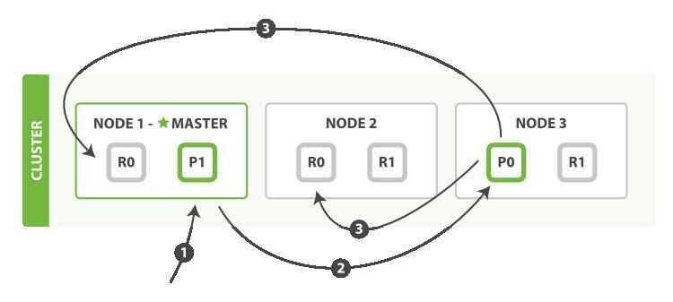
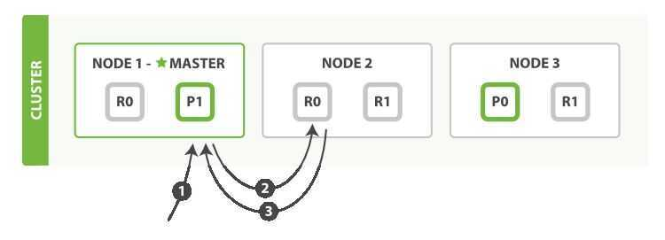
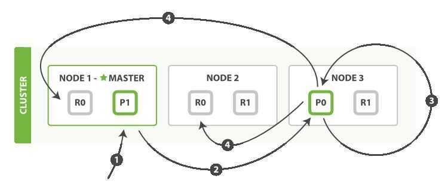
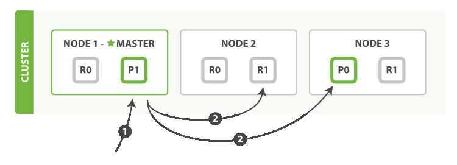

# Internal Working

Here is the sequence of steps necessary to successfully create, index, or delete a document on both the primary and any replica shards:

1. The client sends a create, index, or delete request to Node 1.
2. The node uses the document's `_id` to determine that the document belongs to shard0. It forwards the request to Node 3, where the primary copy of shard0is currently allocated.
3. Node 3 executes the request on the primary shard. If it is successful, it forwards the request in parallel to the replica shards onNode 1 and Node 2. Once all of the replica shards report success, Node 3 reports success to the coordinating node, which reports success to the client.

By the time the client receives a successful response, the document change has been executed on the primary shard and on all replica shards. Your change is safe.

Here is the sequence of steps to retrieve a document from either a primary or replica shard:

1. The client sends a get request to Node 1.
2. The node uses the document's `_id` to determine that the document belongs to shard0. Copies of shard0exist on all three nodes. On this occasion, it forwards the request to Node 2.
3. Node 2 returns the document to Node 1, which returns the document to the client.

Here is the sequence of steps used to perform a partial update on a document:

1. The client sends an update request to Node 1.

2. It forwards the request to Node 3, where the primary shard is allocated.

3. Node 3 retrieves the document from the primary shard, changes the JSON in the `_source` field, and tries to reindex the document on the primary shard. If the document has already been changed by another process, it retries step 3 up to retry_on_conflict times, before giving up.

4. If Node 3 has managed to update the document successfully, it forwards the new version of the document in parallel to the replica shards on Node 1 and Node 2 to be reindexed. Once all replica shards report success, Node 3 reports success to the coordinating node, which reports success to the client.

Here is the sequence of steps necessary to retrieve multiple documents with a single mget request:

1. The client sends an `mget` request to Node 1.
2. Node 1 builds a multi-get request per shard, and forwards these requests in parallel to the nodes hosting each required primary or replica shard. Once all replies have been received, Node 1 builds the response and returns it to the client.

The sequence of steps followed by the bulkAPI are as follows:

1. The client sends a bulk request to Node 1.

2. Node 1 builds a bulk request per shard, and forwards these requests in parallel to the nodes hosting each involved primary shard.

3. The primary shard executes each action serially, one after another. As each action succeeds, the primary forwards the new document (or deletion) to its replica shards in parallel, and then moves on to the next action. Once all replica shards report success for all actions, the node reports success to the coordinating node, which collates the responses and returns them to the client.

## Links

- [Inverted Index](databases/indexing/inverted-index.md)
