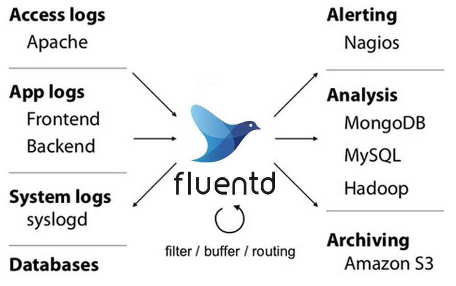

# Others

## Heartbeat

Heartbeat is a lightweight daemon that you install on a remote server to periodically check the status of your services and determine whether they are available. Unlike [Metricbeat](https://www.elastic.co/guide/en/beats/metricbeat/7.1/index.html), which only tells you if your servers are up or down, Heartbeat tells you whether your services are reachable.

https://www.elastic.co/guide/en/beats/heartbeat/current/heartbeat-overview.html

## FluentBit

Fluent Bit is an open source and multi-platformLog Processor and Forwarderwhich allows you to collect data/logs from different sources, unify and send them to multiple destinations. It's fully compatible with Docker and [Kubernetes](https://fluentbit.io/kubernetes/) environments.

Fluent Bit is written inC, have a pluggable architecture supporting around 30 extensions. It's fast and lightweight and provide the required security for network operations through TLS.

https://fluentbit.io

https://github.com/fluent/fluent-bit

## Fluentd

Fluentd is an open source data collector for unified logging layer.

- **Unified Logging with JSON**

Fluentd tries to structure data as JSON as much as possible: this allows Fluentd tounifyall facets of processing log data: collecting, filtering, buffering, and outputting logs acrossmultiple sources and destinations([Unified Logging Layer](http://www.fluentd.org/blog/unified-logging-layer)). The downstream data processing is much easier with JSON, since it has enough structure to be accessible while retaining flexible schemas.

- **Pluggable Architecture**

Fluentd has a flexible plugin system that allows the community to extend its functionality. Our 500+ community-contributed plugins connect dozens of [data sources](https://www.fluentd.org/datasources) and [data outputs](https://www.fluentd.org/dataoutputs). By leveraging the plugins, you can start making better use of your logs right away.

- **Minimum Resources Required**

Fluentd is written in a combination of C language and Ruby, and requires very little system resource. The vanilla instance runs on 30-40MB of memory and can process 13,000 events/second/core. If you have tighter memory requirements (-450kb), check out [Fluent Bit](http://fluentbit.io/), the lightweight forwarder for Fluentd.

- **Built-in Reliability**

Fluentd supports memory- and file-based buffering to prevent inter-node data loss. Fluentd also supports robust failover and can be set up for high availability.[2,000+ data-driven companies](https://www.fluentd.org/testimonials) rely on Fluentd to differentiate their products and services through a better use and understanding of their log data.

An event consists of *tag*, *time* and*record*. Tag is a string separated with '.' (e.g. myapp.access). It is used to categorize events. Time is a UNIX time recorded at occurrence of an event. Record is a JSON object.

https://www.fluentd.org

https://github.com/fluent/fluentd

https://www.youtube.com/watch?v=Gp0-7oVOtPw&ab_channel=ThatDevOpsGuy

## Splunk

Splunk is a software technology which is used for monitoring, searching, analyzing and visualizing the machine generated data in real time. It can monitor and read different type of log files and stores data as events in indexers. This tool allows you to visualize data in various forms of dashboards.

https://www.guru99.com/splunk-tutorial.html

## Eland

Eland is a Python Elasticsearch client for exploring and analyzing data residing in Elasticsearch with a familiar Pandas-compatible API.

Where possible the package uses existing Python APIs and data structures to make it easy to switch between numpy, pandas, scikit-learn to their Elasticsearch powered equivalents. In general, the data resides in Elasticsearch and not in memory, which allows Eland to access large datasets stored in Elasticsearch.

https://towardsdatascience.com/elasticsearch-for-data-science-just-got-way-easier-95912d724636

https://github.com/elastic/eland

## APM

Application Performance Monitoring (APM) collects in-depth performance metrics and errors from inside your application. It allows you to monitor the performance of thousands of applications in real time.

## Flask

Please note that errors and transactions will only be sent to the APM Server if your app isnotin [debug mode](http://flask.pocoo.org/docs/0.12/quickstart/#debug-mode).

https://www.elastic.co/guide/en/apm/agent/python/current/flask-support.html

https://toptechtips.github.io/2019-07-08-add_python_code_to_apm

## Opensearch

https://github.com/opensearch-project/OpenSearch
