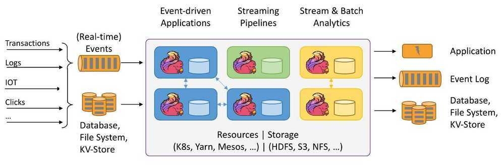

# Internals

## Apache Flink- Stateful Computations over Data Streams

Apache Flink is a framework and distributed processing engine for stateful computations over *unbounded and bounded* data streams. Flink has been designed to run in *all common cluster environments*, perform computations at *in-memory speed* and at *any scale*.

Streaming dataflow engine for Java

## TaskManager Memory

[Set up TaskManager Memory \| Apache Flink](https://nightlies.apache.org/flink/flink-docs-master/docs/deployment/memory/mem_setup_tm/)

The TaskManager runs user code in Flink. Configuring memory usage for your needs can greatly reduce Flink’s resource footprint and improve Job stability.

### Detailed Memory Model

## Uber - IngestionNext

At the data plane, events **arrive in Apache Kafka® and are consumed by Flink jobs.** These jobs **write to the data lake in Apache Hudi™ format**, providing transactional commits, rollbacks, and time travel. Freshness and completeness are measured end-to-end, from source to sink.

Managing ingestion at scale requires automation. We designed a control plane that handles the job life cycle (create, deploy, restart, stop, delete), configuration changes, and health verification. This enables operating ingestion across thousands of datasets consistently and safely.

The system is also designed with regional failover and fallback strategies to maintain availability. In the event of outages, ingestion jobs can shift across regions or temporarily run in batch mode, ensuring continuity and no data loss.
