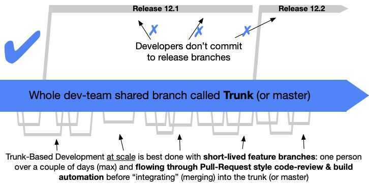
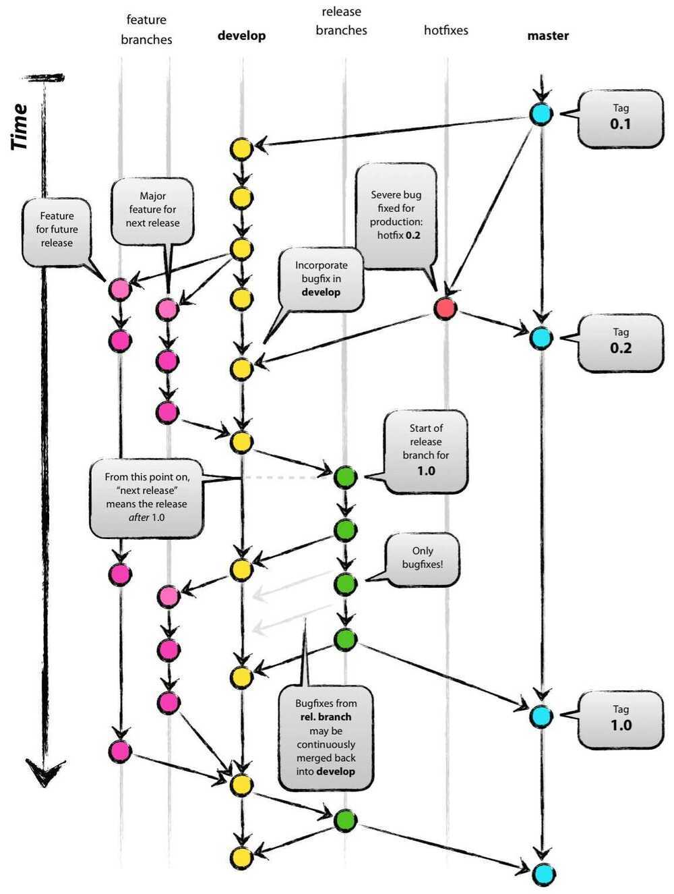

# Branching Strategies

Note: Up until the first public release of a product, it absolutely makes sense to commit all changes directly to the main branch - even if you are a Git flow advocate - for the sake of the speed and simplicity of the development workflow. Since there's no production yet, there's no possibility of a production bug that the team needs to fix ASAP. Doing all the branching magic that classic Git flow implies is therefore overkill at this stage

Everything in dev can be merged to master (if it can't it's a good candidate to break the repository)

## Github Flow

- Code in master is deployable at all times.
- When you want to start working on a new task, create a new branch off of master and give it a descriptive name.
- Commit to that branch locally and regularly send your work to the same-named branch on the server.
- Open a pull request when you feel your changes are ready to be merged (or even if you aren't so sure, but would like some feedback).
- After the new feature is revised and approved, you can merge it into master.
- Once your changes are merged and pushed to the master, you can andshoulddeploy immediately.

## Git Flow and Trunk Based development

<https://www.toptal.com/software/trunk-based-development-git-flow>

<https://martinfowler.com/articles/branching-patterns.html>

## Trunk based development

only a single branch (called trunk) everyone commits to it. Making sure they commit at least once in 24 hours. (Trunk means main development branch)

A source-control branching model, where developers collaborate on code in a single branch called 'trunk' *, resist any pressure to create other long-lived development branches by employing documented techniques. They therefore avoid merge hell, do not break the build, and live happily ever after.




## Git Flow - feature branches (can cause long running branches which can be hard to merge)

GitHub flow, is supposed to be a very lightweight branching strategy for Git. You can't say the same about GitFlow. It lies on the opposite end of the spectrum, being a more **heavy-weight process**. So, how does GitFlow work?

In short, **GitFlow relies on two long-lived branches and some short-lived ones**. The permanent ones are good old master and the new kid on the block, "development." The state of "master" should always be pristine; it reflects the last "good," stable version that's in production.

"Development," on the other hand, is always potentially unstable. This is the branch where, well, development happens. And how does it happen? By the use of the supporting branches, which can fall into one of the three following categories:

- Feature branches
- Release branches
- Hotfix branches

## Feature Branches

Feature branches are the ones developers create to work on new features. They should always branch off "development." After the feature is complete, the developer should merge the feature back to master.

The next type of supporting branch is the release branch.

## Release Branches

These branches allow forpreparation of a new release. And besides that, they enable the developer to perform minor bug fixes and to prepare metadata for the release. Since this work is being done in a separate branch, the development branch is free to receive features intended for the next release.

When the release branch gets stable enough to become a release, it should be merged into master. Then, the commit on master should be tagged, with the correct version numbers, so it can be easily accessed in the future.

Finally, it's time to cover hotfix branches.

## Hotfix Branches

Hotfix branches are also meant to prepare for a release in production. The difference, though, is that this time the release wasn't planned. Instead, it's due to necessity: a critical bug in production that must be dealt with swiftly.

The idea is that work on new features can continue as usual while, at the same time, someone is preparing a fix for the critical production problem.

Hotfix branches should be created from master since that branch reflects the last desirable state of the application in production. While the fix is done and ready to go, the branch should be merged to master. But don't just merge it to master: it's also vital that it's merged to "develop" because the feature releases will need those corrections as well.



## Enhanced Git Flow

**Master or single flow problems**

If there's a critical bug in production that needs to be fixed immediately, it would be a major disaster for the development team to have to roll back all the work accrued in the main branch thus far just to deploy the fix. And deploying code without proper testing-whether the code is considered half-baked or well-developed-is clearly not an option.

That's where branching models shine, including Git flow. Any sophisticated branching model should answer questions regarding how to **isolate** the next release from the version of the system currently used by people, how to **update** that version with the next release, and how to**introduce hotfixes** of any critical bugs to the current version.

The Git flow process addresses these fundamental scenarios by separating "main" (the production or "current version" branch) and "develop" (the development or "next release" branch) and providing all the rules about using feature/release/hotfix branches. It effectively solves a lot of headaches from the development workflows of release-based products.

But even with projects well-suited to the classic Git flow model, I've suffered the typical problems it can bring:

- Git flow is complex, with two long-lived branches, three types of temporary branches, and strict rules on how branches deal with each other. Such complexity makes mistakes more likely and increases the effort required to fix them.
- Release and hotfix branches require "double merging"-once into main, then into develop. At times you can forget to do both. You can make Git flow branching easier with scripts or VCS GUI client plugins, but you have to set them up first for every machine of every developer involved in a given project.
- In CI/CD workflows, you usually end up with two final builds for a release - one from the latest commit of the release branch itself and another one from the merge commit to main. Strictly speaking, you should use the one from the main, but the two are usually identical, creating the potential for confusion.

<https://www.toptal.com/gitflow/enhanced-git-flow-explained>

## The Forking WorkFlow

Under the forking workflow, each developer has two Git repositories: a local one and a server-side one. If you're used to contributing to open-source software projects, you're probably aware of this branching strategy.

The forking workflow presents the benefit that developers' contributions can be integrated without the need for a single central repository. Developers can push to their own server-side repositories. The project maintainer can then push to the official repository That way, the maintainer can accept commits from any developer but doesn't have to grant them write access to the official repository.

To start working under the forking workflow, a developer would typically fork the "true" repository in order to create a copy of it on the server. This copy serves as their personal public repository - no one can push to it, but they can pull changes from it. After their server-side copy is created, the developer can then perform "Git clone" to get a local copy of their online copy of the original repository.

When developers want to publish a local commit, they push the commit to their ownrepository instead of the official/original one. Then, they submit a pull request to the repository, which lets the project maintainer know that an update is coming their way. The pull request can also serve as discussion thread if there are problems with the contributed code.

## Tips

- Start as simple as possible. Advance to more sophisticated approaches when the need emerges, but not before that.
- Consider picking a strategy that reduces the different "types" of branches available for developers to choose from.
- Consider using [feature flagging](https://rollout.io/blog/the-future-of-feature-flags-lies-in-infrastructure-as-code/), which can also reduce some of the need people have for excessive branching.

## References

<https://nvie.com/posts/a-successful-git-branching-model>

<https://jeffkreeftmeijer.com/git-flow>

<https://github.com/nvie/gitflow>

<https://github.com/danielkummer/git-flow-cheatsheet>

<https://danielkummer.github.io/git-flow-cheatsheet>

[**https://rollout.io/blog/branching-strategy/**](https://rollout.io/blog/branching-strategy/)

## Workflow: Topic Branches

A topic branch is a branch that we create and use for work on a feature.

Ex -

```bash
git checkout -b iss14
# checkout as a new branch "iss14"

# fix the issue

# after fixing the issue
git checkout master
git merge iss14

# merge the fix

# delete the branch
git branch -d iss14
```
