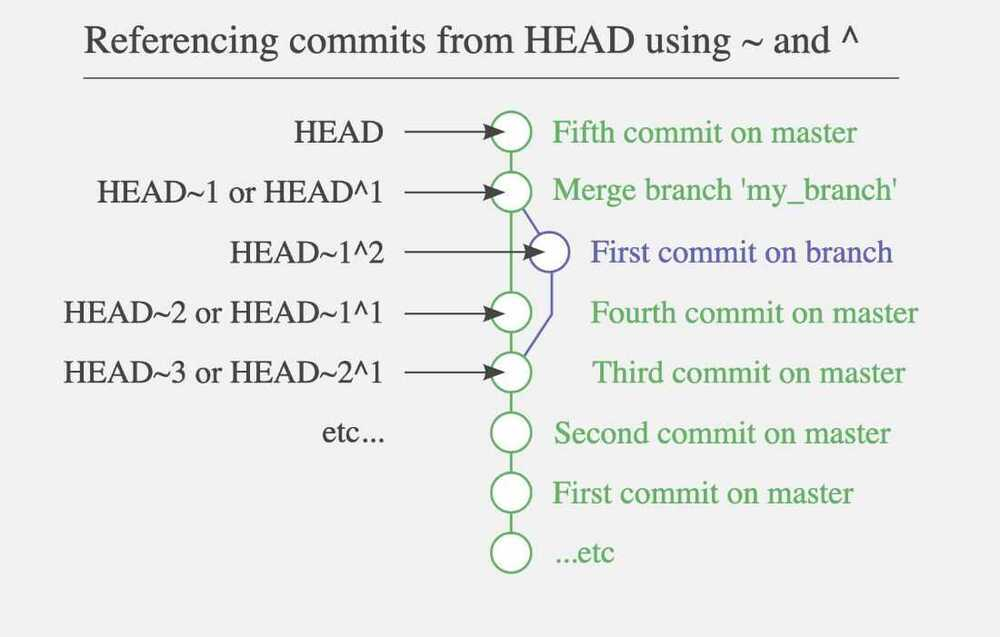

# Commands

## Shortcuts

```bash
ggpull
ggpush
gst
```

<https://github.com/ohmyzsh/ohmyzsh/blob/master/plugins/git/git.plugin.zsh>

## git clone without history

```bash
git clone --depth 1 reponame.git
git clone --depth=1 --branch=master git://someserver/somerepo dirformynewrepo
<https://stackoverflow.com/questions/30001304/clone-git-repository-without-history/30001366>
Clone all repo in organization - <https://gist.github.com/potter0815/42dda83fa1709693be36>
```

## Git add origin

```bash
git remote add origin <https://github.com/deepaksood619/DjangoDemoApplication.git>
git push -u origin master
git remote set-url origin git@gitlab.com:example-datascience/decision-engine.git (change remote repository origin)
git remote rm destination
git push -u origin --all (for pushing old repo to new place)
```

## Git Config

```bash
git config --global user.name (seeing the current set username globally)
git config user.email (seeing the set username for current project)
git config --global user.name "deepaksood619" (set username globally)
git config --global core.editor "vim" (Change git editor)
```

## Create alias for a command

```bash
git config --global alias.a "add ."
git config --global alias.c "f"
```

## Git reset osX credentials in keychain

```bash
git config --local credential.helper ""
git config --local credential.helper osxkeychain
git credential-osxkeychain erase host=github.com protocol=https (press return)
```

## Allow unrelated histories

```bash
git pull --allow-unrelated-histories
git pull origin master --allow-unrelated-histories
```

## Branches

```bash
git branch (Show all branches)
git branch -v (verify remote branch)
git branch -a (show all branches)
git branch --delete <branch>
git branch -d <branch> # Shorter version
git branch -D <branch> # Force delete un-merged branches
git branch --remote (check remote branches)
git branch | grep -v "master" | xargs git branch -D (Delete all branches except master locally)
git branch --merged origin/master | xargs git branch -d (Remove all local branches that are not in master (merged on master))

Create and checkout a branch
    git checkout -b bugFix
    git checkout [branch_name] (Checkout existing branch)

Checkout remote branch in local
    git checkout -b bugFix -t origin/bugFix
    git checkout -t origin/bugFix (shorthand)
    git checkout --track origin/issuefix

    git branch -u origin/dev (track remote branch after checkout)

Delete branch from remote
    git push -d <remote-name> <branch-name>
    Ex - git push -d origin master
    git push origin --delete dev

Git show all branches with author
    git for-each-ref --format='%(committerdate) %09 %(authorname) %09 %(refname)' | sort -k5n -k2M -k3n -k4n

Update a branch with master
    git checkout master
    git pull
    git checkout branch_name
    git rebase master

Create and push new branch
    git checkout -b my_branch
    git commit -m "some work done"
    git push -u origin my_branch

    # error: src refspec remotes/origin/decision_engine_monika matches more than one
    git push origin HEAD:remotes/origin/decision_engine_monika
```

## Delete untracked files

```bash
git clean [-f] (delete untracked files in current directory)
git clean -f -d (remove untracked directories)
git clean -f -i (clean the working directory interactively)
-n (to dry-run the operation and display the results without actually deleting anything)
```

## Delete all files expect `.git`

```bash
# Resetting the index is cheap, so
git rm -rf .
git clean -fxd

# Then you can reset the index (with git reset) or go straight on to checking out a new branch.
```

## Undo all unstaged local changes

```bash
git checkout .
git checkout origin/master filepath #revert a file to origin/master after commiting the file
```

## Checkout specific file from specific commit

```bash
git checkout c5f567 -- file1/to/restore file2/to/restore
```

## Stage all files

`git add .`

## Git unstage a file

`git reset <filepath>` - will **unstage** any staged changes for the given file(s). **makes git stop tracking the file completely**.

`git rm --cached <filepath>` - **does not unstage** a file, it actually **stages the removal of the file(s)** from the repo (assuming it was already committed before) but leaves the file in your working tree (leaving you with an untracked file). **unstages any modifications made to the file since the last commit**(but doesn't revert them in the filesystem, contrary to what the command name might suggest**). The file remains under revision control.

if you used `git rm --cached` on a new file that is staged, it would basically look like you had just unstaged it since it had never been committed before.

### This will tell git you want to start ignoring the changes to the file

`git update-index --assume-unchanged path/to/file`

### When you want to start keeping track again

`git update-index --no-assume-unchanged path/to/file`

## Gitlab revert/reset

```bash
1. unprotect the branch
2. git reset cba55c24dfe8fe96ae3abe6b38888bd12bb97980 (the commit you want to go to)
3. git reset --hard
4. git push -f origin master
```

<https://dev.to/neshaz/when-to-use-git-reset-git-revert--git-checkout-18je>

## Revert

- Rollback changes you have committed.
- Creates a new commit from a specified commit by inverting it. Hence, adds a new commit history to the project, but it does not modify the existing one.
- Has the potential to overwrite files in the working directory.

`git revert HEAD~1`

<https://git-scm.com/docs/git-revert>

## Reset

- Use this to return the entire working tree to the last committed state.This will discard commits in a private branch or throw away uncommitted changes!
- Changes which commit a branch HEAD is currently pointing at. It alters the existing commit history.
- Can be used tounstagea file.

## Reset head

This will discard commits in a private branch or throw away uncommitted changes

```bash
git reset --hard [HEAD]
git reset .
git reset HEAD~ (revert a last commit with changes shown)
git reset HEAD~ --hard (Revert a last commit with all changes removed)
```

**Tilde vs Caret**

- Use `~` most of the time - to go back a number of generations, usually what you want
- Use `^` on merge commits - because they have two or more (immediate) parents

**Mnemonics:**

- Tilde `~` is almost linear in appearance and wants to go backward in a straight line
- Caret `^` suggests an interesting segment of a tree or a fork in the road



<https://stackoverflow.com/questions/2221658/whats-the-difference-between-head-and-head-in-git>

<http://www.paulboxley.com/blog/2011/06/git-caret-and-tilde>

**Move to forward commit**

`git reset 'HEAD@{1}'`

## Git Merge

```bash
git checkout --theirs path/to/file # accept their changes in conflict state
git checkout --theirs .
git merge --abort
git reset --hard HEAD
git reset HEAD~1
```

## git Reflog

reflog is a local record of all commits referenced in your repository, and can be seen as a "safety net", useful for recovering lost commits.

Show histories of references

## Git request-pull

Prints in the standard output a report asking the upstream project to pull changes into their tree.

## Git merge-base

Finds best common ancestor(s) between two commits to use in a three-way merge.

## Logs

```bash
git log --abbrev-commit -- preety=oneline (get abbreviated commit hash)
git log --pretty=format:"%h %s" --graph (show commit history as a graph)
git log --graph
git log --oneline
git log --oneline --graph
[A DOG] git log --all --decorate --oneline --graph
```


## Move the last commit to a new branch

If you commit to the current branch when instead you wanted to commit to a new branch, you can easily correct your mistake.

For example if you made your commit to master instead of test:

```bash
# create new branch from current HEAD but stays on master
$ git branch test

# reset master to before last commit
$ git reset --hard HEAD~

# continue on new branch
$ git checkout test

```

## Rewrite or rename the last commit message (Change the last commit message)

```bash
git commit --amend
git commit --amend --signoff # Add DCO (contributing)
git commit --amend --reuse-message HEAD
```

## Add a forgotten file after a commit

```bash
git add forgotten_file
git commit --amend
```

## Squashing Commits

If you contribute to an open source project, e.g. by submitting a pull request with a bug fix, it should be presented as one unit of code.

You should **squash** your commits together. For example, if you have three commits:

```bash
git reset HEAD~3
git add .
git commit -am "Fix bug #14"
git push --force
```

The --force option is needed if the commits have already been pushed, in order for them to be replaced. **Beware** that this overwrites previous history so always avoid when possible

## Reverting The Working Copy to an Older Commit

```bash
# Resets index to former commit; replace '56e05fced' with your commit code
git reset 56e05fced
# Moves pointer back to previous HEAD
git reset --soft HEAD@{1}
git commit -m "Revert to 56e05fced"
# Updates working copy to reflect the new commit
git reset --hard
```

## Git stashing

```bash
git-stash - Stash the changes in a dirty working directory away

git stash --all #stashes all files, including untracked and ignored files.

git stash list [<options>]
git stash show [<stash>]
git stash drop [-q|--quiet] [<stash>]
git stash ( pop | apply ) [--index] [-q|--quiet] [<stash>]
git stash branch <branchname> [<stash>]
git stash [push [-p|--patch] [-k|--[no-]keep-index] [-q|--quiet]
        [-u|--include-untracked] [-a|--all] [-m|--message <message>]]
        [--] [<pathspec>…​]]
git stash clear
git stash create [<message>]
git stash store [-m|--message <message>] [-q|--quiet] <commit>

Git stash apply stash@{1}
Git stash drop stash@{1}

# push specific file to stash
git stash push -m test alert_driver/alertdriver.py

```

## Git add a file forcefully (overriding the file in .gitignore)

`git add -f assets/debug.apk`

## Submodules

```bash
git submodule update --recursive --remote (1.8.2)
git submodule update --recursive (1.7.3)
git pull --recurse-submodules

# Submodules init and update recursively
    git submodule update --init -recursive
    git submodule update --recursive

# Adding submodule to a repository
    git submodule add http://github.com/submodule

# git submodule reset
git submodule update -f --recursive
```

## Find a string in git repo

```bash
git grep "the magic string"
git show-ref --heads'
```

## Checkout

- Use this to move the [HEAD pointer](https://kolosek.com/git-branches/) to a specific commit orswitchbetween branches.
- Itrollbacksany content changes to those of the specific commit.
- This willnotmake changes to the commit history.
- Has potential tooverwritefiles in the working directory.

```bash
# git command to switch between two branches w\ passing the branch name:
git switch -
```

## Cleanup branches

### Prune origin (remove all branches that are merged)

`git remote prune origin`

### Delete merged branches from remote

`git branch -r --merged | egrep -v "(^*|master|dev)" | sed 's/origin///' | xargs -n 1 git push origin --delete`

<https://nickymeuleman.netlify.app/blog/delete-git-branches>

## Cleaning git history, commits, branches

```bash
java -jar ~/Downloads/office/bfg-1.13.0.jar --strip-blobs-bigger-than 1M .
java -jar ~/Downloads/office/bfg-1.13.0.jar --strip-blobs-bigger-than 128K .

git reflog expire --expire=now --all && git gc --prune=now --aggressive
git gc --aggressive --prune=all

# unprotect the branch in gitlab first
git push --force origin master

# brew install coreutils
# This shell script displays all blob objects in the repository, sorted from smallest to largest.
git rev-list --objects --all \
| git cat-file --batch-check='%(objecttype) %(objectname) %(objectsize) %(rest)' \
| sed -n 's/^blob //p' \
| sort --numeric-sort --key=2 \
| cut -c 1-12,41- \
| $(command -v gnumfmt || echo numfmt) --field=2 --to=iec-i --suffix=B --padding=7 --round=nearest
```

<https://passingcuriosity.com/2017/truncating-git-history>

[**https://github.com/newren/git-filter-repo**](https://github.com/newren/git-filter-repo)

`brew install git-filter-repo`

### Rewrite history of entire branch (git-filter-branch)

One common use case for this is removing sensitive data (e.g. login credentials for production systems) that were committed to a public repository.

```bash
# Manual
man git-filter-branch

git filter-branch --force --index-filter
'git rm --cached --ignore-unmatch k8s/secrets.txt'
--prune-empty --tag-name-filter cat -- --all

git push --force
```

This will remove the filesecrets.txt from every branch and tag. It will also remove any commits that would be empty as a result of the above operation. Keep in mind that this will rewrite your project's entire history, which can be very disruptive in a distributed workflow. Also while the file in question has now been removed, the credentials it contained should still be considered compromised!

<https://github.com/newren/git-filter-repo> (filter-branch replacement)

## git cherry-pick

```bash
git cherry-pick <hash>
git cherry-pick --skip
git cherry-pick --abort
```

## git commit case-sensitive filename changes

`git mv -f OldFileNameCase newfilenamecase`

## Git ignore already tracked files

- `git update-index --skip-worktree`

    `--skip-worktree` is the flag which means the files should change locally

    That is, Use the command when you want to modify files managed by Git locally (or updated automatically) but you do not want Git to manage that change.

    Because the command is to prevent local changes from being managed by Git,we will use the command in most cases.

    ```bash
    $ git update-index --skip-worktree path/to/file # Exclude from the management of Git

    $ git ls-files -v | grep ^S # Confirming
        git ls-files shows all files managed by git.
        -v check the file being ignored.
        --skip-worktree is displayed withS.

    $ git update-index --no-skip-worktree path/to/file # Restore to the management of Git
    ```

- `git update-index --assume-unchanged`

    `--assume-unchanged` is the flag which means the files should not change locally

    In other words, it is used whenignore files that you do not need to change locally (or should not change).

    --assume-unchanged is used when you want to speed up Git's behavior by ignoring unnecessary files.

    Also, since it is an idea to ignore local changes,git reset - hardcommand will delete local changes.

    ```bash
    $ git update-index --assume-unchanged path/to/file # Exclude from the management of Git
    $ git ls-files -v | grep ^h # Confirming
        assume-unchanged is displayed with h

    $ git update-index --no-assume-unchanged path/to/file # Restore to the management of Git
    ```

## Analytics

```bash
git shortlog -sn
git shortlog -sn --no-merges
https://github.com/IonicaBizau/git-stats

git ls-files | xargs wc -l #git count number of lines

https://www.gitclear.com/measuring_developer_productivity_a_comprehensive_guide_for_the_data_driven

brew install cloc (count lines of code)
    cloc --vcs=git
```

### loc

loc is a tool for counting lines of code. It's a rust implementation of cloc, but it's more than 100x faster. There's another rust code counting tool called tokei, loc is ~2-10x faster than tokei, depending on how many files are being counted.

Counting just the dragonflybsd codebase (~9 million lines):

```bash
loc: 1.09 seconds
tokei: 5.3 seconds
cloc: 1 minute, 50 seconds

brew install loc

loc
```

[GitHub - cgag/loc: Count lines of code quickly.](https://github.com/cgag/loc)
