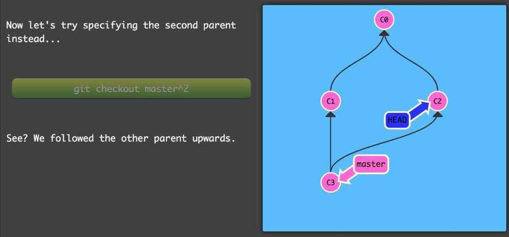
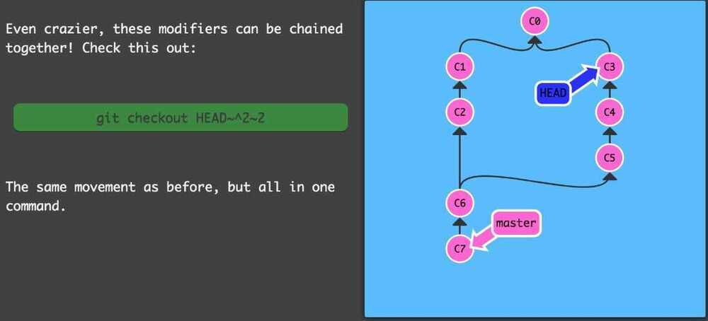

# Theory

## Learnings

- git is not made for handling huge number of images, it can bloat up .git directory
  - [How do I handle images in a Git repo?](https://stackoverflow.com/questions/5756324/how-do-i-handle-images-in-a-git-repo)
  - Keep images seperately in cdn and use links in repository. CDN must have basic trash for recovering accidently deleted images

## git submodule

Mounting one repository inside another.

A submodule is a repository embedded inside another repository. The submodule has its own history; the repository it is embedded in is called a superproject.

## git subtree

Git subtree is the most common replacement for Git submodule. A Git subtree is a replica of a Git repository that has been dragged into the main repository. A Git submodule is a reference to a particular commit in a different repository. Git subtrees, which were first introduced in Git 1.7.11, help you make a copy of any repo into a subdirectory of another.

```bash
git add .layouts/public -f
git commit -m "added docs"
git subtree push --prefix .layouts/public origin pages
```

### Advantages of Subtrees

- Supported by Git’s previous version. It supports versions older than 1.5 as well.
- Workflow management is simple.
- After the super-project is completed, there will be an available sub-project code.
- You don’t need newer Git knowledge.
- Content modification without the need for a different repo of the dependence.

### Disadvantages of Subtrees

- It’s not immediately obvious that a subtree is used to build the main repo.
- Your project’s subtrees are difficult to list.
- You can’t, at least not simply, list the subtrees’ remote repositories.
- When you change the main repository with subtree commits, then submit the subtree to its main server, and then pull the subtree, the logs can be a little misleading.

<https://www.geeksforgeeks.org/git-subtree>

<https://www.atlassian.com/git/tutorials/git-subtree>

<https://medium.com/@porteneuve/mastering-git-subtrees-943d29a798ec>

## Git Bisect

`git-bisect` - Use binary search to find the commit that introduced a bug

## git pull origin master from a different branch

This command directly fetch and merge the changes from origin to ECBC-master and than merges to the current branch. So we don't have to perform following steps-

- git pull
- git checkout master
- git pull (For fast forwarding the branch)
- git checkout form-validations
- git merge master

## Rebase

<https://dev.to/gonedark/a-closer-look-at-git-rebase>

Rebasing is the process of modifying the base commit from which series of commits stem

## Bringing a branch up to date

For some,git rebasefalls on themagicend of the spectrum for Git commands. Yet, if we break down the actions taken bygit rebasewe can understand the magic.

While atreeis the goto analogy when visualizing Git commands, I findvideo editingalso helps describegit rebase.

In the case of bringing astalebranch up to date, let's consider the following tree progression.


Starting with the full tree, we have astalebranch (in red) off amasterbranch. If we zoom in, we see the branch isstalebecause it's missing the recent commits frommaster(in blue).

When we run git rebase, it first will rewind both branches back to the first point when their commit history matches (in gray). From this point, git rebase will fast-forward through the commits on the master branch and apply them to the stale branch. Finally, git rebase replays the commits from the stale branch.

The resulting tree is as if you just created a new branch offmasterand made your commits. In doing so,git rebasefacilitates a clean merge.

Just remember to always git branch backupbefore you rebase. Then, after the rebase, you can git diff backup to make sure it went well. If something does go awry, you can just git reset --hard backup and start over.


## .git folder

```python
.
|-- COMMIT_EDITMSG
|-- FETCH_HEAD
|-- HEAD
|-- ORIG_HEAD
|-- branches
|-- config
|-- description
|-- hooks
| |-- applypatch-msg
| |-- commit-msg
| |-- post-commit
| |-- post-receive
| |-- post-update
| |-- pre-applypatch
| |-- pre-commit
| |-- pre-rebase
| |-- prepare-commit-msg
| |-- update
|-- index
|-- info
|  |-- exclude
|-- logs
| |-- HEAD
| |-- refs
|-- objects
|-- refs
    |-- heads
    |-- remotes
    |-- stash
    |-- tags
```

<https://git-scm.com/docs/gitrepository-layout>

## Git Merge Commit

git merge commit is used when two branches are added to master with interleaving commits. So doing git log shows all the commits in chronological order with different branches commit interleaved.

Doing git reset on a merge commit will roll back all the commits of that merge commit which are interleaved between other branches commit.

When there is no merge commit it's called **Fast Forward Merge.**

[Fast forward merge](https://kolosek.com/git-merge/#fastforwardmerge) is a type of merge that doesn't create a commit, instead, it updates the branch pointer to the last commit.

## Git is an event sourcing system

Event sourcing system have two components - current state of the systems and logs for the event that has happened. Replaying all the events from the logs can give any state of the system at any time.

Other example of event sourcing system is accounting systems.

## gitattributes

The .gitattributes file allows you to specify the files and paths attributes that should be used by git when performing git actions, such asgit commit, etc.

In other words git automatically saves the file according to the attributes specified, every time a file is created or saved.

One of these attributes is the eol (end of line) and is used to configure the line endings for a file. This article will now dive deeper into how to configure the line endings, so every developer uses the same value when using different machines / OSes across the repository.

## 7 Rules of great Git commit message

1. [Separate subject from body with a blank line](https://chris.beams.io/posts/git-commit/#separate)
2. [Limit the subject line to 50 characters](https://chris.beams.io/posts/git-commit/#limit-50)
3. [Capitalize the subject line](https://chris.beams.io/posts/git-commit/#capitalize)
4. [Do not end the subject line with a period](https://chris.beams.io/posts/git-commit/#end)
5. [Use the imperative mood in the subject line](https://chris.beams.io/posts/git-commit/#imperative)
6. [Wrap the body at 72 characters](https://chris.beams.io/posts/git-commit/#wrap-72)
7. [Use the body to explainwhatandwhyvs.how](https://chris.beams.io/posts/git-commit/#why-not-how)

## References

<https://kolosek.com/git-merge/#fastforwardmerge>

<https://dev.to/neshaz/git-merge-vs-git-rebase-5134>

<https://chris.beams.io/posts/git-commit/#seven-rules>

## Git Branches

Branches in Git are incredibly lightweight as well. They are simply pointers to a specific commit -- nothing more. This is why many Git enthusiasts chant the mantra:

branch early, and branch often

Because there is no storage / memory overhead with making many branches, it's easier to logically divide up your work than have big beefy branches.

When we start mixing branches and commits, we will see how these two features combine. For now though, just remember that a branch essentially says "I want to include the work of this commit and all parent commits."

```bash
git checkout -b bugFix
git branch -f three C2
git branch -f <branch_name> <where_to_move>
```

## Git Merging

The first method to combine work that we will examine isgit merge. Merging in Git creates a special commit that has two unique parents. A commit with two parents essentially means "I want to include all the work from this parent over here and this one over here,andthe set of all their parents."

1. **Checkout the branch where you want the commits to merge.**
2. **Use command git merge <branch_name> from where you want commits to merge to the branch**

```bash
git checkout -b bugFix
git commit
git checkout master
git commit
git merge bugFix
```

## Git Rebase

The second way of combining work between branches isrebasing.Rebasing essentially takes a set of commits, "copies" them, and plops them down somewhere else.

While this sounds confusing, the advantage of rebasing is that it can be used to make a nice linear sequence of commits. The commit log / history of the repository will be a lot cleaner if only rebasing is allowed.

```bash
git checkout -b bugFix
git commit
git checkout master
git commit
git checkout bugFix
git rebase master
```

## Forwarding the branch

```bash
git rebase master bugFix
git rebase <changes_where_to_add> <changes_from_where_to_add>
```

## Git interactive rebase

All interactive rebase means is using therebasecommand with the-ioption.

If you include this option, git will open up a UI to show you which commits are about to be copied below the target of the rebase. It also shows their commit hashes and messages, which is great for getting a bearing on what's what.

When the interactive rebase dialog opens, you have the ability to do 3 things:

- Reorder commit
- Omit commits
- Squash commits

`git rebase <branch-name> -i`

## Moving around in Git

### HEAD

HEAD is the symbolic name for the currently checked out commit -- it's essentially what commit you're working on top of.

HEAD always points to the most recent commit which is reflected in the working tree. Most git commands which make changes to the working tree will start by changing HEAD.

### Detaching HEAD

Detaching HEAD just means attaching it to a commit instead of a branch.

### Relative Refs

- Moving upwards one commit at a time with `^` (Caret Operator)
- Moving upwards a number of times with `~num`

```bash
git checkout bugFix^ (parent of bugFix)
git checkout HEAD^ (parent of current HEAD)
git checkout HEAD~4
```

## Branch Forcing

You can directly reassign a branch to a commit with the-foption.

`git branch -f master HEAD~3` (moves (by force) the master branch to three parents behind HEAD.)

## Reversing Changes in Git

And just like committing, reversing changes in Git has both a low-level component (staging individual files or chunks) and a high-level component (how the changes are actually reversed). Our application will focus on the latter.

There are two primary ways to undo changes in Git -- one is using git resetand the other is using git revert. We will look at each of these in the next dialog

### Git Reset

git resetreverts changes by moving a branch reference backwards in time to an older commit. In this sense you can think of it as "rewriting history;"git resetwill move a branch backwards as if the commit had never been made in the first place.

`git reset HEAD~1`

### Git Revert

While reseting works great for local branches on your own machine, its method of "rewriting history" doesn't work for remote branches that others are using.

In order to reverse changes andshare those reversed changes with others, we need to usegit revert. Let's see it in action

`git revert HEAD`

Weird, a new commit plopped down below the commit we wanted to reverse. That's because this new commit C2 ' introduces changes -- it just happens to introduce changes that exactly reverses the commit of C2.

With reverting, you can push out your changes to share with others.

## Cherry Pick

`git cherry-pick <Commit1> <Commit2> <...>`

It's a very straightforward way of saying that you would like to copy a series of commits below your current location (HEAD).

## Locally stacked commits

### Problem

Here's a development situation that often happens: I'm trying to track down a bug but it is quite elusive. In order to aid in my detective work, I put in a few debug commands and a few print statements.

All of these debugging / print statements are in their own commits. Finally I track down the bug, fix it, and rejoice!

Only problem is that I now need to get mybugFixback into themasterbranch. If I simply fast-forwardedmaster, thenmasterwould get all my debug statements which is undesirable. There has to be another way...

```bash
git checkout master
git cherry-pick bugFix

Or

git rebase master -i
git rebase -i overHere
```

## Juggling commits

Here's another situation that happens quite commonly. You have some changes (newImage) and another set of changes (caption) that are related, so they are stacked on top of each other in your repository (aka one after another).

The tricky thing is that sometimes you need to make a small modification to an earlier commit. In this case, design wants us to change the dimensions ofnewImageslightly, even though that commit is way back in our history!!

We will overcome this difficulty by doing the following:

- We will re-order the commits so the one we want to change is on top withgit rebase -i
- We willcommit --amendto make the slight modification
- Then we will re-order the commits back to how they were previously withgit rebase -i
- Finally, we will move master to this updated part of the tree to finish the level (via the method of your choosing)

```bash
git rebase -i master
git commit --amend
git rebase -i master
git checkout master
git merge C3
# Or
git rebase caption master

# Using Cherry-pick
git checkout master
git cherry-pick C2
git commit --amend
git cherry-pick C3
```

## Git Tags

```bash
git tag v1 C1
git tag v2 C2
```

## Git Describe

Git describe can help you get your bearings after you've moved many commits backwards or forwards in history; this can happen after you've completed a git bisect (a debugging search) or when sitting down at a coworkers computer who just got back from vacation.

git has a command todescribewhere you are relative to the closest "anchor" (aka tag).

`git describe <ref>`

Where `<ref>` is anything git can resolve into a commit. If you don't specify a ref, git just uses where you're checked out right now (HEAD).

The output of the command looks like:

`<tag>_<numCommits>_g<hash>`

Where tag is the closest ancestor tag in history, num Commits is how many commits away that tag is, and `<hash>` is the hash of the commit being described.

## Specifying Parents in merge commit (Using Modifiers)

Like the `~` modifier, the `^` modifier also accepts an optional number after it.

Rather than specifying the number of generations to go back (what `~` takes), the modifier on `^` specifies which parent reference to follow from a merge commit. Remember that merge commits have multiple parents, so the path to choose is ambiguous.

Git will normally follow the "first" parent upwards from a merge commit, but specifying a number with^changes this default behavior.

`git checkout master^`


`git checkout master^2`






Creating Branch

`git branch bugWork HEAD~^2~`

## Remote Commands

1. **Git clone**
2. **Git fetch**

    git fetch performs two main steps, and two main steps only. It:

    - downloads the commits that the remote has but are missing from our local repository, and...
    - updates where our remote branches point (for instance,o/master)

    git fetchessentially brings our local representation of the remote repository into synchronization with what the actual remote repository looks like (right now).

3. **Git pull**
4. **Git push**

## Diverged history


`Git pull --rebase; git push`

## Feature Branches Push and Pull


## Remote Tracking

Another way to set remote tracking on a branch is to simply use thegit branch -uoption. Running

`git branch -u o/master foo`

will set the foo branch to track o/master. Iffoois currently checked out you can even leave it off: `git branch -u o/master`

`git checkout -b side o/master`

## Colon refspec


`git push origin <source>:<destination>`

<https://learngitbranching.js.org>

<https://www.freecodecamp.org/news/git-for-professionals>
